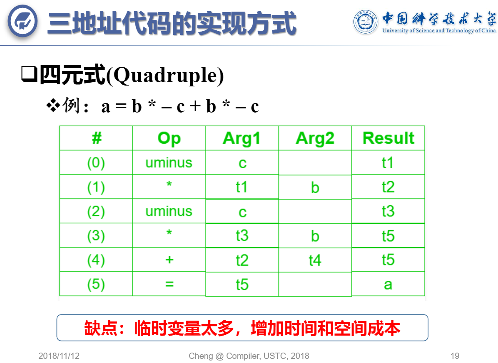
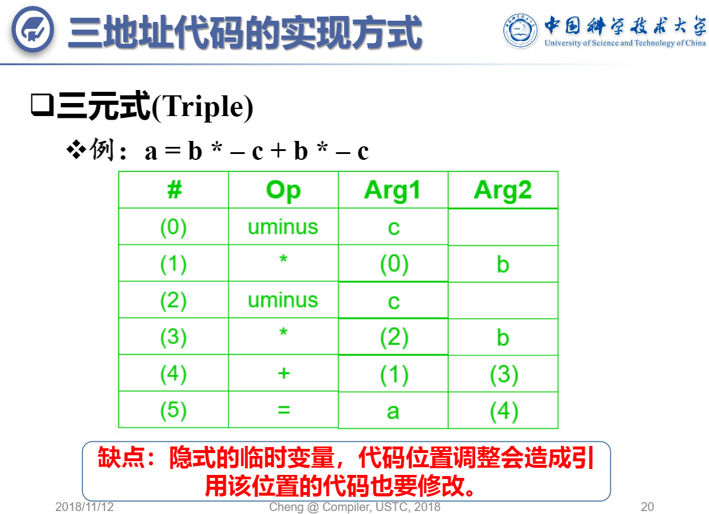
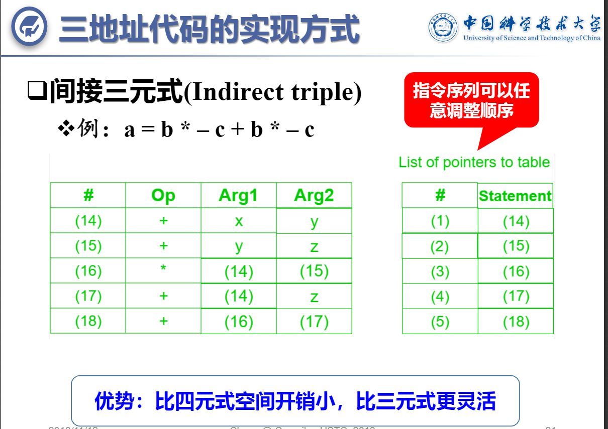

- 常见的图IR主要有：语法分析树、抽象语法树、有向无环图、控制流图、依赖关系图、调用图。

- 较为常见的线性IR有：堆栈机代码和三地址代码。


源代码-->|前端|-中间代码IR->|代码优化们llvm很多pass|-中间代码IR->|代码生成器|-目标程序


>目标体系架构

RISC精简指令计算机:很多寄存器，三地址指令，简单的寻址方式，简单指令集


CISC复杂指令集计算机：较少寄存器，两地址指令，多种的寻址方式，多种类型的寄存器，可变长度指令，有副作用的指令

基于栈的机器（WASM JVM）——JustInTime加速


# 1. 代码的中间表示---中间代码IR


XYZ三地址码：YZ(X不能)可以代表常量或者没有运行时地址的字面常量

2*a +(b-3)

>X = Y *op*  Z
>t1 = 2*a
>t2 = b-3
>t3 = t1+t2


从左向右线性化对应语法树（也可以从左往右，不同线性化不同形式，所以**表达相同程序的语法树和三地址码没有标准形式**，但是为了防止不必要的麻烦，在没有明显优势情况下，约定一种就好。）


```
         (t3)+
         /    \
      （t1）*  (t2)- 
     /    \  /    \
    2      a b    3
```


一元运算符  t2 =哑元0幺元 - t1；t2 = 哑元1幺元*2  是三地址码变种。


但是二叉树只能表示 operate leftValue rightRight ，事实上三元运算符A 是“()? :”```(condition B)?;ture operate C;false operate D```,条件运算符是右结合的，也就是说，从右向左分组计算。例如，a ? b : c ? d : e将按a ? b : (c ? d : e)执行。

一般的三目运算符就能解决大部分判断筛选的问题，当遇到多个数据判断时就可以通过三目运算的嵌套来达到目的。
a ? b : (c ? d : e) = (B)?C:((B1)?C1:D1;);
四元运算符 
```
var row.status == 0 ? '未支付' : (row.status == 1 ? '已支付' : '作废')"
```
此时可以对Status的三个状态进行筛选


三元/多元表达式怎么办？

a ? b : (c ? d : e) = (B)?C:((B1)?C1:D1;);
也许可以用多叉树ASt转换为二叉树Binary-AST的算法，


        A
      / |  \
     B  C  ((B1)?C1:D1;)
        |\
        E F

变

        A
      /   
     B —— C —— ((B1)?C1:D1;)
          |\
          E F

只要先序遍历AST打平树结构转换为 list源码序列时候，记得恢复为 (B)?C:D; 就行，就能从Binary-AST(一般省略;) source code生成。


多元运算符同理

chrome-extension://oemmndcbldboiebfnladdacbdfmadadm/http://staff.ustc.edu.cn/~chengli7/courses/compiler18/notes/Lecture12_intermediate_code_generation.pdf

《编译原理及实践》第八章三地址码 最常见的是根据现实的内容，4个域：1个op，XYZ三个地址(少于3地址的null/empty/nullptr).


必须有4个域的三地址码表示叫做四元式quadruple


四元式：(op, arg1, arg2, result)



三元式：(op, arg1, arg2)




[Compiler Design: A Simple Code Generator手写理论算法教程](https://www.youtube.com/watch?v=_i5B8Ca0Sxs)


间接三元式：(三元式的指针表)





P-代码


四元式，三元式间接三元式等三地址表示法

语法树

DAG有向无环计算图等 Flow graph（常用在中间代码优化）

字节代码和堆栈机表示方法

后缀表示等线性表达方法


- TAC Three-Address Code三地址码/四元式
- P-code(用于Pascal语言实现)
- Bytecode(java虚拟机的class)
- SSA静态单赋值形式Static Single Assignment form


- **S-expression**

- AST 抽象语法树Abstract Syntax Tree 及其改进形式有向无圈图Directed Acyclic Graph https://www.sciencedirect.com/topics/computer-science/abstract-syntax-tree

AST is an abstraction of the CST ( http://en.wikipedia.org/wiki/Parse_tree concrete syntax tree, or, parse tree). 

[有很多编程语言。在将每种语言转换为代码之前，都会对每种语言进行解析和语法检查，以便构建抽象语法树（AST）。有这个抽象的语法树，为什么不存储这个语法树而不是源代码（或在源代码旁边）呢？](https://softwareengineering.stackexchange.com/questions/119095/why-dont-we-store-the-syntax-tree-instead-of-the-source-code)

通过使用AST而不是源代码。团队中的每个程序员都可以将此树序列化为所需的任何语言（具有适当的上下文无关语法），并在完成后解析回AST。因此，这将消除有关编码样式问题（在何处放置{和}，在何处放置空格，缩进等）的争论。

这种方法的优缺点是什么？

《通用编程：方法，工具和应用程序》一书的第11章概述了由Microsoft Research开发的意图编程 Intentional_programming。意图编程优势的关键在于，捕获意图的域代码不是存储在源代码文本文件中，而是存储在基于树的存储中（可以是二进制或XML）。

>确实，这是一个合理的想法。微软在1990年代有一个研究项目 https://en.wikipedia.org/wiki/Intentional_programming 几乎可以做到这一点。
我想到了几种情况。
首先是微不足道的；如您所说，您可以根据不同程序员对空格等事物的偏好，将AST渲染为不同的视图。但是，在这种情况下，存储AST会显得过大。只是给自己写一个漂亮的打印机。将文件加载到编辑器中时，请运行漂亮打印机将其设置为首选格式，然后在保存时恢复为原始格式。
第二个更有趣。如果您可以存储抽象语法树，则对代码进行差异化更改就不会变成文本，而是语法。重构代码的位置变得更加容易理解。不利的一面当然是，编写树差异算法并不完全是琐碎的事，通常必须根据每种语言来完成。文本差异适用于几乎所有语言。
第三个更像西蒙尼（Simonyi）为有意编程所设想的那样：编程语言共有的基本概念是序列化的，然后您对以不同语言呈现的那些概念有不同的看法。尽管这是一个很不错的主意，但丑陋的事实是语言在细节上存在很大差异，以至于采用最低公分母的方法实际上是行不通的。
简而言之，这是一个不错的主意，但这是大量的额外工作，但收益却相对较小。这就是为什么几乎没有人这样做。

>我相信这个想法在理论上很有趣，但不是很实用，因为不同的编程语言支持不同的结构，有些结构没有其他语言的等效语言。
例如，X ++有一个'while select'语句，如果没有很多额外的代码（额外的类，额外的逻辑等），就无法用C＃编写该语句。http://msdn.microsoft.com/en-us/library/aa558063.aspx
我在这里要说的是，许多语言都有**语法糖**，它们可以翻译成相同语言的大块代码，甚至翻译成其他语言根本不存在的元素。这是为什么AST方法不起作用的示例：
语言X的AST中有以下四个语句来翻译关键字K：S1，S2，S3和S4。AST现在被翻译成语言Y，并且程序员更改了S2。现在，转换回X会发生什么？该代码被翻译为4条语句，而不是单个关键字。
反对AST方法的最后一个争论是平台功能：将功能嵌入平台后会发生什么？就像.NET的Environment.GetEnvironmentVariable一样。您如何翻译？


>解析问题在技术上已广为人知，但是解析C或C ++并不是一件容易的事，因为它们是杂乱的讨厌的语言。许多编译器将C或C ++解析为AST：Clang，GCC等……它们并不是用于程序存储的，GCC迫切希望成为编译器，而不是程序分析工具。我们的DMS软件再造工具包可解析C和C ++的许多方言，生成AST，符号表和各种流分析工件。这种方法的最大优点是能够构建自动化变更工具。logicaldesigns.com/Products/DMS/DMSToolkit.html –  Ira Baxter，


>Lisp通常写为抽象语法树。如果同时存储文本和AST，那么您实际上并没有添加任何有用的东西，因为文本已经以一种语言存在，并且AST可以从文本中快速重建。
另一方面，如果仅存储AST，则会丢失无法恢复的注释之类的内容。


>有一个围绕这个想法的系统：JetBrains MPS http://www.jetbrains.com/mps/ 。编辑器有点奇怪，或者只是有所不同，但是总的来说，这并不是一个大问题。最大的问题是，好了，这是不是一个文本的多，所以你不能使用任何正常的基于文本的工具-其他编辑，grep，sed，合并和差异工具，等等。

>

>实际上，有几种产品（通常称为“语言工作台”）存储AST，并在其编辑器中将AST的“投影”呈现回特定的语言。正如@ sk-logic所说，JetBrains的MPS就是这样一种系统。另一个是故意软件的故意工作台。
语言工作台的潜力似乎很高，尤其是在特定领域的语言领域，因为您可以创建特定领域的投影。例如，Intentional演示了与电力相关的DSL，它以电路图的形式展示-与基于文本的编程语言描述的电路相比，对于领域专家来说，讨论和批评它更容易，更准确。
在实践中，语言工作台一直很慢，因为除DSL工作外，开发人员可能更喜欢使用熟悉的通用编程语言工作。当与文本编辑器或编程IDE进行面对面的比较时，语言工作台会产生大量的开销，并且它们的优势还不太明显。我所见过的语言工作台都没有引导到可以轻松扩展自己的IDE的地步，也就是说，如果语言工作台对提高生产力非常有用，为什么语言工作台工具却没有变得更好越来越好？

>另外两个与抽象语法树编码有关的有趣项目是Tree-Sitter，它现在是Atom文本编辑器和Github的一部分。它将您的代码实时解析为AST。这使您可以做一些非常有趣的事情，例如它的创建者称为“扩展选择”的部分，您可以在其中继续单击一个单词，由于它了解AST的结构，因此它将突出显示与AST级别更高有关的文本。 
没有用于存储AST的标准，或更重要的是，从您的角度来看，在工具之间共享它们。原因是AST依赖于语法（语法有所不同； C取决于具体的编译器和版本，C有“很多”）和解析技术。
已经进行了很多尝试来定义跨多种语言的通用AST形式，但是没有一个真正起作用。运算符的语义差异太大。（仅考虑“ +”：它的真正含义是什么？在Fortran中，您可以添加数组，在Java中，您可以“添加”字符串）。
但是，可以很容易地写出特定的AST。一种简单的方法是使用某种表示法，其中使用某种嵌套的“括号”来标识节点及其递归子级。
Lisp S表达式是执行此操作的常用方法。您可以看到我们的工具生成的S表达式样式的示例。 https://stackoverflow.com/a/6378997/120163
人们也为此使用了XML，但是它非常庞大。您可以在 https://stackoverflow.com/a/5466414/120163  此处看到XML输出示例 https://stackoverflow.com/a/5466414/120163 。


------------------------------


纸质书第四章WAT中WebAssemblyTextFormat

```c++
int fib(){
    if(X<2){
        return 2;
    }else{
        return FIB(X-1)+FIB(X-2);
    }
}
```


WasmFiddle https://wasdk.github.io/WasmFiddle/ 或者类似线上线下编译平台-->wat


WAT是一种与wasm二进制格式等效的，可以用来对WebASsembly模块及其包含的所有定义(即模块内容)进行编码的一种文本格式

```wasm
(module
 (type $FUNCSIG$i (func (result i32)))
 (type $FUNCSIG$ii (func (param i32) (result i32)))
 (import "env" "FIB" (func $FIB (param i32) (result i32)))
 (table 0 anyfunc)
 (memory $0 1)
 (export "memory" (memory $0))
 (export "fib" (func $fib))
 (func $fib (; 1 ;) (param $0 i32) (result i32)
  (local $1 i32)
  (set_local $1
   (i32.const 2)
  )
  (block $label$0
   (br_if $label$0
    (i32.lt_s
     (get_local $0)
     (i32.const 2)
    )
   )
   (set_local $1
    (i32.add
     (call $FIB
      (i32.add
       (get_local $0)
       (i32.const -1)
      )
     )
     (call $FIB
      (i32.add
       (get_local $0)
       (i32.const -2)
      )
     )
    )
   )
  )
  (get_local $1)
 )
)

```


WAT格式基于“S-表达式expression”来表达模块的定义过程.


S-expression是一种以人类可读的文本格式来表达半结构化数据的语法约定symbol

在S-expression中我们用小括号"（）"来定义每一个的表达式，并子表达式与子表达式之间还可以通过语法规则来互相嵌套，这就在整体上构建出了**AST抽象语法树**的结构

简单起见，这里的+\*完全可以变成程序计算中符号表的任意二元运算符(至于其他0元/三元运算符改成二元的表达或者多个空字段什么的方法,也不是问题)

比如“1+2\*3+4\*5”分别转换为S-expression和WAT:


S-expression一定程度上反映了源代码的AST

```s
(+
    (+ 1
        (* 2 3)
    )
    (* 4 5)
)
```


WAT:

```wat
(module
 (table 0 anyfunc)
 (memory $0 1)
 (export "memory" (memory $0))
 (export "calculate" (func $calculate))
 (func $calculate (; 0 ;) (result i32)
  (i32.add
      (i32.add
          (i32.const 1)
          (i32.mul
              (i32.const)(i32.const 3)    
          )
      )
      (i32.mul
          (i32.const 4)(i32.const 5)
      )
  )
 )
)
```

定义了calculate函数

优化只能看到这个：

```wat
(module
 (table 0 anyfunc)
 (memory $0 1)
 (export "memory" (memory $0))
 (export "calculate" (func $calculate))
 (func $calculate (; 0 ;) (result i32)
  (i32.const 27)
 )
)
```


WAT是一种可读文本类型的AST,wasm二进制文件内的opCode代码是一种Linear Binary AST一种Binary-AST结构

WAT2wasm等工具或者二进制在线编译平台得到等效的wasm二进制模块


```wasm
41 02 41 03 6c 41 01 6a 41 04 41 05 6c 6a
```


```wasm
41 02     #i32.const 02
41 03     #i32.const 03
6c        #i32.mul
41 01     #i32.const 01
6a        #i32.add
41 04     #i32.const 04
41 05     #i32.const 05
6c        #i32.mul
6a        #i32.add
```


