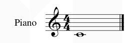

# Midi和musicXML-json等知识
【C++MIDI音乐编程教程-哔哩哔哩】 https://b23.tv/eXxIqDX
smartscoreX2这个软件可以转换任意的五线谱tif图片/PDF到midi，还可以用来制作五线谱
PianoTrans这个扒谱软件，学会了就可以让电脑帮你扒MIDI出来然后你就可以转成谱面了
另外我想说你的耳朵其实才是最靠谱的扒谱工具，所有软件都只起到一个辅助作用，多练练耳朵才是真理
PianoTrans下载地址：https://github.com/azuwis/pianotrans/

★下载链接：

MIDI素材下载链接：https://partme.com/ziyuan/goods/265788052301000

Vps Avenger合成器下载链接：https://partme.com/ziyuan/goods/259282923841000

 DS THORN下载链接：https://partme.com/ziyuan/goods/261711380501000

其他插件：https://partme.com/ziyuan/goods

 一个mid转简谱的工具
https://je.acgmuse.com/viewtopic.php?f=14&t=39
不过没有处理时值，因为简谱渲染的算法比较复杂
https://github.com/Zhangzijing/AcgmuseBackup 简谱库


## musicXML
[https://www.musicxml.com/](https://www.musicxml.com/)
这是 Midi 之后更完善的通用乐谱格式, 已有 Sibelius 等众多软件兼容; 官方网站: http://www.musicxml.org/ 或 http://www.recordare.com/musicxml


```
<?xml version="1.0" encoding="UTF-8" standalone="no"?>
<!DOCTYPE score-partwise PUBLIC "-//Recordare//DTD MusicXML 3.0 Partwise//EN" "http://www.musicxml.org/dtds/partwise.dtd">
<score-partwise version="3.0">       <!-- 根节点: score-partwise -->
  <part-list>                        <!-- 行(分谱)列表 -->
    <score-part id="P1">
      <part-name>Piano</part-name>   <!-- 乐器名称 -->
    </score-part>
  </part-list>
  <part id="P1">
    <measure number="1">             <!-- 第一小节 -->
      <attributes>                   <!-- 小节属性 -->
        <divisions>256</divisions>   <!-- 设定用 256 表示一个四分音符的长度 -->
        <key>                        
          <fifths>0</fifths>         <!-- C大调(没有升降号) -->
        </key>
        <time>
          <beats>4</beats>
          <beat-type>4</beat-type>   <!-- 4/4 拍 -->
        </time>
        <clef>
          <sign>G</sign>
          <line>2</line>             <!-- 使用高音谱号(G谱号) -->
        </clef>
      </attributes>
      <note>                         <!-- 音符 -->
        <pitch>                      <!-- 音高 -->
          <step>C</step>
          <octave>4</octave>         <!-- 中央 C -->
        </pitch>
        <duration>1024</duration>    <!-- 演奏时值 -->
        <type>whole</type>           <!-- 音符类型: 256th、128th、64th、32nd、16th、eighth、quarter、half、whole、breve、long -->
      </note>
    </measure>
  </part>
</score-partwise>
```


https://www.w3.org/community/music-notation/
MusicXML文件分为两种类型：score-partwise与score-timewise，其中较为常见的是score-partwise。

 在2004年，Recordare公司发布了一个通用的乐谱格式：MusicXML。采用XML的文档描述格式，来描述乐谱。
MusicXML在2005年发布1.1版本，对乐谱的支持程度进行了扩展。在2007年推出了2.0版本，增加了压缩格式和更多的乐谱类型。2014年推出了3.0版本，后面又进行一次更新。

如今3.1版本的MusicXML应支持了从18世纪以来，所有的古典音乐乐谱的展示逻辑，包括：多声部、多乐器、章节、音调、升降掉、音符展示、连音、五线谱位置、歌词、强弱等所有乐谱上可以表示的信息。

音乐生成—文件格式，相关工具与MIDO Package - 明天会更好的文章 - 知乎
https://zhuanlan.zhihu.com/p/359340227

MusicXML 是最通用的乐谱格式的音乐文件，它的数据类型是文本数据。

- Mido： 可以读取MIDI文件的Message，如Track, Event，Delta Time，Tempo and Beat Resolution,等信息。并且可以得到具体的二进制编码。也可以反向操作，写入二进制编码，生成MIDI Message，来写一个midi文件


- Pretty Midi: 和mido比较类似，也可以读取note，pitch， time signiture等信息。但功能似乎没有mido多以及强大。

- Music21: Music21是MIT开发的一个可以解析音乐文件的package。它可以读取多种音乐文件的格式（如：ABC，MIDI，**MusicXML**，Capella……。）。它除了基础了Note，Pitch, Time Duration 等音乐元素的编码外，提供了对音乐文件的分析函数（如：分析一整首曲子的各个音高出现的次数，各种节拍的音符出现的次数）。并且，music21的语料库里包含了十四世纪的音乐文件（巴赫，贝多芬等作曲家的乐曲），据MIT教授说，数据是从一本十四世纪音乐的书上获得的。这些音乐会没有版权问题。Music21简明指南 - 吴雨松的文章 - 知乎
https://zhuanlan.zhihu.com/p/73564852


musicXML可以转换midi
```python
import music21 as music21
import os
import threading

from concurrent.futures import ThreadPoolExecutor  # 并行 线程池


def convert(mid):
    xml = mid.rstrip(".mid") + ".xml"
    try:
        s = music21.converter.parse(mid)
        if len(s.parts) == 2:
            s.write('xml', xml)
        else:
            xml = "{} {} {}".format('Track', len(s.parts), mid)
    except Exception as ex:
        xml = "Error:" + mid + "\n" + str(ex)
    print(xml)


def find(base):
    for root, ds, fs in os.walk(base):
        for f in fs:
            yield os.path.join(root, f)


def main():
    base = 'F:\\音乐资料\\MIDI文件库\\3400首古典钢琴&管弦乐MIDI文件\\Chopin'
    threadpool = ThreadPoolExecutor(3)
    for mid in find(base):
        if str(mid).lower().endswith(".mid"):
            threadpool.submit(convert, str(mid))

    print("等待线程池中的任务执行完毕中······")
    threadpool.shutdown(True)  # 等待线程池中的任务执行完毕后，在继续执行
    print("END")


if __name__ == '__main__':
    main()
```

midi用musescore可以转换为musicXML


##  软件合集

https://ldzhangyx.github.io/2019/02/25/music-toolkits/


LilyPond
项目官网：http://lilypond.org/index.html
LilyPond是GNU Project的一部分，是免费的乐谱生成软件。生成的乐谱质量很高，支持从xml/mxl以及从midi转化成lilypond格式源代码（.ly），并且可以使用类LaTeX语言编写。

可以用两个方法通过Python代码调用LilyPond库：

Python-ly库，其GitHub地址在https://github.com/wbsoft/python-ly
mingus的lilypond模块，GitHub地址在https://github.com/bspaans/python-mingus


