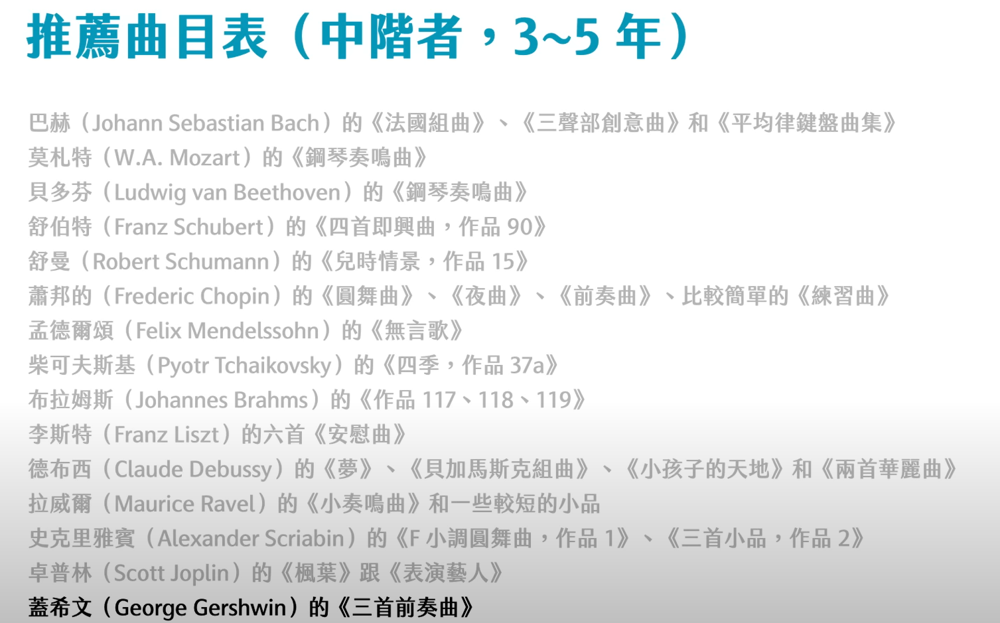
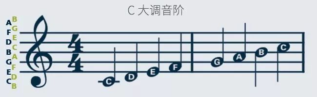
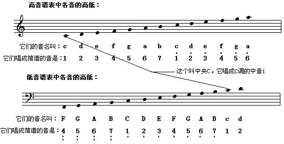

https://youtu.be/esljyLyIj7Q
官大为讲钢琴学习, 

新手曲目推荐Streabbog: Twelve Very Easy and Melodious Studies (斯特列伯格初级钢琴旋律性练习曲 作品63、64)

小奏鸣曲程度：克莱门悌《六首小奏鸣曲，作品36》，莫扎特《奏鸣曲K.545》 ，舒曼《青少年曲集，作品68》才科夫斯基《青少年曲集，作品39》巴赫二声部创意曲，萧邦《圆舞曲》海顿的《奏鸣曲》贝多芬的小奏鸣曲《给爱丽丝》......

---------------

135724 
逗Me说洗理发，

64275
辣发来洗手

# Piano

先哈农：主要活动手指

车尔尼：练习曲，练习部分手指技巧

拜厄：有一点旋律性 所以最后

 