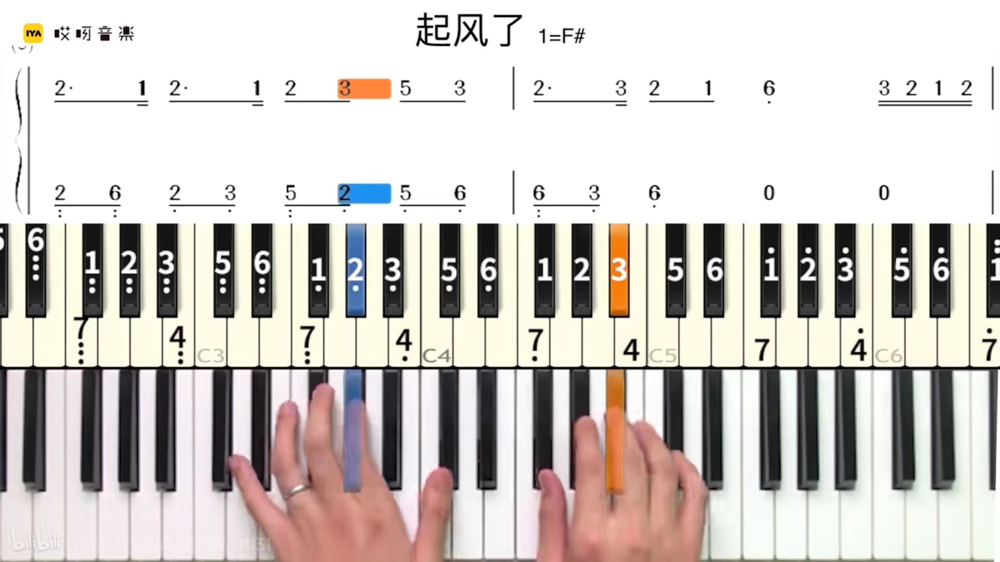
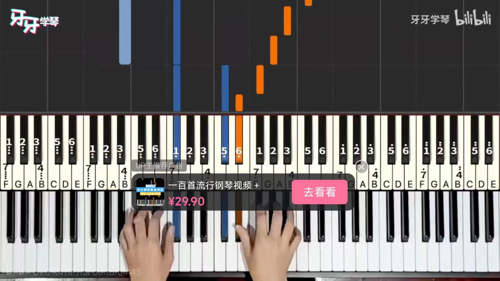
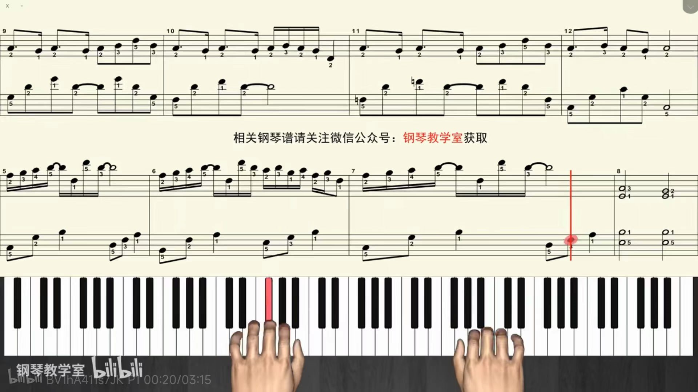

https://github.com/topics/synthesia

# Synthesia开源替代品

https://github.com/PolyMeilex/Neothesia/releases

https://github.com/spaceface777/viano/releases/tag/v1

https://github.com/DaCapo7/PyPiano

Neothesia ⭐ 549
Flashy Synthesia Like Software For Linux,Windows and MacOs
most recent commit a day ago

Synthesiakontrol ⭐ 91
🎹 Use Native Instruments Komplete Kontrol mk2 light guide in Synthesia

Syn2midi ⭐ 42
Create pianobooster midi from youtube piano video lessons (Synthesia).

Viano ⭐ 25
MIDI piano app, written in V. Visualizes and plays back a MIDI file (similarly to Synthesia)

Kazedan ⭐ 15
A Synthesia styled MIDI visualization.

Midi Converter ⭐ 14
Converts videos of synthesia like piano tutorials to a midi file, to be further converted to piano sheets.

Pianoforte ⭐ 11
 🎹 Pianoforte: Synthesia for Everyone.

Kompletesynthesia ⭐ 6
Native Instruments Komplete Kontrol Light Guide support for Synthesia

Synthesiavideo2midi ⭐ 4
Uses OpenCV to convert a synthesia video to a playable importable midi file.

Midi2tiles ⭐ 2
A tool for creating synthesia-like piano tiles effect from midi files.

--------------

