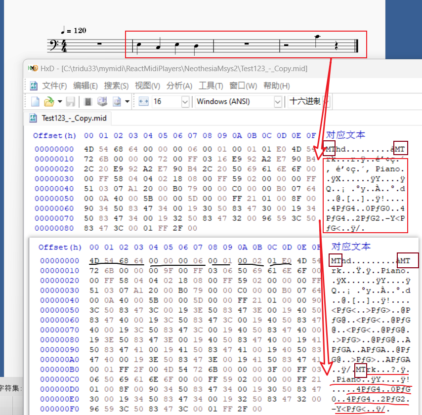
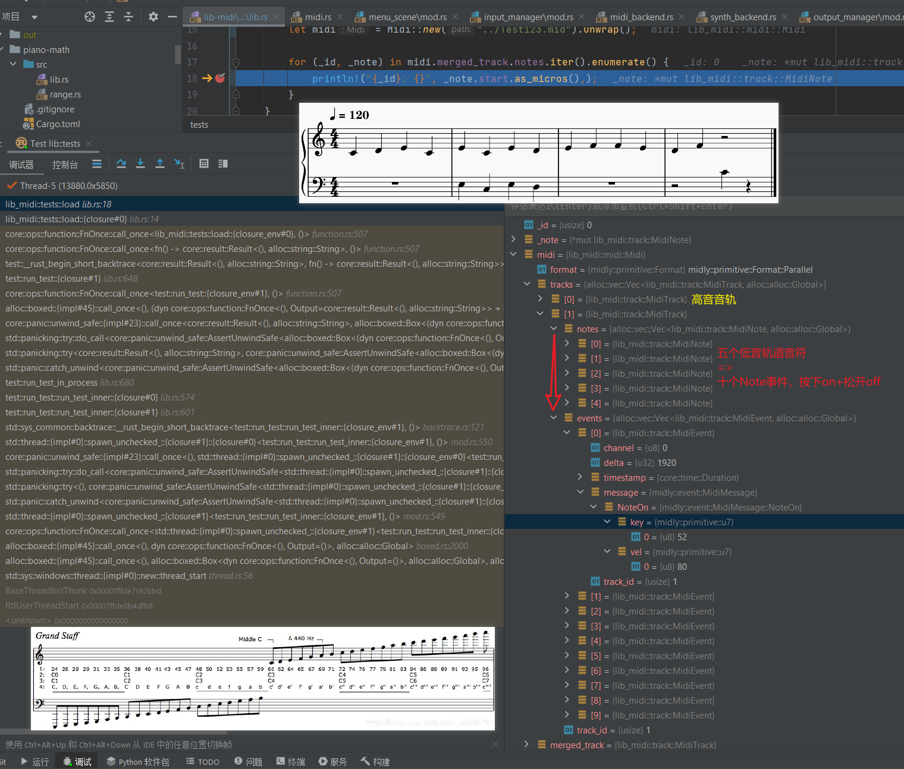
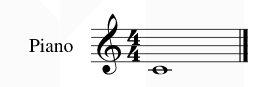

https://www.midi.org/specifications-old/item/table-1-summary-of-midi-message

电子琴MIDI自制,MP3转MIDI? wave转MIDI？下载还收费自己做吧 - warframe的文章 - 知乎
https://zhuanlan.zhihu.com/p/371942525

https://youtu.be/UR8otPcYchc wiwi讲的midi相关介绍

 逐个字节解释midi格式
```
4D 54 68 64 00 00 00 06 00 00 00 01 01 E0 4D 54 
72 6B 00 00 00 25 00 FF 03 05 B2 E2 CA D4 30 00 
FF 51 03 07 A1 20 00 FF 58 04 04 02 18 08 00 90 
3C 64 8E 7E 80 3C 40 00 FF 2F 00

```


Neothesia读取的midi格式解释


velocity速率的解释：note on 中的 velocity 实际上是按键的“触发速率”，你可以把其视为从键盘能感知到下按到下按结束这个过程中的键程除以按下时间，note off 则是反向的“释放速率”。速率的计算方式和更多细节可以参考这篇论文：The Interpretation of MIDI Velocity https://www.cs.cmu.edu/~rbd/papers/velocity-icmc2006.pdf


音乐研发必备：理解 MIDI 协议与标准 MIDI 文件格式 - 云原生基地的文章 - 知乎
https://zhuanlan.zhihu.com/p/504184193

MIDI二进制文件格式简析 - 不凋花的文章 - 知乎
https://zhuanlan.zhihu.com/p/364343026

将音频转换为MIDI或乐谱是否困难？ - 侯晓涛的回答 - 知乎
https://www.zhihu.com/question/364956196/answer/968829249

# midi编程解释

音乐研发必备：理解 MIDI 协议与标准 MIDI 文件格式
https://blog.csdn.net/ByteDanceTech/article/details/124358016

by字节

详细midi编程解释视频
https://www.youtube.com/watch?v=2BccxWkUgaU
https://www.youtube.com/watch?v=5IQvu8zlmJk
https://www.youtube.com/watch?v=w732EXqmfZU


规范文档
http://www.harfesoft.de/aixphysik/sound/midi/pages/genmidi.html
https://www.midi.org/specifications
https://en.wikipedia.org/wiki/General_MIDI#Percussion

参考文献

MIDI Tutorial

Standard MIDI-File Format Spec. 1.1, updated

MIDI Polyphonic Expression (MPE) Specification Adopted

钢琴的触键方式是如何影响弹出来的音色的？（https://zhuanlan.zhihu.com/p/19964066）

MIDI Tick、Meta-event、变长数表示法、区分 MIDI 文件中单个字节的含义（https://www.cndzq.com/bbs/thread-117332-1-1.html）

MPE in Live 11（https://help.ableton.com/hc/en-us/articles/360019144999-MPE-in-Live-11）

GDX-620 使用说明书（https://de.yamaha.com/files/download/other_assets/9/334239/DGX-620_ZH.pdf）


推荐读物

《音乐声学——音响、乐器、计算机音乐、MIDI、音乐厅声学原理及应用》- 龚镇雄

The Computer Music Tutorial - Curtis Roads


**字节跳动音乐研发团队**，业务包含字节旗下的音乐流媒体应用、字节音乐中台、抖音 & 西瓜视频中的音乐视频和音乐创作工具等场景。团队拥有良好的技术氛围，在 ByteTech 沉淀了大量优秀的视频课程和技术文章，欢迎各位同学加入。 音视频服务端资深/高级研发工程师


# Midi和musicXML-json等知识
【C++MIDI音乐编程教程-哔哩哔哩】 https://b23.tv/eXxIqDX
smartscoreX2这个软件可以转换任意的五线谱tif图片/PDF到midi，还可以用来制作五线谱
PianoTrans这个扒谱软件，学会了就可以让电脑帮你扒MIDI出来然后你就可以转成谱面了
另外我想说你的耳朵其实才是最靠谱的扒谱工具，所有软件都只起到一个辅助作用，多练练耳朵才是真理
PianoTrans下载地址：https://github.com/azuwis/pianotrans/

★下载链接：

MIDI素材下载链接：https://partme.com/ziyuan/goods/265788052301000

Vps Avenger合成器下载链接：https://partme.com/ziyuan/goods/259282923841000

 DS THORN下载链接：https://partme.com/ziyuan/goods/261711380501000

其他插件：https://partme.com/ziyuan/goods

 一个mid转简谱的工具
https://je.acgmuse.com/viewtopic.php?f=14&t=39
不过没有处理时值，因为简谱渲染的算法比较复杂
https://github.com/Zhangzijing/AcgmuseBackup 简谱库


## musicXML
[https://www.musicxml.com/](https://www.musicxml.com/)
这是 Midi 之后更完善的通用乐谱格式, 已有 Sibelius 等众多软件兼容; 官方网站: http://www.musicxml.org/ 或 http://www.recordare.com/musicxml


```
<?xml version="1.0" encoding="UTF-8" standalone="no"?>
<!DOCTYPE score-partwise PUBLIC "-//Recordare//DTD MusicXML 3.0 Partwise//EN" "http://www.musicxml.org/dtds/partwise.dtd">
<score-partwise version="3.0">       <!-- 根节点: score-partwise -->
  <part-list>                        <!-- 行(分谱)列表 -->
    <score-part id="P1">
      <part-name>Piano</part-name>   <!-- 乐器名称 -->
    </score-part>
  </part-list>
  <part id="P1">
    <measure number="1">             <!-- 第一小节 -->
      <attributes>                   <!-- 小节属性 -->
        <divisions>256</divisions>   <!-- 设定用 256 表示一个四分音符的长度 -->
        <key>                        
          <fifths>0</fifths>         <!-- C大调(没有升降号) -->
        </key>
        <time>
          <beats>4</beats>
          <beat-type>4</beat-type>   <!-- 4/4 拍 -->
        </time>
        <clef>
          <sign>G</sign>
          <line>2</line>             <!-- 使用高音谱号(G谱号) -->
        </clef>
      </attributes>
      <note>                         <!-- 音符 -->
        <pitch>                      <!-- 音高 -->
          <step>C</step>
          <octave>4</octave>         <!-- 中央 C -->
        </pitch>
        <duration>1024</duration>    <!-- 演奏时值 -->
        <type>whole</type>           <!-- 音符类型: 256th、128th、64th、32nd、16th、eighth、quarter、half、whole、breve、long -->
      </note>
    </measure>
  </part>
</score-partwise>
```


https://www.w3.org/community/music-notation/
MusicXML文件分为两种类型：score-partwise与score-timewise，其中较为常见的是score-partwise。

 在2004年，Recordare公司发布了一个通用的乐谱格式：MusicXML。采用XML的文档描述格式，来描述乐谱。
MusicXML在2005年发布1.1版本，对乐谱的支持程度进行了扩展。在2007年推出了2.0版本，增加了压缩格式和更多的乐谱类型。2014年推出了3.0版本，后面又进行一次更新。

如今3.1版本的MusicXML应支持了从18世纪以来，所有的古典音乐乐谱的展示逻辑，包括：多声部、多乐器、章节、音调、升降掉、音符展示、连音、五线谱位置、歌词、强弱等所有乐谱上可以表示的信息。

音乐生成—文件格式，相关工具与MIDO Package - 明天会更好的文章 - 知乎
https://zhuanlan.zhihu.com/p/359340227

MusicXML 是最通用的乐谱格式的音乐文件，它的数据类型是文本数据。

- Mido： 可以读取MIDI文件的Message，如Track, Event，Delta Time，Tempo and Beat Resolution,等信息。并且可以得到具体的二进制编码。也可以反向操作，写入二进制编码，生成MIDI Message，来写一个midi文件


- Pretty Midi: 和mido比较类似，也可以读取note，pitch， time signiture等信息。但功能似乎没有mido多以及强大。

- Music21: Music21是MIT开发的一个可以解析音乐文件的package。它可以读取多种音乐文件的格式（如：ABC，MIDI，**MusicXML**，Capella……。）。它除了基础了Note，Pitch, Time Duration 等音乐元素的编码外，提供了对音乐文件的分析函数（如：分析一整首曲子的各个音高出现的次数，各种节拍的音符出现的次数）。并且，music21的语料库里包含了十四世纪的音乐文件（巴赫，贝多芬等作曲家的乐曲），据MIT教授说，数据是从一本十四世纪音乐的书上获得的。这些音乐会没有版权问题。Music21简明指南 - 吴雨松的文章 - 知乎
https://zhuanlan.zhihu.com/p/73564852


musicXML可以转换midi
```python
import music21 as music21
import os
import threading

from concurrent.futures import ThreadPoolExecutor  # 并行 线程池


def convert(mid):
    xml = mid.rstrip(".mid") + ".xml"
    try:
        s = music21.converter.parse(mid)
        if len(s.parts) == 2:
            s.write('xml', xml)
        else:
            xml = "{} {} {}".format('Track', len(s.parts), mid)
    except Exception as ex:
        xml = "Error:" + mid + "\n" + str(ex)
    print(xml)


def find(base):
    for root, ds, fs in os.walk(base):
        for f in fs:
            yield os.path.join(root, f)


def main():
    base = 'F:\\音乐资料\\MIDI文件库\\3400首古典钢琴&管弦乐MIDI文件\\Chopin'
    threadpool = ThreadPoolExecutor(3)
    for mid in find(base):
        if str(mid).lower().endswith(".mid"):
            threadpool.submit(convert, str(mid))

    print("等待线程池中的任务执行完毕中······")
    threadpool.shutdown(True)  # 等待线程池中的任务执行完毕后，在继续执行
    print("END")


if __name__ == '__main__':
    main()
```

midi用musescore可以转换为musicXML


##  软件合集

https://ldzhangyx.github.io/2019/02/25/music-toolkits/


LilyPond
项目官网：http://lilypond.org/index.html
LilyPond是GNU Project的一部分，是免费的乐谱生成软件。生成的乐谱质量很高，支持从xml/mxl以及从midi转化成lilypond格式源代码（.ly），并且可以使用类LaTeX语言编写。

可以用两个方法通过Python代码调用LilyPond库：

Python-ly库，其GitHub地址在https://github.com/wbsoft/python-ly
mingus的lilypond模块，GitHub地址在https://github.com/bspaans/python-mingus


