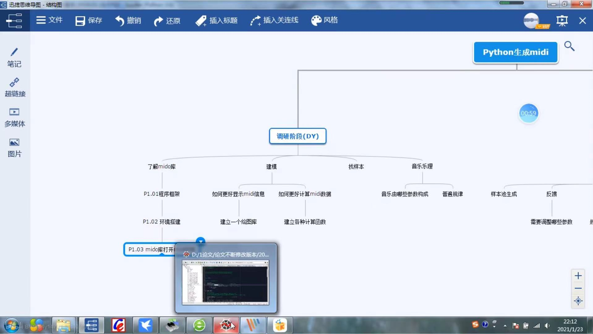
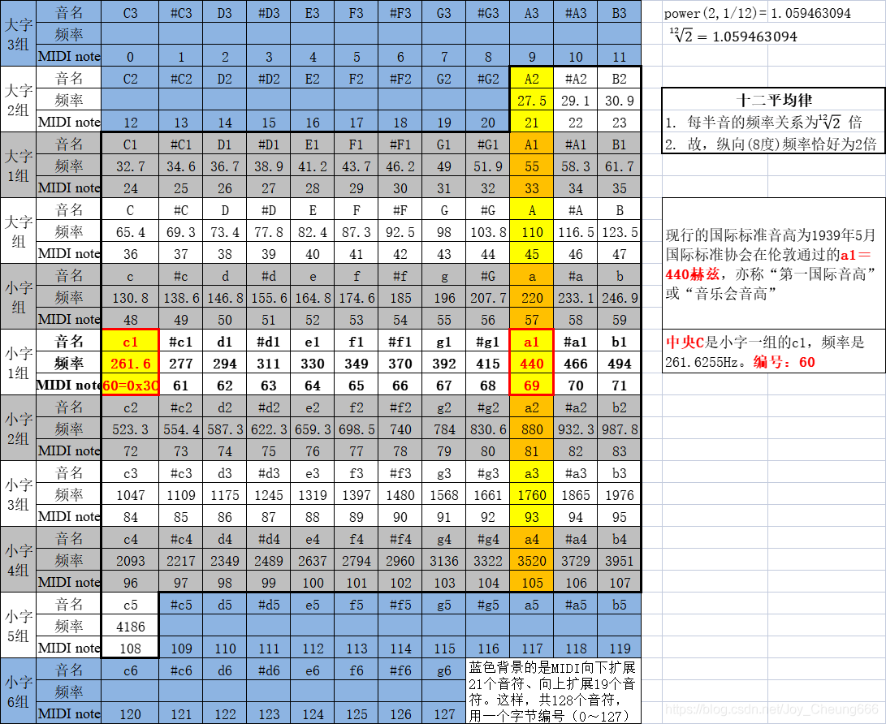

[TOC]

---------------

软件幻灭 https://tonsky.me/blog/disenchantment/zh/ 


计划整理一本tauri rust midi json的乐理gitbook，指导钢琴和口琴吉他乐器弹唱


mp3转midi AuthemScore

https://www.bilibili.com/video/av55082645/  扒谱软件wavetone的使用

https://github.com/erictherobot/react-web-midi

https://github.com/surikov/midi-sounds-react-examples

https://github.com/surikov/midi-sounds-react


https://github.com/tzmcion/ReactPianoPlayer


Magenta魔改记-2：数据格式与数据集 - 吴雨松的文章 - 知乎
https://zhuanlan.zhihu.com/p/49539387
https://ldzhangyx.github.io/2019/02/25/music-toolkits/ 最全工具集


# umi项目笔记
https://blog.csdn.net/MrNoboday/article/details/85339820 musicXML
```
假设
	1、第一小节节拍 2/4
	2、速度为60
	3、第一小节全为四分音符时

那么有
	>第一小节的时长是：第一小节节拍 * 第一小节beat-type / 速度 = 2/4 * 4/60 = 1/30 分钟 = 2秒
	>而一个音符则是：节拍 * 第一小节beat-type / 速度 * (音符duration/小节总duration) = 2/4 * 4 /60 * (4/8) = 1/60分钟 = 1秒

假设（通用-变拍）
	1、第一小节节拍 2/4
	2、目标小节变拍 3/8
	3、速度为60
那么有
	> 小节的时长是：本节拍 * 第一小节beat-type / 速度 = 3/8 * 4 / 60 = 1/40 分钟 = 1.5s

公式：
	小节时长 = (beats / beat-type) * 第一小节beat-type / speed
	音符时长 = note duration / measure duration * 小节时长
>注意：beats beat-type都能从<time>标签中获取
>note duration要从note的<duration>标签中取
>小节的要从<backup>的<duration>中获取
>注意变拍情况

```


【Tauri 1.0，与 Electron 对比 | 骇客说-哔哩哔哩】 https://b23.tv/KUVJ1lr

 Tauri 1.0 在近期正式发布了，让骇客君一起带大家了解一下 Tauri
视频中的 Demo 地址： https://github.com/haikeshuo/tauri-counter

参考midi文件解析：

【自己录制了一个MIDI播放软件“TMIDI Player”的使用简介。这是我用过最好的MIDI播放软件！-哔哩哔哩】 https://b23.tv/Go5kcmN


# midi口琴前端小项目

MIDI已成为编曲界最广泛的音乐标准格式，可称其为“计算机能理解的乐谱”。

MIDI音符编码




enum枚举音符参数
```c
enum Scale  //音阶参数
{
	Rest = 0, C8 = 108, B7 = 107, A7s = 106, A7 = 105, G7s = 104, G7 = 103, F7s = 102, F7 = 101, E7 = 100,
	D7s = 99, D7 = 98, C7s = 97, C7 = 96, B6 = 95, A6s = 94, A6 = 93, G6s = 92, G6 = 91, F6s = 90, F6 = 89,
	E6 = 88, D6s = 87, D6 = 86, C6s = 85, C6 = 84, B5 = 83, A5s = 82, A5 = 81, G5s = 80, G5 = 79, F5s = 78,
	F5 = 77, E5 = 76, D5s = 75, D5 = 74, C5s = 73, C5 = 72, B4 = 71, A4s = 70, A4 = 69, G4s = 68, G4 = 67,
	F4s = 66, F4 = 65, E4 = 64, D4s = 63, D4 = 62, C4s = 61, C4 = 60, B3 = 59, A3s = 58, A3 = 57, G3s = 56,
	G3 = 55, F3s = 54, F3 = 53, E3 = 52, D3s = 51, D3 = 50, C3s = 49, C3 = 48, B2 = 47, A2s = 46, A2 = 45,
	G2s = 44, G2 = 43, F2s = 42, F2 = 41, E2 = 40, D2s = 39, D2 = 38, C2s = 37, C2 = 36, B1 = 35, A1s = 34,
	A1 = 33, G1s = 32, G1 = 31, F1s = 30, F1 = 29, E1 = 28, D1s = 27, D1 = 26, C1s = 25, C1 = 24, B0 = 23,
	A0s = 22, A0 = 21
};
enum Voice //声调
{
	L1 = C3, L2 = D3, L3 = E3, L4 = F3, L5 = G3, L6 = A3, L7 = B3,
	M1 = C4, M2 = D4, M3 = E4, M4 = F4, M5 = G4, M6 = A4, M7 = B4,
	H1 = C5, H2 = D5, H3 = E5, H4 = F5, H5 = G5, H6 = A5, H7 = B5,
	LOW_SPEED = 500, MIDDLE_SPEED = 400, HIGH_SPEED = 300,
	_ = 0XFF
};
```
 
凭借上面的代码，你就可以调用来谱曲啦，还可以自己修改speed，以及_的数量得到节奏不同的音乐。

我们一起学猫叫
```cpp
void Cats()
{
	HMIDIOUT handle;
	cout << "我们一起学猫叫~~~" << endl;
	cout << "\n\n我们一起学猫叫\n\n一起喵喵喵喵喵\n\n在你面前撒个娇\n\n哎呦喵喵喵喵喵\n\n我的心脏砰砰跳\n\n迷恋上你的坏笑\n\n你不说爱我我就喵喵喵\n\n";
	midiOutOpen(&handle, 0, 0, 0, 0);

	int volume = 0x7f;
	int voice = 0x0;
	int sleep = 150;
	int helloworld[] = {  // 声调
	 M1,_,M2,_,M3,_,L5,_,M1,_,M3,_,M3,_,_,_,
	 M2,_,M1,_,M2,_,M5,_,M5,_,M5,_,M5,_,_,_,
	 M1,_,L7,_,M1,_,M1,_,M1,_,M1,_,M1,_,_,_,
	 L7,_,M1,_,L7,_,M1,_,L7,_,L6,_,L5,_,_,_,
	 L5,_,L5,_,L6,_,L1,_,L4,_,L6,_,L6,_,_,_,
	 L5,_,L3,_,L5,_,L3,_,L5,_,M2,_,M1,_,_,_,
	 L5,_,M3,_,M3,_,M3,_,M4,_,M5,_,M1,_,M1,_,M2,M3,M2,_,_,_,_,_,_,_,
	};

	for (auto i : helloworld)
	{
		if (i == LOW_SPEED || i == HIGH_SPEED || i == MIDDLE_SPEED)
		{
			sleep = i;
			continue;
		}
		if (i == _)
		{
			Sleep(150);
			continue;
		}

		voice = (volume << 16) + (i << 8) + 0x90;
	
		midiOutShortMsg(handle, voice);
		Sleep(sleep);
	}

	midiOutClose(handle);

} 
```
具体的音乐程序已经封装好放这里啦


【自己录制了一个MIDI播放软件“TMIDI Player”的使用简介。这是我用过最好的MIDI播放软件！-哔哩哔哩】 https://b23.tv/Go5kcmN


1. 参考
GitHub网址
https://github.com/gxto/pymidi
读取midi文件
2. 口琴可视化发声
3. react部署


输入简谱导出midi


fl studio 可，finake 或是作曲大

mkdi转简谱的方法： 用EOP简谱大师解析ove文件。EOP简谱大师是免费软件，在官网可下载。无意中发现的这种强大的功能，但是最多只支持四声部同时解析。


五线谱转简谱转midi快速方法https://blog.csdn.net/weixin_39903872/article/details/110854028
EOP简谱大师——EopNMNMaster1.6.11.28


# 一些React-midi-Player


https://github.com/jazz-soft/react-midi-player.git


## mywasm


各大家推荐一个资源 https://wasmbyexample.dev/home.en-us.html
这里的wasm的项目都用cpp，rust，go还有ts四种语言各自写了一遍~
很适合观察各种语言的实现wasm的优缺点~


【【WASM】如何创建一个基于AssemblyScript开发语言的WASM 项目-哔哩哔哩】 https://b23.tv/Ix95mhL


