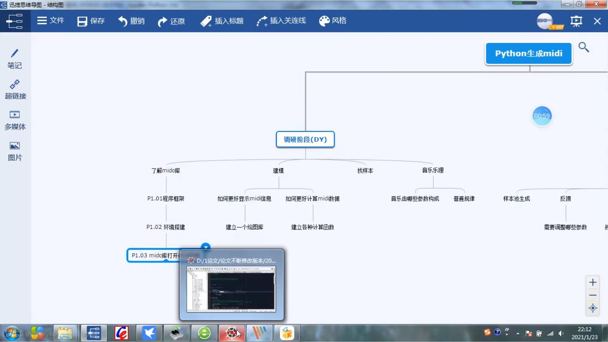

https://github.com/erictherobot/react-web-midi

https://github.com/surikov/midi-sounds-react-examples

https://github.com/surikov/midi-sounds-react

https://github.com/tzmcion/ReactPianoPlayer

[TOC]

音乐生成—文件格式，相关工具与MIDO Package - 明天会更好的文章 - 知乎
https://zhuanlan.zhihu.com/p/359340227

Mido： 可以读取MIDI文件的Message，如Track, Event，Delta Time，Tempo and Beat Resolution,等信息。并且可以得到具体的二进制编码。也可以反向操作，写入二进制编码，生成MIDI Message，来写一个midi文件

Pretty Midi: 和mido比较类似，也可以读取note，pitch， time signiture等信息。但功能似乎没有mido多以及强大。

Music21: Music21是MIT开发的一个可以解析音乐文件的package。它可以读取多种音乐文件的格式（如：ABC，MIDI，MusicXML，Capella……。）。它除了基础了Note，Pitch, Time Duration 等音乐元素的编码外，提供了对音乐文件的分析函数（如：分析一整首曲子的各个音高出现的次数，各种节拍的音符出现的次数）。并且，music21的语料库里包含了十四世纪的音乐文件（巴赫，贝多芬等作曲家的乐曲），据MIT教授说，数据是从一本十四世纪音乐的书上获得的。这些音乐会没有版权问题。

# umi项目笔记

参考midi文件解析：

【自己录制了一个MIDI播放软件“TMIDI Player”的使用简介。这是我用过最好的MIDI播放软件！-哔哩哔哩】 https://b23.tv/Go5kcmN

# midi口琴前端小项目

【自己录制了一个MIDI播放软件“TMIDI Player”的使用简介。这是我用过最好的MIDI播放软件！-哔哩哔哩】 https://b23.tv/Go5kcmN

1. 参考
GitHub网址
https://github.com/gxto/pymidi
读取midi文件
2. 口琴可视化发声
3. react部署

输入简谱导出midi

fl studio 可，finake 或是作曲大

mkdi转简谱的方法： 用EOP简谱大师解析ove文件。EOP简谱大师是免费软件，在官网可下载。无意中发现的这种强大的功能，但是最多只支持四声部同时解析。

五线谱转简谱转midi快速方法https://blog.csdn.net/weixin_39903872/article/details/110854028
EOP简谱大师——EopNMNMaster1.6.11.28

# 一些React-midi-Player

https://github.com/jazz-soft/react-midi-player.git

