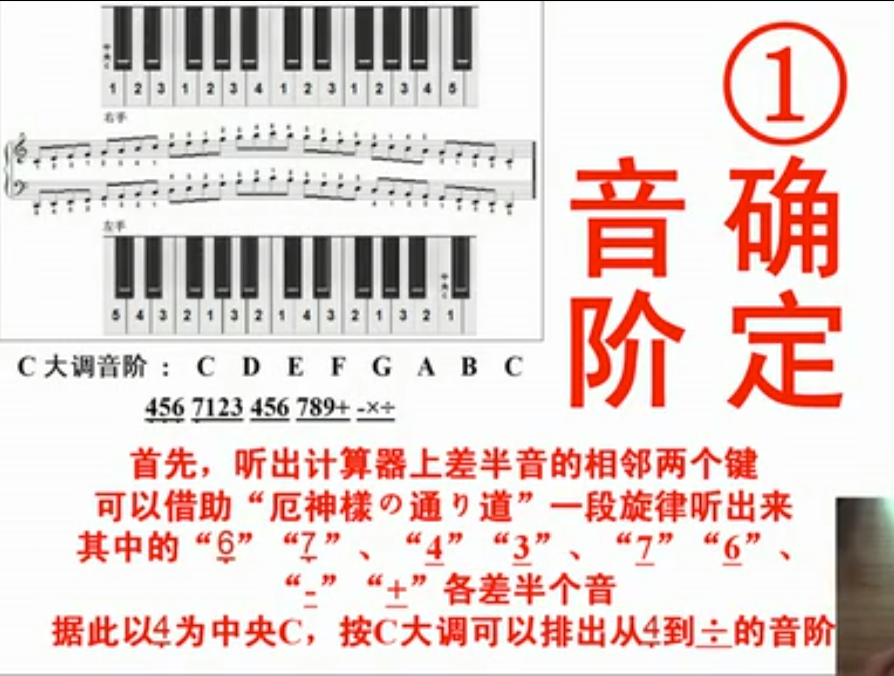
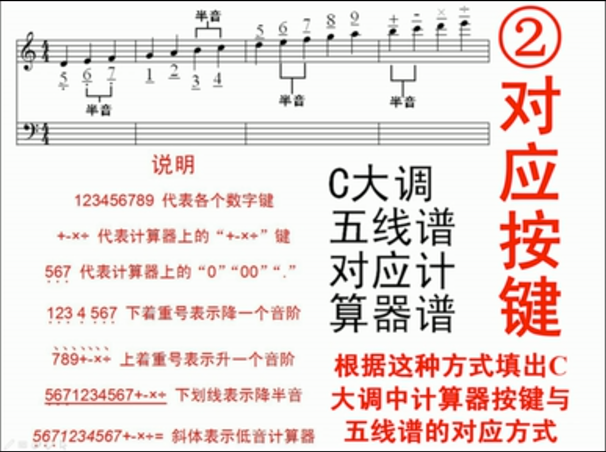
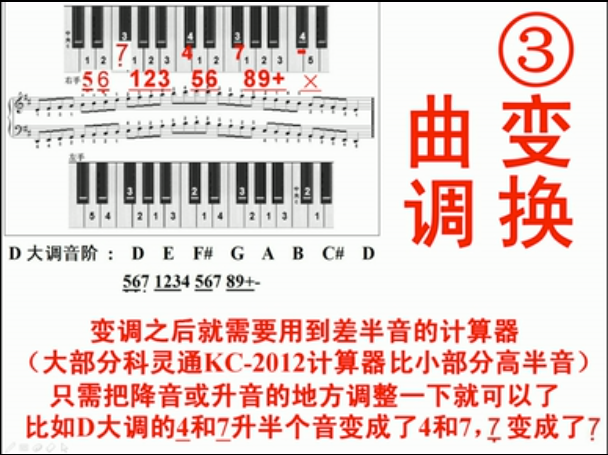
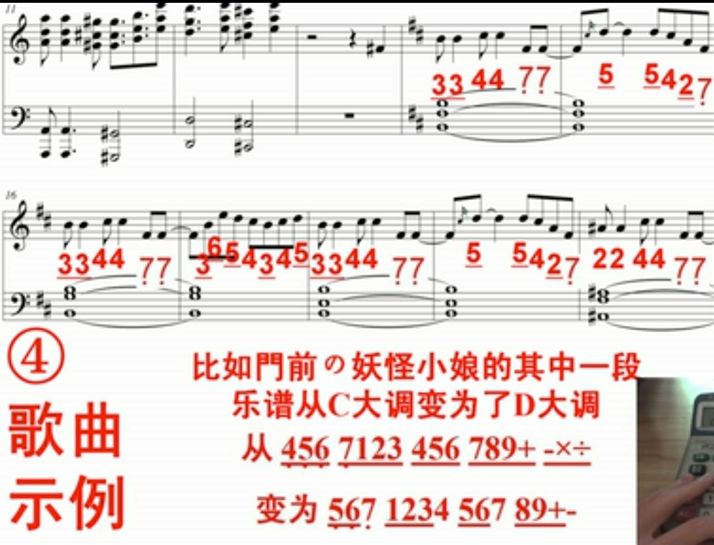
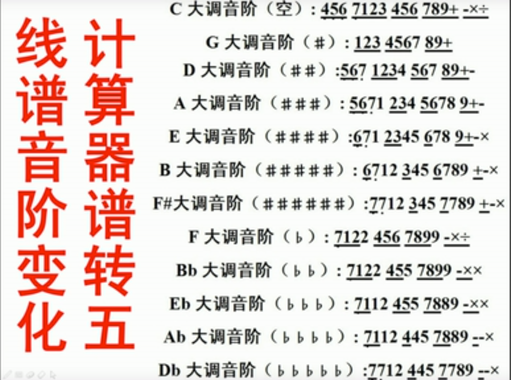
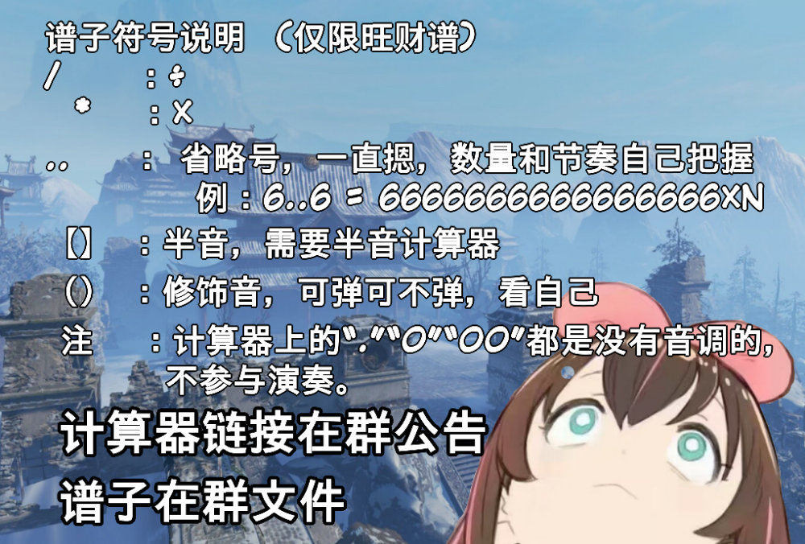
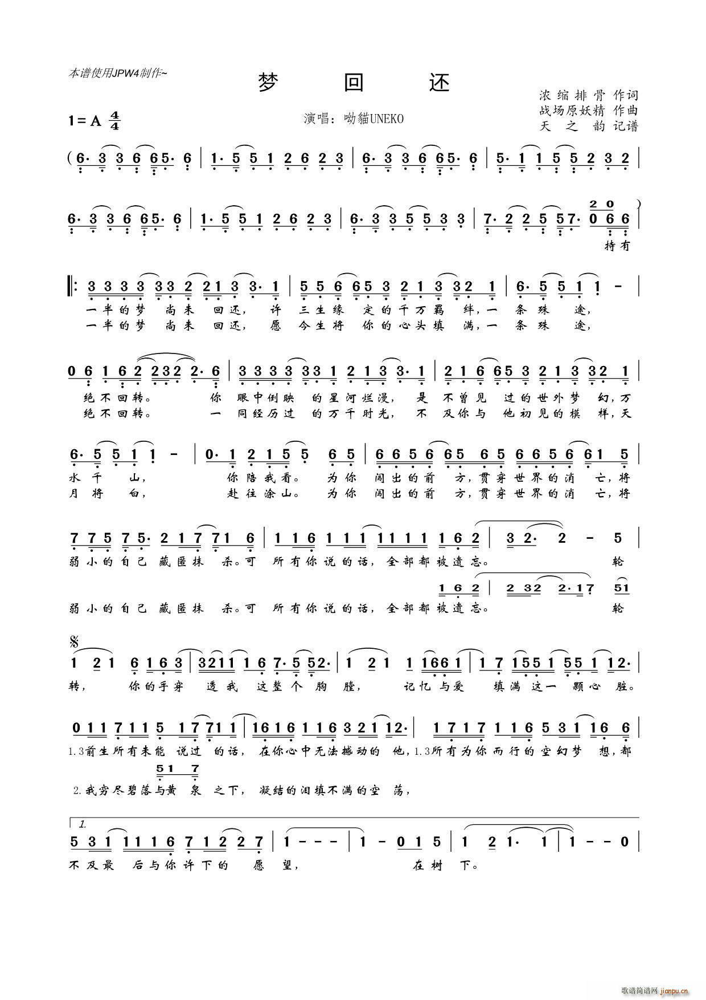
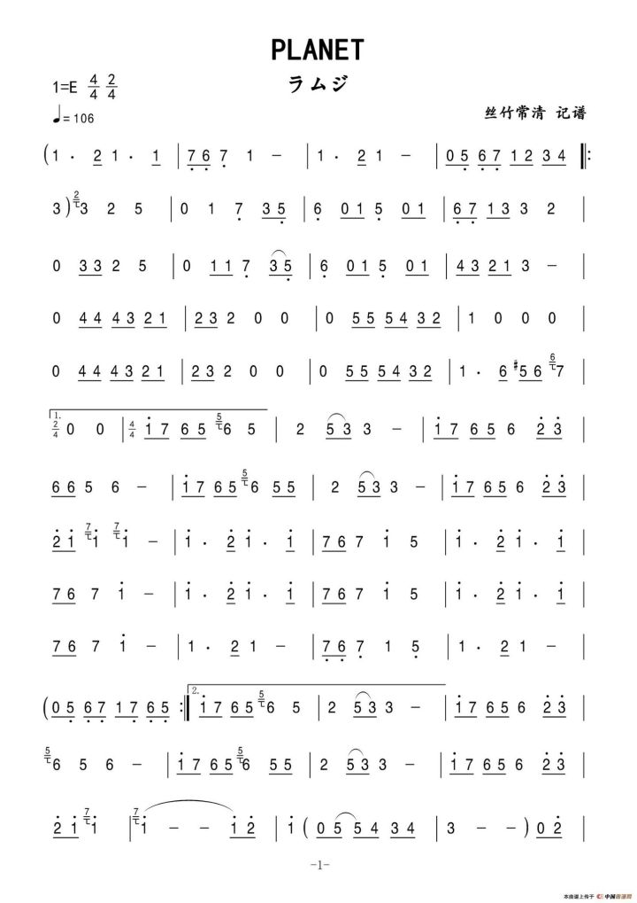
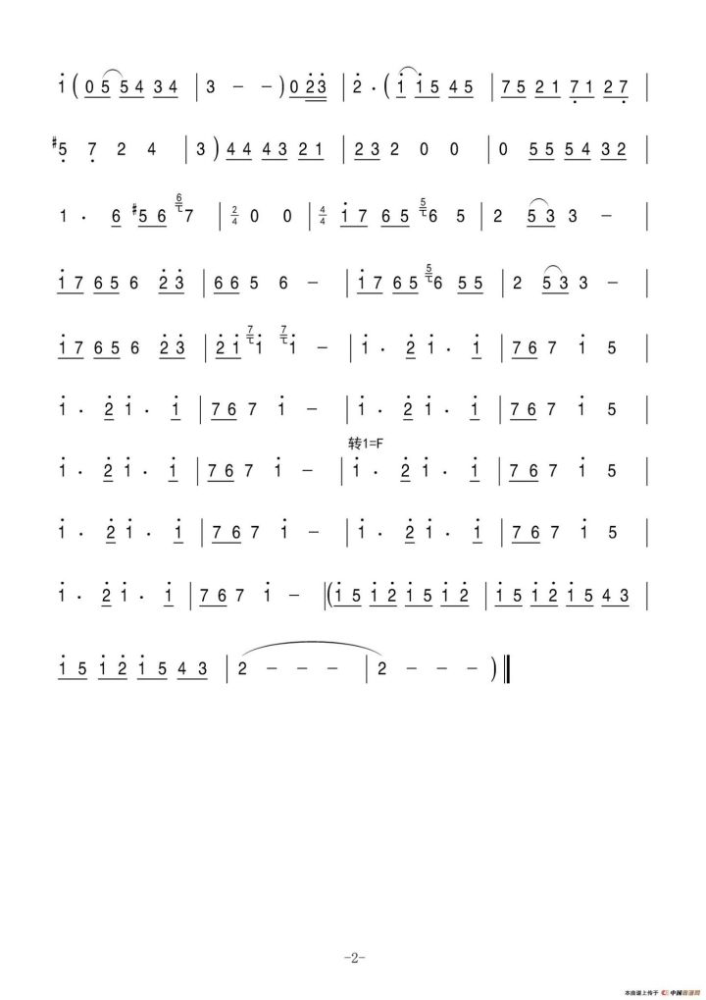
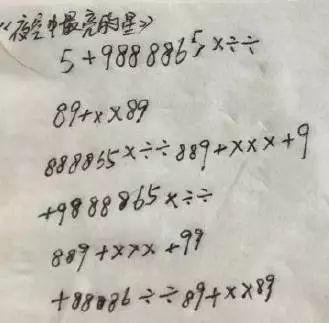

# 指法

https://wjy50.wodemo.com/musicalculator-help-en


## OpenCV+五线谱midi简谱编程主调计算器乐曲

60秒教你将五线谱转为计算器谱


https://www.bilibili.com/video/av810341/

**算法**
















食指放在4位置，中指放在5位置，无名指放在6位置，拇指放在0位置，小指轻放在+号上，食指管“7.4.1”，中指管“8.5.2.00”无名指管“9.6.3.../*-”，看自己的手指长度和适应度。

 熟练记住计算器的各个数字的位置，按照A4纸上的数字慢慢敲打数字，刚开始很慢，不要着急，错了先不要更改，等到得出结论后再输入一遍，多敲打几遍，把正确答案写上。


 熟练运用计算器上的数字后，就要快速打字，给自己指定时间，在规定的时间内要又快又正确，先从加号开始，熟练后添加减号、乘号、除号等。

左右手指法相反


QQ 605199575

https://www.bilibili.com/video/av16733811/


# 计算器音乐


众生[https://www.bilibili.com/video/av19872835?share\_medium=android&share\_source=weixin&bbid=48c7f640507804dc9c1fbec57e7a5ae6&ts=1574179745370](https://www.bilibili.com/video/av19872835?share_medium=android&share_source=weixin&bbid=48c7f640507804dc9c1fbec57e7a5ae6&ts=1574179745370)


扒谱[https://www.bilibili.com/video/av20943111?share\_medium=android&share\_source=weixin&bbid=48c7f640507804dc9c1fbec57e7a5ae6&ts=1574179670143](https://www.bilibili.com/video/av20943111?share_medium=android&share_source=weixin&bbid=48c7f640507804dc9c1fbec57e7a5ae6&ts=1574179670143)


谢谢收听的各位！  
附带谱子！（是真的累。。  

```


9+9   9+678   6+8786     
568+989+   66787898  
89+   9789x  
75876   78698+  
6+86   987x  
66796   66+8++989876   89x  
8x   xx/x   8789xx  
86  876  898x   +-x++-x+99  
8x  xx/x   8988  x（9）+  
8x88   +-+x  ++--+     
+9++x--x-+9  8x9+8


```


[众生钢琴https://www.bilibili.com/video/av16733811?share\_medium=android&share\_source=weixin&bbid=48c7f640507804dc9c1fbec57e7a5ae6&ts=1574179418387](https://www.bilibili.com/video/av16733811?share_medium=android&share_source=weixin&bbid=48c7f640507804dc9c1fbec57e7a5ae6&ts=1574179418387)





[https://www.bilibili.com/video/av22704095/](https://www.bilibili.com/video/av22704095/)





```

《梦回还》
谱子By@旺财WC
降3 双计算器 【】内为高半音
前奏:
26212 4845956
26212 141565
26212 4845956
2686 3513
正片:
2266666546
48898 65465
4984 242565
2666664546
45498 65465
4984 4548
98 99898989989-
8++8+8
8*-+-
9--9--- ----9-*/*
【=】-*-
9-9/*-9+8*-*-
--9-+-8-8-*
--+--8-+--
9-9--9/*-*
-+-+--9【=】/-9
9【=】/---9+-*+-
间奏:
6212 4845956
26212 141565
26212 4845956
2686 3513
正片:
2266666546
48898 65465
4984 242565
2666664546
45498 65465
4984 4548
98 99898989989-
8++8+8
8*-+-
9--9--- ----9-*/*
【=】-*-
9-9/*-9+8*-*-
--9-+-8-8-*
--+--8-+--
9-9--9/*-*
-+-+--9【=】/-9
9【=】/---9+-*+
9889889
8--+88+++-
9889889
8/*-99【=】+-
---9-+- 9-9/*-*
9/*//*/*-*-【=】
【=】-*-
9-9/*-9+8*-*-
--9-+-8-8-*
--+--8-+--
9-9--9/*-*
-+-+--9【=】/-9
9【=】/---9+-*+-
间奏:
6212 4845956
26212 141565
26212 4845956
2686 3513
正片:
2266666546
48898 65465
4984 4548 26654
END


```
https://www.bilibili.com/video/av13026536/


未闻花名口琴简谱？ \- 叁月有信的回答 \- 知乎 https://www.zhihu.com/question/68657433/answer/338459730


PLANET
www.gangqinpu.com/html/33892.htm#







```

```


```

```


```

```


```

```


```

```


```

```


```

求收藏 谢谢(=・ω・=)
《起风了》
谱子By@旺财WC
双计算器 【】内为低半音
前奏：
【5】567 9976
【5】567 997 67 57 【5】7 37
【5】567 9976
【5】567 997 67 57 【5】7 37
【5】567 9976
【5】567 997 67 57 【5】7 37
【5】567 997652【5】3【3】
正片1：
65656797 656567652
65656797 676566
65656797 67653
76565 76565 76565
5675 +9+ 5【*】+【*】
【*】+【*】7*/*【*】+
9+9+9+9+9697
5675 +9+ 5【*】+【*】
【*】+【*】7*/*【*】+
9+== 9+== 9++
567+9+9+96
7+9+9+97
6535 5653 5 787676
567+9+9+96
7+9+9+97
6537 65355
376537 65355
间奏1：
(5)5556666
【5】567 997 67 57 【5】7 37
【5】567 997652【5】3【3】
正片2：
65656797 656567652
65656797 676566
65656797 67653
76565 76565 76565
5675 +9+ 5【*】+【*】
【*】+【*】7*/*【*】+
9+9+9+9+9697
5675 +9+ 5【*】+【*】
【*】+【*】7*/*【*】+
9+== 9+== 9++
567+9+9+96
7+9+9+97
6535 5653 5 787676
567+9+9+96
7+9+9+97
6537 65355
间奏2：
【5】567 297
【5】567 297 
796535 7879 +765353
737379976 【5】5 626267765
【5】567 +987569+
正片3：
567+9+9+96
7+9+9+97
6535 5653 5 787676
567+9+9+96
7+9+9+97
6537 65355
567+9+9+96
7+9+9+97
6535 5653 5 787676
567+9+9+96
7+9+9+97
6537 65355
376537 65355

(5)5556666
【5】567 997 67 57 【5】7 37
【5】567 9976
【5】567 997 67 57 【5】7 37
【5】567 9976
【5】567 997 67 57 【5】7 37
【5】567 997652【5】333333333
【5】567 9976
【5】567 997 67 57 【5】7 37
【5】567 9976
【5】567 997 67 57 【5】7 32
END

```


```


芒种谱子By@旺财WC
+89666+×+×+
67865
5+×68
9998+86

+×÷+××+986 
5689+×÷+××+89+9
89+×÷+××+986
5689+×÷+××+89+9

332323 441454
55655532
1113 32323
441488765 165
666865+ 6565×
55+888855 98787
6565+ ÷÷×8
555+8855+9

+89666+×+×+
9989989+5
5+×68
998998+868
6+×+×+
××+××+×+8
5÷×+× +886
56898
568+
5689
+886

332323 441454
55655532
1113 32323
441488765 165
666865+ 6565×
55+888855 98787
6565+ ÷÷×8
555+8855+9

+89666+×+×+
9989989+5
5+×68
998998+868
6+×+×+
××+××+×+8
5÷×+× +886
56898
568+
5689
+886
1...
2...
5...
343457
5335335335335356
885885885885858+
999+ 99+95+5
9876765432121
553...
858595+5-5*5-+98
5335335335335356
885885885885858+
999+ 99+95+5
987676521
END


合起来发
谱子By@旺财WC 
+89666+×+×+
67865
5+×68
9998+86

+×÷+××+986 
5689+×÷+××+89+9
89+×÷+××+986
5689+×÷+××+89+9

332323 441454
55655532
1113 32323
441488765 165
666865+ 6565×
55+888855 98787
6565+ ÷÷×8
555+8855+9

+89666+×+×+
9989989+5
5+×68
998998+868
6+×+×+
××+××+×+8
5÷×+× +886
56898
568+
5689
+886
332323 441454
55655532
1113 32323
441488765 165
666865+ 6565×
55+888855 98787
6565+ ÷÷×8
555+8855+9

+89666+×+×+
9989989+5
5+×68
998998+868
6+×+×+
××+××+×+8
5÷×+× +886
56898
568+
5689
+886
1...
2...
5...
343457
5335335335335356
885885885885858+
999+ 99+95+5
9876765432121
553...
858595+5-5*5-+98
5335335335335356
885885885885858+
999+ 99+95+5
987676521
END


```


```

病名为爱2.0
谱子By@旺财WC
前奏:
8 7 5
5 4 3
正片1:
666+..+96 666+..--+
699889 6999889
97..9-+
6+..96 666+..--+
699889 6999889
97..9+-+ 8
88*..-+9+-+
88*..-+8
88*..-+9+-+
88*..-+8
高潮:
668899 ++66**99 55**7788
(787878787)68899 ++66**99 55**7788
(787878787)68899 ++66**99 55**7788
(787878787)68899 ++66**99 55**7788
(78787878765)
重复正片1
重复高潮
正片2:
8..7875 58..59+98
58..7875 5555543 3343
8..7875 58..59+98
58..7875 558..
135(5)6 (4)5(2)3
135(5)6 (4)5(2)3
135(5)6 (4)5(2)3
135(5)6 (4)5(2)3
8+* ///*///* /*+ *+
8+* ///*///* /*+ *+
8+* ///*///* /*+ *+
8+* ///*///* /*+ *+
135(5)6 (4)5(2)3
135(5)6 (4)5(2)3
135(5)6 (4)5(2)3
135(5)6
END

```


```

极乐净土谱子来咯
356 56 568563 356 56 56+896 356 56 5685635123 86+9+9896
（666 689+6665 66689+66--+ 
666 689+6665 66689+6 5566 
6655653353 6656787676 6655653353 556 556 67896 33556+9 66+9 99898655566 33556+9 66+9 998986556656
35666++ 98989+6 356++98656689 66656+ 8989++ 568 56+ +98756）这段×2
~花魁步~
33556 +9 66+9 66
33556 +9 66+9 998986556656 
35666++ 98989+6 356++98656689 66656+ 8989++ +99 899 +98656 568 56+ +989+÷
666 689+6665 66689+66--+ 
666 689+6665 66689+6 5566


```


如何弹出【演员】

所需按动的数字及符号如下：


```
***-+-*6666787

**-+-*777598

+++*6666487

89898989898+

**-+-*7777898

+++-666487

7598
```


计算器应选用多音的那种，以便弹出相应的音调；再演奏之前应先去了解下该首歌的曲调，熟悉每个段落的掌握。

如何弹出【绅士】

所需按动的数字及符号如下：

```

+9989+777798836

+9989+998989*9+

66565636+-9

77676757988

667868+9778988


```


```

安娜的橱窗:  
6+9+6  
989+96  
88987  
6+9+6  
989+96  
898767  
6889+99  
6889877  
6889+9+×+9+  
÷+86+9+×+  
÷÷+86+9  
÷+86+9+×+  
÷÷+86+7  
÷+86+9+×+  
÷÷+÷+＝  
8887799  
++666677  
8887799  
++77++77  
8887799  
++666677  
8887799  
++++  
后面重复  
1行1句歌词


```


```

粉刷匠 5353531 24325 5353531 24321 2244325 24325 5353531 24321
```


```


小星星 1155665 4433221 5544332 5544332 1155665 4433221
```


用计算器弹《夜空中最亮的星》

教程：
```
5+9888865x÷÷ 89+xx89 888865x÷÷ 889+xxx+9 +9888865x÷÷ 889+xxx+9 9+88886÷÷ 89+xx89
```


http://tieba.baidu.com/p/5111958565


## 搜集乐谱


[计算机音乐吧](http://tieba.baidu.com/f?kw=%BC%C6%CB%E3%C6%F7%D2%F4%C0%D6&fr=ala0&tpl=5)

玛丽有只小羊羔
```
7535777 555 777 7535777 557533  

```
我们不一样


```
+x÷x÷ ÷xx+ xx÷9x+ 989+6 989x+
```


欢乐颂  

```

55688653  
1135533  
55688653  
1135311  
335135651  
35653138  
55688653  
1135311

```

因为遇见你  

```

1454 4454 44569+- 9988645  
1454 4456 14569+- 99889685  
44342-89 9886645  
4342-x- -9 8685  
45434 4565434  
这首歌我是别人摸索出来的，不是抄袭！

```

凉凉。

```
88878 788878 977767 677767 656 653523 88878 788878 977767 677678756

```


找朋友:

```
5656565 5876553 55335533 2532111
```


爱河

```

4566899446545645668994465434
```


学猫叫

```

89+58++ 989×××× 8788888 7878765 5566666 53535985+++++98+9

```

**98k  **

```
8666 66 66 5657  
8666 66 566 +989  
8668 88 88 5657  
8666 66 566 +989  
666666666665356下面的重复三次  
0666666666665356重复3次

```


**《生僻字》计算器数字简谱乐谱**

茕茕孑立，沆瀣一气：88888886

踽踽独行，醍醐灌顶：888889+8

绵绵瓜瓞，奉为圭枭：99999886

龙行龘龘，犄角旮旯：68866886

娉婷袅娜，涕泗滂沱：0÷÷×÷××+

呶呶不休，不稂不莠：×××××++89


**体面：**


```

89+89+8×× ×+98 8678 6++ +765 8678×÷× ×+8 9+6 ++++98+ 89+89+ 8×× ×+98 8678 5++9+×8 8678 5÷×7 ++86 +678


```


**成都：**

```


6888 68996 54 4566 68 8689 996 54 1564 124 4 55 86 689 8 98 56 45 4542 565 45555698


```

**纸短情长：**

```

1123323321 5535 56788888 767635 56856 6535321 11322 12512

```

**喜欢你：**

```

999+9858763

999+9858786

68+9989

68+9989

```

**带你去旅行：**

```

555535565

55553

555535875

55875

6785531

143452

555535565

55535565

55555587875

1678555321

44522

889+9+9+9+89

++98888897

8856789853

55-+9889

889+9+9+89*+

9+99888888 +

87567855 *+98

5-+898

```

**丑八怪：**

```

566566 12333

如果世界漆黑 其实我很美

566586 12353

在爱情里面进退 最多被消费

5566566 12333 512

无关痛痒的是非 又怎么不对 无所谓

566566 12333

如果像你一样 总有人赞美

5566586 12353

围绕着我的卑微 也许能消退

5566566 12333

其实我并不在意 有很多机会

5 5443434

像巨人一样的无畏

5434321 33343

放纵我心里的鬼 可是我不配

89+9+9+*+ 9*+

丑八怪咿呀咿呀哎哎 哎哎哎

8999989

能否别把灯打开

66787878*9

我要的爱咿呀咿呀哎哎

876 656568+

出没在 漆黑一片的舞台

（876 5656568+）

（用力踩 那不堪一击的洁白）

89+9+9+*+ 9*+

丑八怪咿呀咿呀哎哎 哎哎哎

8999989

在这暧昧的时代

66787878*9 876

我的存在咿呀咿呀哎哎 像意外

（66787878*9 68+）

（我的存在咿呀咿呀哎哎 不意外）

```


**计算器弹奏音乐总结**

《纸短情长》

```
1123323321 5535 56788888 767635 56856 6535321 11322 12512
```
《体面》


```

89+89+8×× ×+98 8678，6++ +765 8678×÷× ×+8

9+6 ++++98+ 89+89+ 8×× ×+98 8678 5++9+×8 8678 5÷×7 ++86 +678
```

《丑八怪》

```

566566，12333，566586，12353

如果世界漆黑，其实我很美，在爱情里面进退，最多被消费

5566566，12333，512

无关痛痒的是非，又怎么不对，无所谓

566566，12333，5566586，12353

如果像你一样，总有人赞美，围绕着我的卑微，也许能消退

5566566，12333

其实我并不在意，有很多机会

5 5443434，5434321，33343

像巨人一样的无畏，放纵我心里的鬼，可是我不配

89+9+9+*+，9*+，8999989

丑八怪咿呀咿呀哎哎，哎哎哎，能否别把灯打开

66787878*9，876 656568+，(876 5656568+)

我要的爱咿呀咿呀哎哎，出没在漆黑一片的舞台，(用力踩 那不堪一击的洁白)

89+9+9+*+ 9*+，8999989

丑八怪咿呀咿呀哎哎，哎哎哎，在这暧昧的时代

66787878\*9 876，(66787878\*9 68+)

我的存在咿呀咿呀哎哎，像意外，(我的存在咿呀咿呀哎哎 不意外)
```


《喜欢你》

```
999+9858763，999+9858786，68+9989，68+9989

```

《成都》

```
6888 68996 54 4566 68 8689 996 54 1564

124 4 55 86 689 8 98 56 45 4542 565 45555698

```


作者：保持冷静Rev3
著作权归作者所有。商业转载请联系作者获得授权，非商业转载请注明出处。


极乐净土（最新，未完成）

```

356_56_568563_356_56_56+896_356_56_568563512_3_8_6_+_9+9856_6_6_6_89+_6_6_65566_6_6_89+_6_65566_6666655653353_666665678_7_6_5_6666655653353_556_56_569+_6_35666++_8989+6_56_+_986566689_66656+_8989++_568_56+_9+9856

```

核爆神曲（完全版）

```

68687_68687_68687_68687__3333356_3333356_356_3567878755_3333356_8786_678678988773_65686568988696_65686568755375_65686568988696_387568767_+6+_×+_+6+_×+_+6+_-+_+69898+66_+_×+_+6+_×+_+6+_-+_+6989+9×+__6_67_86+_+8__6_63_753_355__33878_33879_33875_7777_77786_33878_33879_33875_7777_77786__65686568988696_65686568755375_65686568988696_687568767__+6+_×+_+6+_×+_+6+_-+_+69898+66_+_×+_+6+_×+_+6+_-+_+6989+9×+__6_8_6_8_7_33__6_8_6_8_7_33_6_8_6_8_7_33_6_8_6_8_7_3_3发布于 2017-08-13

```

告白气球 

```

6868 68689 5757 57578 68+98+ 6868 68689 5757 57578 68+988 6788886 6788899 5677775 5677788  89+++88 89+++88 89++++899 5-+-+9 89+8 68*8++ 5-+-+9 89+/ *7898

```
作者：欢喜
链接：https://www.zhihu.com/question/54784295/answer/223939672
来源：知乎
著作权归作者所有。商业转载请联系作者获得授权，非商业转载请注明出处。


作者：匿名用户  
链接：https://www.zhihu.com/question/23119228/answer/86579636  
来源：知乎  
著作权归作者所有。商业转载请联系作者获得授权，非商业转载请注明出处。  
  

两只老虎  

```
　　1231 1231 345 345 565431 565431 351 351  
```
　　一闪一闪亮晶晶（ABC歌）  
```
　　1155665 4433221 5544332 5544332 1155665 4433221  
```
　　发如雪（有点长）  

```
　　566 5686 566 5698654 2455245 2456  
　　556 5686 566 5698654 2455245 45654  
　　24242454 2424246466698665  
　　156656898 4569868  
　　8998686 4564265  
　　156656898 4569868 8998686 4265 4424554
```
天空之城  


```
　　671713 733 65615 5033 4341 30111 7447 70  
　　671713 7033 6561503 41771 22310 176675 6012  
　　3235 2055 1713 300 671722 1550 4321 3  
　　303 655 32101 21225 303 65 32101 21227 6067 6

```

最炫民族风


```

62246,55654542,62246,85654542, 62246,55654542,62246,868. 221,224,4542,4414568,856, 999866,422265,,66865654,212. 221,224,4542,4414568,856, 999866,422265,66865654,212,66866889-89. 221,224,565456,299862256,666, 424511,686542,2245654312,222. 221,224,565456,299862256,666, 424511,686542,2245686689.
```


作者：千山  
链接：https://www.zhihu.com/question/23119228/answer/27837015  
来源：知乎  
著作权归作者所有。商业转载请联系作者获得授权，非商业转载请注明出处。  
  

你说的应该是有音调的计算器，我只知道佳灵通AR7778，有这个演奏功能。  
千本樱计算器谱，此谱源于网络，不能保证100%正确，谢谢理解  

```

221 221 221 24 221 221 2456 562121 562121 562121 4321 562121 562121 568- +-+986 562121 562121 562121 4321 12568653 2456 2212  
665 6889 665 6535 665 689+ +986 6665 6889 6665 6535 6665 689+ +986 8765 556323 356 97 88756 8765 556323 3566 6897 6899++ +×÷98+ 6899++ +-+988 6899++ +×÷98+ 68-+98 9+756 6899++ +×÷98+ 6899++ +-+988 6899++ +×÷98+ 68-+98 +9+×÷  
562121 562121 562121 4321 562121 562121 568- +-+986 562121 562121 562121 4321 12568653 2456 2212  

```
然后还有最炫民族风，还有神马的都能演奏。这个得靠自己摸索，或许在网上也能找的到





[千本樱https://jingyan.baidu.com/article/49711c616c6616fa441b7cb8.html](https://jingyan.baidu.com/article/49711c616c6616fa441b7cb8.html)


# github
musicalcalculator软件


