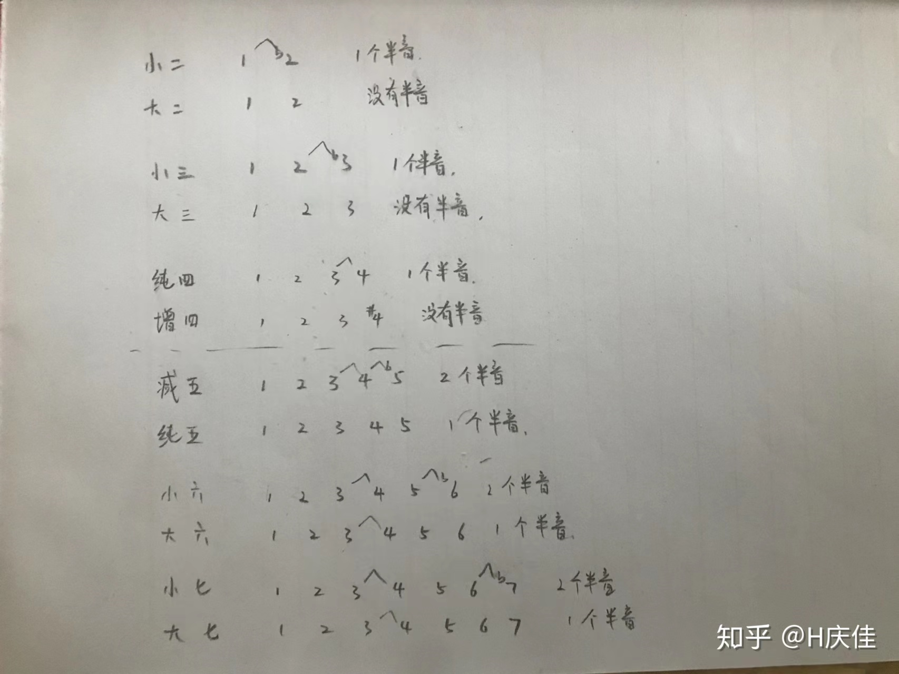
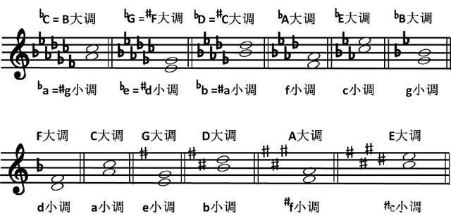

[TOC]

# 音程

# 流行曲和弦

我们总结了流行歌曲中最为常用的几类和弦，学会这些，完全可以应对日常伴奏或乐队排练啦！

大三和弦（major）
小三和弦（m）
大七和弦（M7）
小七和弦（m7）
属七和弦（7）
大六和弦（6）
挂四和弦（sus4）
增三和弦（aug）
减三和弦（dim）

这么多和弦！ 你都会弹吗？别急，送一张图给你！

有这么一张图是不是演奏和弦什么的就很简单了？

在开头谱子中，我要弹C调的话，第一个和弦是6m，6是什么？C往上数六个，A！我演奏Am和弦就好了！再也不用四处翻书找和弦了，想不起和弦怎么弹，对着这个图找一下就ok啦！

https://nicechord.com/circle/ wiwi官大为的五度圈

# 和弦构成
https://www.bilibili.com/video/BV1ot4y1S7jh/  神他妈乐理·和弦：和弦的构造、标识、功能与应用，以及一种不需要绝对

Songs with the same chords http://www.hooktheory.com/trends
…chords（英语）：n.和弦；和音；弦…
…Songs with the same chords：和弦相同的歌曲…
网站里收集了18238首各种风格的歌曲（或者乐曲）的和弦进行，

【神他妈乐理·和弦：和弦的构造、标识、功能与应用，以及一种不需要绝对音感的扒谱方法-哔哩哔哩】 https://b23.tv/605LxdU

https://zhuanlan.zhihu.com/p/346693351
五线谱和弦标记符号

# 和弦类型

三和弦 7是好听的，B开始3+3是难听的

C F G 开始 开心组 4+3 大三度，**大三和弦**

D E A开始 伤心组 基音3中音+4最高音  小三度，**小三和弦**

B D F 是两个小三度，整体六个半音(减五度/增四度)称为 **减三和弦**

音程（1458纯2367大）
自然音程。包括:纯一度、大小二度、大小三度、纯四度、增四度、纯五度、减五度、大小六度、大小七度、纯八度。

标识方法

|   名称   |       英文       |    字符    |
| -------- | --------------- | --------- |
| 大三和弦 | M               | Maj Major |
| 小三和弦 | m*              | min minor |
| 减三和弦 | dim* diminished | $\phi$    |

根音 CDEFGAB 123... I II III IV ... 

因此，所有三和弦的音都落在 当前调式 的所有音阶中的和弦可分级
**和弦的级数表示法**

C大调音阶

| 音名 |  C  |  D  |  E  |  F  |  G  |  A  |  B   |
| ---- | --- | --- | --- | --- | --- | --- | ---- |
| 和弦 | C   | Dm  | Em  | F   | G   | Am  | Bdim |
| 级数 | I   | II  | III | IV  | V   | VI  | VII  |

https://nicechord.com/circle/

# 和弦命名

# 和弦调式音阶

钢琴音阶的指法规律是什么？
https://zhuanlan.zhihu.com/p/65270852

大调和弦基本使用规则：一大、二小、三小、四大、五大、六小、七减

归类一下

Major和弦有：一、四、五

Minor和弦有：二、三、六

# 复杂和弦

# 和弦功能

# 常用套路
https://www.zhihu.com/answer/1056206150
吉他和弦8套路

其实所有的和弦进行都是有“套路”的，只不过“17654325”和“4536251”已经逐步被越来越多的人了解。

递归流《jay chou青花瓷》
4536251

4536251就是不停地搞V-I罢了。
第一个5换成7，你就会发现4-7是V-I，7-3是V-I，整个走向都是V-I

顺路流
卡农进行
15364125

15634145和1645

除了6415这个和弦走向，我们还经常见到如下和弦走向：1645、6451、6145、4156、4516、15614145等等。简单说，就是把这四个和弦颠过来倒过去使用，组成不同的和弦框架，用来写不同的作品。
 周杰伦和李宗盛是怎么把1645写得好听不俗气的？ - 哎呀君的文章 - 知乎
https://zhuanlan.zhihu.com/p/166688630

----------------------------------

现在最流行的和弦进行就是4536251、1645和15634125了。1645其实就是4536251的简化版，4536251后面的6251改一下就是1625，再改一下就是1645。这里就只讨论4536251和15634125为什么这样流行。https://www.zhihu.com/answer/1683754068

“4536251”的来源其实就是一个下行五度循环圈：“14736251”，所以在1=C时，和弦是这样的：FMaj7 - Bm7b5 - Em7 - Am7 - Dm7 - G7 - CMaj7。但是由于Bm7b5和弦在大调里不常用，所以使用它的顺阶和弦，G和弦。最终就变成FMaj7 - G7 - Em7 - Am7 - Dm7 - G7 - CMaj7。也就是 “4536251”了。

除了Locrian调式，自然大小调和中古调式的调性内1级和弦往往有稳定的感觉，5级和弦在这个调性上会有紧张感，4级和弦有倾向于5级的感觉。其他和弦都是作为这个“功能性”的角度上可以替换的东西，然后整首歌你就不断地推高紧张感再解决回稳定和弦就完了，本质跟电音拉无限微笑差不多。

--------------------------------

约翰帕赫贝尔的Canon in C和弦进行都是1-5-6-3-4-1-4-5，且一直重复。

一开始用主和弦为了明确调性。然后试着找一下他们的规律。

数学好的小伙伴应该发现了，1级到5级的根音往高升了纯五度，5级到6级的根音高了二度，6级到3级又高了纯五度，3级到4级又高了二度，然后4级到1级又高了纯五度，然后突然降了纯五度回到平4级，再升高两度到属和弦让其循环。

没错这就是传说中的古典和弦进行模式之一，通过一种规律进行循环的方式。

除此之外，你还可以一直通过五度循环得到（降）：1-4-7-3-6-2-5-1 很耳熟把？

因为7和弦不常用（五度是三全音），改成同样功能的5和弦，再改下位置，就有了“华老师”的“4536251”。（跑题了）

----------------------

1645，对应的和弦，C Am F G 几乎可以伴凑任何音乐，也可以随意编曲（作曲）。C（135）Am（613）F（461）,G(571)

在自然大调的顺阶和弦中。以C调为例。

分别是

1:C 2:Dm 3:Em 4:F 5:G 6:Am 7:Bdim

所以当我们说到所谓的1645或者4536251等之类的和弦级数时，默认236级为小三和弦，145为大三和弦。

那至于为啥236为小三，145为大三。

原因是大调的构成规则是全全半全全全半。

也就是1和2相差一个全音，2和3相差一个全音，3和4相差一个全音，以此类推，最终形成一个闭环。

很多优秀的华语唱作人，他们的歌曲A段基本都能17654325/6545/6415/15634145，B段都能4536251，但是你看他们实际所用的进行，是刻意避开万能进行，绝对是比较有特色，花了心思去构建的和声进行。

# 实战扒谱

