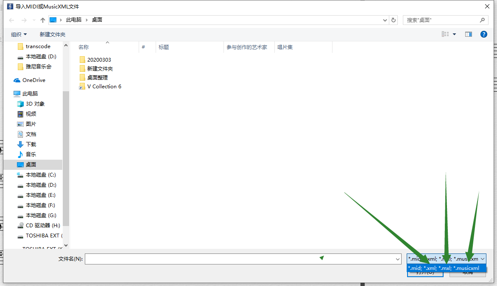

[TOC]

# 1. 简谱大师

视频教程

[https://www.everyonepiano.cn/Video-search/?word=%E7%AE%80%E8%B0%B1%E5%A4%A7%E5%B8%88&come=web](https://www.everyonepiano.cn/Video-search/?word=%E7%AE%80%E8%B0%B1%E5%A4%A7%E5%B8%88&come=web)

简谱还是感觉没五线谱多声部表达方便，https://www.everyonepiano.cn/Video-4646-%E4%BA%94%E7%BA%BF%E8%B0%B1%E8%BD%AC%E7%AE%80%E8%B0%B1-EOP%E7%AE%80%E8%B0%B1%E5%A4%A7%E5%B8%88%E4%BD%BF%E7%94%A8%E6%95%99%E7%A8%8B.html 五线谱自动转简谱overture

用EOP简谱大师在制谱时，发现只能录入单倚音和复倚音（有两个音的倚音），三个音以上的倚音就无法录入了，这就使有些乐曲(如 “少女的祈祷”)不能完整录入。不知有没有解决的方法？

第一种，可以简化一下，变成双倚音。第二种，用64分音符来代替制作。

有位用户用**简谱大师做了几首曲子的eopn谱子**，有时间想着上传一下。很希望能改进一下简谱大师：①一个是能改音的音高，因为在高音do的附近经常要变音高很麻烦；②加附点的时候，还需要点击音符再改，有点麻烦；③加小房子的时候不是很好用，目前研究出来是需要提前确定好房子里的小节数再添加，还不会编完谱之后再添加，希望能改进。还有一些不太会的，比如插音，我是用32分音符代替的，如果能有教程就太好了

程序菜单-帮助-视频教程，还有快捷键说明，都看一遍就知道了。1 选中音符，用上下方向控制八度，直接输入其他数字可以修改音符。2 选中音符，直接点键盘的"."键就可以增加附点。3 选中房子，ctrl+左右方向键控制房子长短。你说的插音不可以，因为简谱大师完全按时值来做的，插音很容易引起时值不对的，有错音，删掉后面的音符，重新输入一次就可以。

**群主教导：简谱大师做谱子，标注指法的，选中音符，右侧指法**

教程

https://www.everyonepiano.cn/Video-search/?word=简谱大师&come=web

eop软件，菜单，帮助，视频教程，第二个是指法，第13个是新手指导

讲究人，论坛注册很有灵魂，人工验证很强

论坛：
[教程文件下载http://bbs.everyonepiano.cn/thread-3565-1-1.html](http://bbs.everyonepiano.cn/thread-3565-1-1.html)

# 2. ovex

群友大大回答：

如果是下载琴谱，那就是流行钢琴网，.OVE是第四代版本的文件，OVEX是第五代版本的文件，五代可以兼容打开四代版本的，由于五代是后来升级出来的，在五代出来以前OVE四代就已经流传江湖二十年了，所以……现在网上大多数弹琴的论坛，乐谱都是适用于版本四的。专门下载OVEX的地方现在没有，估计以后也难有。但是下载OVE的地方就比较多，蝈蝈，虫虫，流行钢琴网，弹唱……好多论坛。

咦，有没有各种打谱软件转换成.ovex文件的方法？因为有必须使用这个格式的需求，打是可以，本着能懒就懒的想法。

ove5打开ove，再按保存，各种打谱软件换成OVEX那想想都不可能。

只是部分兼容的格式

嗯呐，都有什么常用能兼容的？

但是你可以把别的软件存成Music XLS的格式。那是几乎大部的制谱软件都通用的。

但是先告诉你，进去另一个软件里后，版式会发生变化。

那没事，必要的改动总比从头开始打省事儿

那个不是什么秘密，二十年前就有的格式，现在来说相对成熟了。

如果你要保存的是调效好的实际音乐音响和MIDI信息，最好用MIDI保存，但MIDI保存的东西，谱子不规范。

看下面显示出来的，那些就是通用的乐谱文件了，可以由多个不同软件产生出来，而且已经差不多二十年的软件格式，是经历住了时间检验的。

玩软件最先的就是要学会，拿到一个软件，我一般是在打开菜单跳出窗口来的时候，我就先查看一下能打开哪些格式，下面一般会列出来的。然后反过来又要看一下导入窗口里支持导入什么格式，心里有就数了。然后就是保存或是导出里面又能够导出些什么格式。了然于心就不用问了。里面有的当然是可以支持的，没有的，就不用去想了。

