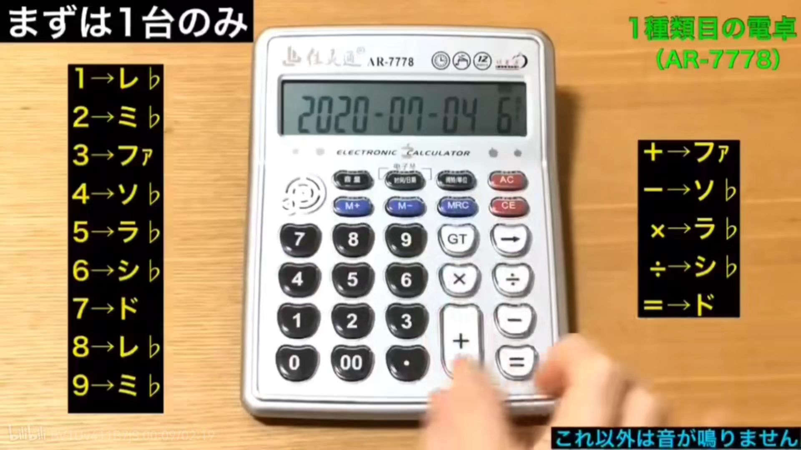
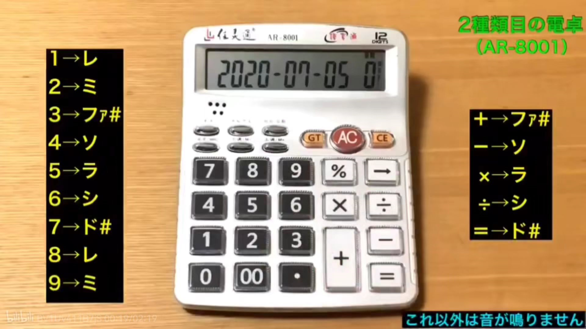

# 计算器音域

计算器音色分为A型 B型和半音

有什么音乐是计算器可以演奏的？ - 知乎
https://www.zhihu.com/question/23119228/answer/86579636

原推主：あたりめ（atarimae_400）
原推文：https://twitter.com/i/status/1277984579178004481

https://www.bilibili.com/read/cv6169644/ 正经科普

