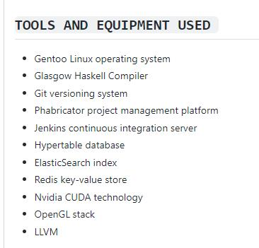

Open day & Share Day

https://space.bilibili.com/522222081 

# EMQ-映云科技
https://www.bilibili.com/video/BV19v411n7ww

本分享将使用 Haskell 来编写贪食蛇游戏的 live code, 在浏览器的网页里从空白开始展示如何一步一步实现一个贪食蛇小游戏。让大家学会一个简单但完整的函数式程序是如何来组织和设计的。

联系我们: 
官网: https://www.emqx.cn 
微博: https://weibo.com/emqtt 
Linkedin: https://www.linkedin.com/company/emqtech

映云社区

https://github.com/HaskellCNOrg/haskellcn/issues/104

英国外企招聘haskell技术员，位于成都天府软件园E6，待遇丰厚，工作氛围好。

