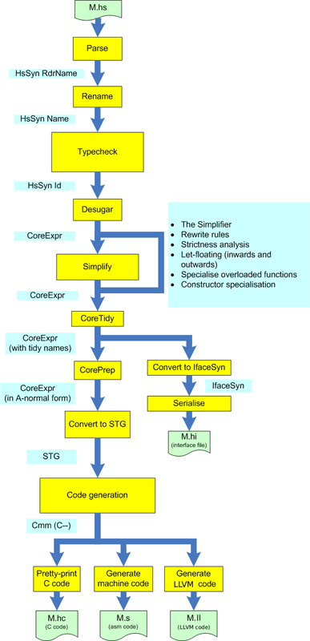

# GHC

http://www.aosabook.org/en/ghc.html

A history of Haskell  论文有讲到发展脉络渊源

 https://stackoverflow.com:/questions/35027952/why-is-haskell-ghc-so-darn-fast

 Haskell编译为C--（C的一个子集），然后通过本机代码生成器编译到汇编。 本机代码生成器通常生成比C编译器更快的代码，因为它可以应用普通C编译器无法实现的一些优化。

机器架构显然势在必行，粗略地基于图灵机。

这不是考虑它的好方法，特别是因为现代处理器将无序地并且可能同时评估指令。

实际上，Haskell甚至没有具体的评估顺序。

实际上，Haskell隐含地定义了评估顺序。

此外，您不必处理机器数据类型，而是始终生成代数数据类型。

如果您拥有足够先进的编译器，它们在许多情况下都是对应的。

你会认为动态创建函数并抛出它们会使程序变慢。

Haskell是编译的，因此高阶函数实际上并不是动态创建的。

它似乎优化了Haskell代码，你需要使它更优雅和抽象，而不是更像机器。

通常，使代码更“机器化”是在Haskell中获得更好性能的非生产性方法。 但是让它更抽象也不总是一个好主意。 什么是好主意是使用经过大量优化的常见数据结构和函数（例如链表）。

例如，f x = [x]和f = pure在Haskell中完全相同。 一个好的编译器在前一种情况下不会产生更好的性能。

为什么Haskell（使用GHC编译）如此之快，考虑到它的抽象性质和与物理机器的差异？

简短的回答是“因为它的设计就是为了做到这一点。” GHC使用无脊椎无标记g-machine（STG）。 你可以在这里阅读一篇关于它的论文（它非常复杂）。 GHC还做了很多其他事情，例如严格性分析和乐观评估。

我说C和其他命令式语言有点类似于图灵机的原因（但不是Haskell类似于Lambda微积分）是因为在命令式语言中，你有一个有限数量的状态（也就是行号）， 使用磁带（ram），以便状态和当前磁带确定如何对磁带执行操作。

那么混淆是否会导致代码变慢？ Haskell的懒惰实际上意味着可变性并不像你想象的那么重要，加上它的高级别，因此编译器可以应用许多优化。 因此，就地修改记录很少会比C等语言慢。

