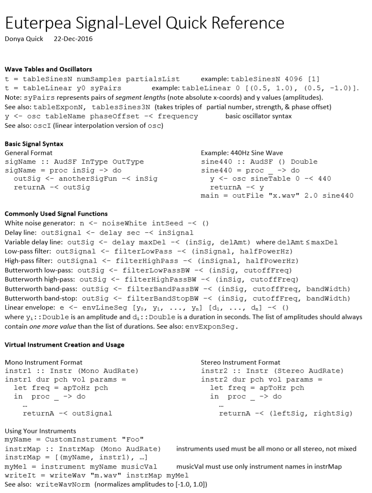

# 1. Euterpea


https://github.com/Euterpea/Euterpea


[本地Euterpea文件PPT代码等](file:///C:/Users/admin/Documents/Tridu33/Fountional_Programme_Haskell/music/Euterpea/)


[http://www.euterpea.com/](http://www.euterpea.com/)


[https://wiki.haskell.org/Applications\_and\_libraries/Music\_and\_sound](https://wiki.haskell.org/Applications_and_libraries/Music_and_sound)


[http://hackage.haskell.org/package/midi-music-box](http://hackage.haskell.org/package/midi-music-box)


[https://github.com/lfborjas/piano-pal](https://github.com/lfborjas/piano-pal)


[https://github.com/Caroisawesome/HSoM](https://github.com/Caroisawesome/HSoM)


`> import Euterpea `


```

Euterpea Signal-Level Quick Reference Donya Quick 22-Dec-2016 
 
Wave Tables and Oscillators t = tableSinesN numSamples partialsList example: tableSinesN 4096 [1] t = tableLinear y0 syPairs  example: tableLinear 0 [(0.5, 1.0), (0.5, -1.0)]. Note: syPairs represents pairs of segment lengths (note absolute x-coords) and y values (amplitudes).  See also: tableExponN, tablesSines3N (takes triples of partial number, strength, & phase offset) y <- osc tableName phaseOffset -< frequency  basic oscillator syntax See also: oscI (linear interpolation version of osc) 
 
Basic Signal Syntax General Format sigName :: AudSF InType OutType sigName = proc inSig -> do   outSig <- anotherSigFun -< inSig   returnA -< outSig 
 
Example: 440Hz Sine Wave sine440 :: AudSF () Double sine440 = proc _ -> do   y <- osc sineTable 0 -< 440   returnA -< y main = outFile "x.wav" 2.0 sine440
 
Commonly Used Signal Functions White noise generator: n <- noiseWhite intSeed -< () Delay line: outSignal <- delay sec -< inSignal  Variable delay line: outSig <- delay maxDel -< (inSig, delAmt) where delAmt ≤ maxDel Low-pass filter: outSignal <- filterLowPass -< (inSignal, halfPowerHz)  High-pass filter: outSignal <- filterHighPass -< (inSignal, halfPowerHz)  Butterworth low-pass: outSig <- filterLowPassBW -< (inSig, cutoffFreq)  Butterworth high-pass: outSig <- filterHighPassBW -< (inSig, cutoffFreq)  Butterworth band-pass: outSig <- filterBandPassBW -< (inSig, cutoffFreq, bandWidth)  Butterworth band-stop: outSig <- filterBandStopBW -< (inSig, cutoffFreq, bandWidth)  Linear envelope: e <- envLineSeg [y0, y1, ..., yn] [d1, ..., dn] -< ()  where yi::Double is an amplitude and di::Double is a duration in seconds. The list of amplitudes should always contain one more value than the list of durations. See also: envExponSeg. 
 
Virtual Instrument Creation and Usage 
 
Mono Instrument Format instr1 :: Instr (Mono AudRate) instr1 dur pch vol params =    let freq = apToHz pch    in  proc _ -> do     …     returnA -< outSignal 
 
Stereo Instrument Format instr2 :: Instr (Stereo AudRate) instr2 dur pch vol params =    let freq = apToHz pch    in  proc _ -> do     …     returnA -< (leftSig, rightSig)
Using Your Instruments myName = CustomInstrument "Foo" instrMap :: InstrMap (Mono AudRate) instruments used must be all mono or all stereo, not mixed instrMap = [(myName, instr1), …] myMel = instrument myName musicVal musicVal must use only instrument names in instrMap writeIt = writeWav "m.wav" instrMap myMel See also: writeWavNorm (normalizes amplitudes to [-1.0, 1.0]) 


```

[http://euterpea.com/examples/](http://euterpea.com/examples/)

[研究员X的网站http://www.donyaquick.com/](http://www.donyaquick.com/)
[https://github.com/donya](https://github.com/donya)


[付费书本https://www.cambridge.org/core/books/haskell-school-of-music/6B377BCD40386E9D27EB93FC2F3B13FB](https://www.cambridge.org/core/books/haskell-school-of-music/6B377BCD40386E9D27EB93FC2F3B13FB)

More examples: 
euterpea.com/examples/
❑Euterpea API and quick references: 
euterpea.com/api/
❑Other Tutorials 
euterpea.com/tutorials


# Examples

Last modified: Sep 23, 2018 @ 8:41 pm

## Getting Started

Once you have Euterpea and possibly HSoM installed, it’s a good idea to try some really simple things first. If you have any trouble with these, please take a look at the troubleshooting section at the bottom of the [download and installation page](http://euterpea.com/download-and-installation/).

**Play Some Notes**

-   Mac/Linux users: open your synthesizer! It must be running first to hear sound from Euterpea.
-   Open a command prompt or terminal and run ghci to start the Haskell interpreter.
-   Run `import Euterpea` and wait for all of the modules to load.
-   Run `play $ c 4 qn` and listen. You should hear a single tone.
-   Want more notes? Try this:  
    `play $ line [c 4 qn, c 4 qn, g 4 qn, g 4 qn, a 4 qn, a 4 qn, g 4 hn]`  
小星星
`play $ line [c 4 qn, c 4 qn, g 4 qn, g 4 qn, a 4 qn, a 4 qn, g 4 hn,f 4 qn,f 4 qn,e 4 qn,e 4 qn,d 4 qn,d 4qn,c 4 qn] 
`
    Recognize the melody?

**Notes from a Musical GUI (Requires the HSoM Library)**

-   Open a command prompt or terminal and start ghci as above. Mac/Linux users: make sure your synthesizer is open!
-   Run `import HSoM.Examples.MUIExamples2` and wait for all of the modules to load.
-   Run `bifurcate `   and wait for a window to pop up (it can take a few seconds to load fully). You should see a bunch of sliders an text fields with changing values, and you should hear notes periodically.
-   Move the sliders to hear some crazy stuff.

## Examples

A collection of supplemental code examples is [available on GitHub](https://github.com/Euterpea/Euterpea2-Examples). These are different from the examples covered in the [Haskell School of Music textbook](http://www.euterpea.com/haskell-school-of-music/). Download the examples here and try editing them to explore how the changes affect what you hear – experimentation is one of the best ways to learn a new library! You can also check out the [Examples folder of the HSoM library](https://github.com/Euterpea/HSoM/tree/master/HSoM/Examples), which contains all of the code examples from the textbook, but without the accompanying descriptions.

## Euterpea 2 Examples

The following supplemental examples can be [downloaded from GitHub](https://github.com/Euterpea/Euterpea2-Examples). Please note that these examples are not meant to fully replace the textbook or other basic tutorials on the Haskell programming language as a means of learning Haskell and Euterpea.

To run the source code in the examples below, you need to first save the source files (either .lhs or .hs) to your computer. Then, open a command prompt, PowerShell, or terminal, and cd to the directory where you saved the source files. Start the GHCi interpreter (run `ghci`) and then run `:load FileName.lhs` to load the file you want. You can then access any functions or values the file defines from within the interpreter. Windows users can also simply double-click the source file to open it with GHCi (as long as you haven’t altered the default “open with” settings for .lhs and .hs files).

- 笔记级示例：使用MIDI制作音乐。

SimpleMusic – Euterpea的Music数据类型的基本用法示例。

RandomMusic –显示如何制作随机数序列并在音乐上解释它们。

BlueLambda –仅用四行代码即可显示的一些有趣的音乐，以及一个自定义播放功能的示例。

-   **Note-level examples: making music with MIDI.**
    -   [SimpleMusic](https://github.com/Euterpea/Euterpea2-Examples/blob/master/NoteLevel/SimpleMusic.lhs) – examples of basic usage of Euterpea’s Music data type.
    -   [RandomMusic](https://github.com/Euterpea/Euterpea2-Examples/blob/master/NoteLevel/RandomMusic.lhs) – shows how to make sequences of random numbers and interpret them musically.
    -   [BlueLambda](https://github.com/Euterpea/Euterpea2-Examples/blob/master/NoteLevel/BlueLambda.lhs) – some interesting music in just four lines of code along with an example of a custom playback function.


- 信号级别的示例：将声音生成为WAV文件。

  

SineWaves –生成正弦波，并使用正弦波制作两个简单的乐器。

  

贝尔–使用Euterpea的信号处理框架构造一个贝尔乐器。


-   **Signal-level examples: generating sound as WAV files.**
    -   [SineWaves](https://github.com/Euterpea/Euterpea2-Examples/blob/master/SignalLevel/SineWaves.lhs) – generating a sine wave and making two simple instruments with sine waves.
    -   [Bell](https://github.com/Euterpea/Euterpea2-Examples/blob/master/SignalLevel/Bell.lhs) – constructing a bell instrument with Euterpea’s signal processing framework.


- 音乐用户界面（MUI）示例：交互式MIDI程序。

  

SimpleGUIs –使用UISF小部件的示例，它们是HSoM的MUI的基础。

其中许多不会产生声音，而只是在简单的设置中说明单个图形小部件的用法。

  

DrumMUI –小型鼓机MUI，允许用户选择要播放的几种模式和速度中的一种。

  

交互式随机音乐（需要MIDI输入）– JythonMusic程序的Haskell端口，用于生成交互式音乐。

实时获取来自MIDI控制器的输入，并将其用于生成新的音序。


-   **Musical User Interface (MUI) Examples: interactive MIDI programs.**
    -   [SimpleGUIs](https://github.com/Euterpea/Euterpea2-Examples/blob/master/MUI/SimpleGUIs.lhs) – examples of using UISF widgets, which are the foundation of HSoM’s MUIs. Many of these do not produce sound and just illustrate the usage of individual graphical widgets in a simple setting.
    -   [DrumMUI](https://github.com/Euterpea/Euterpea2-Examples/blob/master/MUI/DrumMUI.lhs) – a small drum machine MUI that allows the user to select one of several patterns to play and the tempo.
    -   [Interactive Stochastic Music](https://github.com/Euterpea/Euterpea2-Examples/blob/master/MUI/Interactive.lhs) (MIDI input required) – a Haskell port of a JythonMusic program for interactive music generation. Input from a MIDI controller is taken in real-time and used to generate new sequences.


音乐基本类型定义和基本函数       file:///C:/Users/admin/Documents/Tridu33/Fountional_Programme_Haskell/music/Euterpea/Euterpea_Music_Types.pdf


Tempo ,Transposition,Setting instruments
**Control:**
```haskell
data Control = 
    Tempo      Rational 
    | Transpose  AbsPitch
    | Instrument InstrumentName 
    | Phrase     [PhraseAttribute]
    | KeySig PitchClass Mode
    | Custom    String 
   deriving (Show, Eq, Ord)

```
Modifiers
file:///C:/Users/admin/Documents/Tridu33/Fountional_Programme_Haskell/music/Euterpea/Euterpea_Music_Modifiers.pdf


**Phase
Control 2
**
file:///C:/Users/admin/Documents/Tridu33/Fountional_Programme_Haskell/music/Euterpea/Phrase_Modifiers.pdf


## 1.1. Larger Programs

-   [HaskellOx](https://github.com/donya/HaskellOx) – a program that routs MIDI messages between devices and demonstrates two methods for implementing this functionality. The linked zip file includes both the source and a compiled executable for Windows. See the batch file for the best compilation method.一个在设备之间路由MIDI消息并演示实现此功能的两种方法的程序。
链接的zip文件包含Windows的源文件和编译的可执行文件。
请参阅批处理文件以获取最佳的编译方法。


## 1.2. Haskell Tutorials

The Haskell School of Music textbook offers a simultaneous introduction to the Haskell programming language and the Euterpea library. However, that’s not the only way to learn the language and library. You can follow some other online Haskell tutorials to familiarize yourself with the basic syntax of the language, then take a look at the [Euterpea API pages](http://www.euterpea.com/api/), and browse through the code in the Euterpea library itself (all of which is open source). Some useful online tutorials are linked to below.

-   Online tutorial: [Learn You a Haskell for Great Good!](http://learnyouahaskell.com/introduction)
-   Online tutorial: [How to Learn Haskell](https://acm.wustl.edu/functional/haskell.php)
-   PDF document: [A Gentle Introduction to Haskell](https://www.haskell.org/tutorial/haskell-98-tutorial.pdf)
-   PDF document: [Yet Another Haskell Tutorial](https://www.umiacs.umd.edu/~hal/docs/daume02yaht.pdf) (more detailed than the one above)


C:\Users\admin\Documents\Tridu33\Fountional_Programme_Haskell\music\Euterpea

没学会这个类型应该怎么写才能调通？


```haskell


> choose :: [a] -> StdGen -> (a, StdGen)
> choose [] g = error "Nothing to choose from!"
> choose xs g = 
>     let (i,g')= next g
>         in  (xs !! (i `mod` length xs),g')


> randomMel :: [AbsPitch] -> [Dur] -> 应该?这里是什么 -> StdGen -> Music (AbsPitch, Volume)
> randomMel pitches durs thresh g0 =     
>     let (p, g1) = choose pitches g0    -- pick the next pitch
>         (d, g2) = choose durs g1       -- pick the next duration
>         (v, g3) = randomR (0,127) g2   -- pick the next volume
>         x = if v < thresh then rest d  -- allow volume to dictate note vs. rest
>             else note d (p, v)
>         in  x :+: randomMel pitches durs thresh g3


> pitches1, pitches2 :: [AbsPitch]
> pitches1 = [60,62,63,65,67,68,70,72,74,75,77,79]
> pitches2 = [36,36,43,43,46,48] 

> mel1, mel2, duet :: Music (AbsPitch, Volume)
> mel1 = randomMel pitches1 [qn,en,en,en] 40 0 (mkStdGen 500)
> mel2 = randomMel pitches2 [hn,qn,qn,qn] 20 20 (mkStdGen 501)

> duet = tempo 1.75 (
>     instrument Vibraphone mel1 :=: 
>     instrument AcousticBass mel2)


```


```haskell

Simple examples with Euterpea's Music data structures

Donya Quick

Last modified: 22-July-2016

  

> module SimpleMusic where

> import Euterpea

  

This module gives examples of constructing small fragments

of music with Euterpea's Music data structures. At the end, 

there is also an example of pattern matching against these 

data structures.

  

First, we will start with several ways to build the same 

melody with different syntax and functions from Euterpea:

  

> mel1, mel2, mel3, mel4, mel5 :: Music Pitch

  

> mel1 = Prim (Note hn (C,4)) :+: Prim (Note hn (E,4)) :+:

>     Prim (Note hn (G,4)) :+: Prim (Note hn (C,5))

  

> mel2 = note qn (C,4) :+: note qn (E,4) :+: 

>     note qn (G,4) :+: note qn (C,5)

  

> mel3 = c 4 qn :+: e 4 qn :+: g 4 qn :+: c 5 qn

  

> mel4 = line \[c 4 qn, e 4 qn, g 4 qn, c 5 qn\]

  

> mel5 = line $ map ($qn) \[c 4, e 4, g 4, c 5\]

  

We can do similar things with chords:

  

> chord1, chord2, chord3, chord4, chord5 :: Music Pitch

  

> chord1 = Prim (Note hn (C,4)) :=: Prim (Note hn (E,4)) :=:

>     Prim (Note hn (G,4)) :=: Prim (Note hn (C,5))

  

> chord2 = note qn (C,4) :=: note qn (E,4) :=: 

>     note qn (G,4) :=: note qn (C,5)

  

> chord3 = c 4 qn :=: e 4 qn :=: g 4 qn :=: c 5 qn

  

> chord4 = chord \[c 4 qn, e 4 qn, g 4 qn, c 5 qn\]

  

> chord5 = chord $ map ($qn) \[c 4, e 4, g 4, c 5\] 

  
  

We can also mix the parallel and sequential operators

to create a mix of single notes and chords. When 

doing this, remember that parentheses can be important!

  

> combo1 = c 4 qn :+: e 4 qn :=: g 4 qn :+: c 5 qn

> combo2 = (c 4 qn :+: e 4 qn :=: g 4 qn) :+: c 5 qn -- same as above 

> combo3 = c 4 qn :+: (e 4 qn :=: (g 4 qn :+: (c 5 qn))) -- same as above 

> combo4 = c 4 qn :+: (e 4 qn :=: g 4 qn :+: c 5 qn) -- same as above

> combo5 = (c 4 qn :+: e 4 qn) :=: (g 4 qn :+: c 5 qn) -- different!

  
  

Now let's use some of the Modify constructors to change 

how a melody sounds. To work with dynamics, we will use

the type Music (Pitch,Volume). We can convert a Music Pitch

value to Music (Pitch,Volume) with addVolume.

  

> myMel1 = line \[c 4 en, c 4 en, g 4 en, g 4 en, a 4 en, a 4 en, g 4 qn\]

> myMel2 = Modify (Phrase \[Tmp $ Ritardando 0.5\]) myMel1

> myMel3 = Modify (Phrase \[Tmp $ Accelerando 0.5\]) myMel1

> myMel4 = Modify (Phrase \[Dyn $ Diminuendo 0.8\]) $ addVolume 100 myMel1

> myMel5 = Modify (Phrase \[Dyn $ Crescendo 2.0\]) $ addVolume 50 myMel1

> myMel6 = Modify (Tempo 2) myMel1

> myMel7 = Modify (Tempo 0.3) myMel1

  
  

Here is a pattern matching example with Music. This

function transposes a music value up an octave.

  

> octUp :: Music Pitch -> Music Pitch

> octUp (Prim (Note d (p,o))) = note d (p, o+1)

> octUp (Prim (Rest d)) = rest d

> octUp (m1 :+: m2) = octUp m1 :+: octUp m2

> octUp (m1 :=: m2) = octUp m1 :=: octUp m2

> octUp (Modify c m) = Modify c (octUp m)

  

You can try the following in GHCi:

  

play (octUp combo1)

play (octUp (octUp combo1))

  

Note that this is more than one way to accomplish

pattern matching over Music. For example, we could 

also separate handling of the inner constructor 

(Primitive) into another function:

  

> octUp' :: Music Pitch -> Music Pitch

> octUp' (m1 :+: m2) = octUp' m1 :+: octUp' m2

> octUp' (m1 :=: m2) = octUp' m1 :=: octUp' m2

> octUp' (Modify c m) = Modify c (octUp' m)

> octUp' (Prim p) = Prim (octUpP p) where

>     octUpP :: Primitive Pitch -> Primitive Pitch

>     octUpP (Note d (p,o)) = Note d (p, o+1)

>     octUpP x = x


-- zhu 


```


