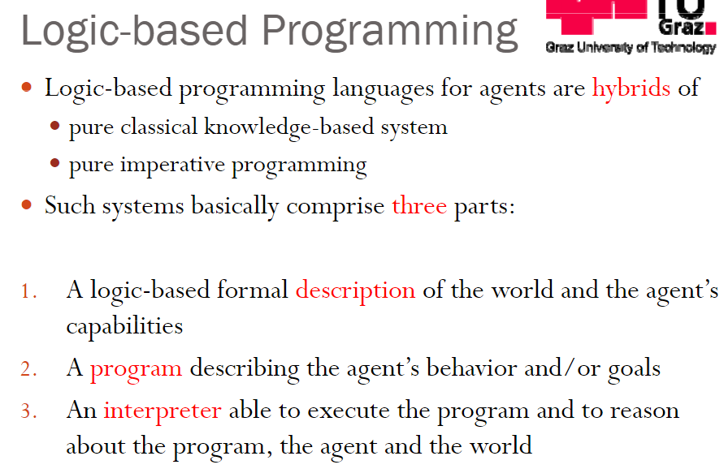

# 1. Py-Golog


Golog is an action language based on the situation calculus. There are many dialects of Golog


旧
Agent Programming with Golog in Python 
https://github.com/fferri/pygolog


# 2. Golog on prolog


python prolog


```
pip install pyswip
```

swiProlog

PySwip enables querying SWI-Prolog in your Python programs.

https://github.com/yuce/pyswip


-------------------------------------------------


Golog(alGolfor Logic) is based on the Situation Calculus，it is a program  language for dynamic systems

多大主页 Golog就是从plan规划问题到program的一种实现

[多伦多大学golog的prolog解析器s](http://www.cs.toronto.edu/cogrobo/main/systems/index.html)there exist(s) (a) **Prolog interpreter**(s) for Golog：


在这里，您可以找到该小组到目前为止开发的大多数系统。它们全部基于Prolog（通常是Eclipse，SWI，LPA和Quintus）。

- **Golog**：一种高级代理程序编程语言。

  在[此处](http://www.cs.toronto.edu/cogrobo/Systems/golog_swi.pl)可以找到SWI Prolog中的口译员。
  在[此处](http://www.cs.toronto.edu/cogrobo/Systems/gologinterpreter.pl)可以找到ECLIPSE Prolog中的口译员。
  与Golog相关的更多代码可以在Reiter的《*知识在行动：指定和实现动态系统的逻辑基础》*一书中找到。单击[此处](http://www.cs.toronto.edu/cogrobo/kia/)转到该书的主页。

- **ConGolog**：并发Golog。

  ConGolog将并发，中断和外来动作合并到Golog中。因此，它允许为生活在复杂场景中的代理设计更灵活的控制器。
  如果要获取相应的代码，请联系[YvesLespérance](http://www.cse.yorku.ca/~lesperan/)。

- **IndiGolog**：增量确定性（Con）Golog。

  IndiGolog是一种高级编程语言，其中的程序以递增方式执行，以允许交错的动作，计划，感测和外来事件。IndiGolog为必须对环境做出反应并不断从中收集新信息的真实机器人提供了一个实用的框架。为了进行规划，IndiGolog提供了一种具有一种称为搜索运算符的新语言构造的本地超前机制。

  最新的Indigolog可以从[此处的](https://bitbucket.org/ssardina/indigolog)Bitbucket git存储库中获得。您可以使用以下命令通过git克隆存储库：
  `git clone https://ssardina@bitbucket.org/ssardina/indigolog.git`

- **LeGolog**：**ConGolog中的**Lego MINDSTORM。

  LeGolog是Prolog中完整的代理架构实现，用于在Lego MINDSTORM机器人中运行IndiGolog高级程序。
  单击[此处](http://www.cs.toronto.edu/cogrobo/Legolog/index.html)转到特殊的LeGolog网页。

- **Planning with Loops**：基于情境演算的迭代计划器。

  单击[此处](http://www.cs.toronto.edu/cogrobo/Papers/planner.pdf)下载相应的论文《*带循环规划》*。
  单击[此处](http://www.cs.toronto.edu/cogrobo/Systems/Kplanner.tar.gz)以在Prolog中下载计划程序的实施。
  单击[此处](http://www.cs.toronto.edu/cogrobo/Systems/fsaplanner.tgz)下载规划器的较新版本。

在使用上面列出的任何系统之前，请仔细阅读免责声明


IndiGolog(Incremental Deterministic Golog) is a successor of Golog still based on Situation Calculus https://github.com/ssardina-agts/indigolog





[多伦多大学golog的prolog-swiprolog解析器文件地址](http://www.cs.toronto.edu/cogrobo/Systems/golog_swi.pl)

```prolog
%%%%%%%%%%%%%%%%%%%%%%%%%%%%%%%%%%%%%%%%%%%%%%%%%%%%%%%%%%%%%%%%%%%%%%%%
%
%                A GOLOG INTERPRETER IN SWI-PROLOG
%
%
% (Adapted from the ECLIPSE version by Sebastian Sardina)
%
%
%                             March 2000
%
% This software was developed by the Cognitive Robotics Group under the
% direction of Hector Levesque and Ray Reiter.  
%
%       Do not distribute without permission.
%       Include this notice in any copy made.
%
%
%        Copyright (c) 1992-1997 by The University of Toronto,
%                       Toronto, Ontario, Canada.
%
%                         All Rights Reserved
%
% Permission to use, copy, and modify, this software and its
% documentation for research purpose is hereby granted without fee,
% provided that the above copyright notice appears in all copies and
% that both the copyright notice and this permission notice appear in
% supporting documentation, and that the name of The University of
% Toronto not be used in advertising or publicity pertaining to
% distribution of the software without specific, written prior
% permission.  The University of Toronto makes no representations about
% the suitability of this software for any purpose.  It is provided "as
% is" without express or implied warranty.
%
% THE UNIVERSITY OF TORONTO DISCLAIMS ALL WARRANTIES WITH REGARD TO THIS
% SOFTWARE, INCLUDING ALL IMPLIED WARRANTIES OF MERCHANTABILITY AND
% FITNESS, IN NO EVENT SHALL THE UNIVERSITY OF TORONTO BE LIABLE FOR ANY
% SPECIAL, INDIRECT OR CONSEQUENTIAL DAMAGES OR ANY DAMAGES WHATSOEVER
% RESULTING FROM LOSS OF USE, DATA OR PROFITS, WHETHER IN AN ACTION OF
% CONTRACT, NEGLIGENCE OR OTHER TORTIOUS ACTION, ARISING OUT OF OR IN
% CONNECTION WITH THE USE OR PERFORMANCE OF THIS SOFTWARE.*/
%%%%%%%%%%%%%%%%%%%%%%%%%%%%%%%%%%%%%%%%%%%%%%%%%%%%%%%%%%%%%%%%%%%%%%%%
:- style_check(-discontiguous).
:- set_prolog_flag(optimise, true).


:- dynamic proc/2,
	   restoreSitArg/3.            /* Compiler directives. Be sure   */

:- op(800, xfy, [&]).   /* Conjunction */ 
:- op(850, xfy, [v]).   /* Disjunction */ 
:- op(870, xfy, [=>]).  /* Implication */
:- op(880,xfy, [<=>]).  /* Equivalence */
:- op(950, xfy, [:]).   /* Action sequence */
:- op(960, xfy, [#]).   /* Nondeterministic action choice */
 
do(E1 : E2,S,S1) :- do(E1,S,S2), do(E2,S2,S1).
do(?(P),S,S) :- holds(P,S).
do(E1 # E2,S,S1) :- do(E1,S,S1) ; do(E2,S,S1).
do(if(P,E1,E2),S,S1) :- do((?(P) : E1) # (?(-P) : E2),S,S1).
do(star(E),S,S1) :- S1 = S ; do(E : star(E),S,S1).
do(while(P,E),S,S1):- do(star(?(P) : E) : ?(-P),S,S1).
do(pi(V,E),S,S1) :- sub(V,_,E,E1), do(E1,S,S1).
do(E,S,S1) :- proc(E,E1), do(E1,S,S1).
do(E,S,do(E,S)) :- primitive_action(E), poss(E,S).

/* sub(Name,New,Term1,Term2): Term2 is Term1 with Name replaced by New. */

sub(_,_,T1,T2) :- var(T1), T2 = T1.
sub(X1,X2,T1,T2) :- \+ var(T1), T1 = X1, T2 = X2.
sub(X1,X2,T1,T2) :- \+ T1 = X1, T1 =..[F|L1], sub_list(X1,X2,L1,L2),
                    T2 =..[F|L2].
sub_list(_,_,[],[]).
sub_list(X1,X2,[T1|L1],[T2|L2]) :- sub(X1,X2,T1,T2), sub_list(X1,X2,L1,L2).

/* The holds predicate implements the revised Lloyd-Topor
   transformations on test conditions.  */

holds(P & Q,S) :- holds(P,S), holds(Q,S).
holds(P v Q,S) :- holds(P,S); holds(Q,S).
holds(P => Q,S) :- holds(-P v Q,S).
holds(P <=> Q,S) :- holds((P => Q) & (Q => P),S).
holds(-(-P),S) :- holds(P,S).
holds(-(P & Q),S) :- holds(-P v -Q,S).
holds(-(P v Q),S) :- holds(-P & -Q,S).
holds(-(P => Q),S) :- holds(-(-P v Q),S).
holds(-(P <=> Q),S) :- holds(-((P => Q) & (Q => P)),S).
holds(-all(V,P),S) :- holds(some(V,-P),S).
holds(-some(V,P),S) :- \+ holds(some(V,P),S).  /* Negation */
holds(-P,S) :- isAtom(P), \+ holds(P,S).     /* by failure */
holds(all(V,P),S) :- holds(-some(V,-P),S).
holds(some(V,P),S) :- sub(V,_,P,P1), holds(P1,S).

/* The following clause treats the holds predicate for non fluents, including
   Prolog system predicates. For this to work properly, the GOLOG programmer
   must provide, for all fluents, a clause giving the result of restoring
   situation arguments to situation-suppressed terms, for example:
         restoreSitArg(ontable(X),S,ontable(X,S)).             */

holds(A,S) :- restoreSitArg(A,S,F), F ;
              \+ restoreSitArg(A,S,F), isAtom(A), A.

isAtom(A) :- \+ (A = -W ; A = (W1 & W2) ; A = (W1 => W2) ;
    A = (W1 <=> W2) ; A = (W1 v W2) ; A = some(X,W) ; A = all(X,W)).

%restoreSitArg(poss(A),S,poss(A,S)).

%%%%%%%%%%%%%%%%%%%%%%%%%%%%%%%%%%%%%%%%%%%%%%%%%%%%%%%%%%%%%%%%%%%%%%%%
% EOF: golog_swi.pl
%%%%%%%%%%%%%%%%%%%%%%%%%%%%%%%%%%%%%%%%%%%%%%%%%%%%%%%%%%%%%%%%%%%%%%%%
```

-------------------------


[https://www.sciencedirect.com/science/article/pii/S0743106696001215](https://www.sciencedirect.com/science/article/pii/S0743106696001215)

IndiGolog: A High-Level Sebastian Sardina:  **IndiGolog**: A High-Level Programming Language for Embedded Reasoning Agents, Multi-Agent Programming,  Springer, 2009.Agents, MultiAgent Programming,  Springer, 2009

用在机器人上An    Integral    Mobile    Rob of Platformfor    Research    and    Experiments    in the    Field    of    Intelligent    Autonomous Systems 