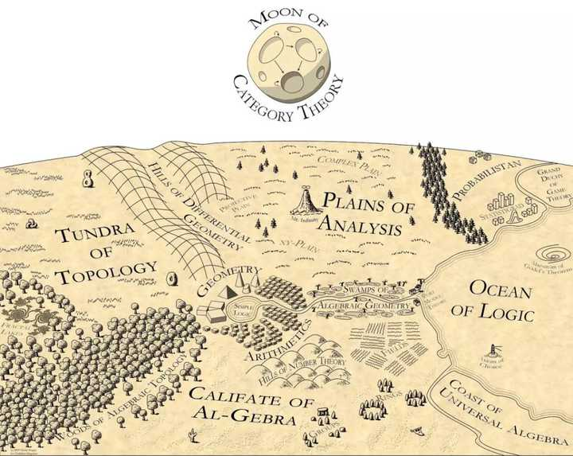

视频教程

https://www.bilibili.com/video/BV1TD4y1Q7r1

教授的这门课的讲义：https://bartoszmilewski.com/2014/10/28/category-theory-for-programmers-the-preface/

作者博客文章集。https://bartoszmilewski.com/2014/10/28/category-theory-for-programmers-the-preface/
GitHub上的pdf资源。https://github.com/hmemcpy/milewski-ctfp-pdf/

https://www.youtube.com/playlist?list=PLbgaMIhjbmEnaH_LTkxLI7FMa2HsnawM_

目录 https://github.com/wenhan-wu/OpenCourseCatalog

链接 https://www.youtube.com/playlist?list=PLbgaMIhjbmEnaH_LTkxLI7FMa2HsnawM_

怎样学范畴论？ - Martin awodey的回答 - 知乎
https://www.zhihu.com/question/20448295/answer/59985497

范畴论简史 - 狼道的文章 - 知乎
https://zhuanlan.zhihu.com/p/108528537

https://www.math3ma.com/ blog很牛  https://www.math3ma.com/categories/category-theory

# 1. 范畴学

有哪些经典的范畴论入门书籍可以推荐？ - 甄景贤的回答 - 知乎
https://www.zhihu.com/question/46755171/answer/503176144

https://www.overleaf.com/project/60c6f3a48ae73da176068417
范畴论笔记

说入门，最好的当然是「中学生也能看懂的」《Conceptual Mathematics》，作者之一是 Lawvere，此人将范畴论变成数理逻辑的基础功不可没

我是研究人工智能逻辑方面的

Goldblatt 的《Topoi》也算是易懂的（很多部分），但也有难懂的地方

《Categorical logic and type theory》重点在 fibration

Thomas Streicher 的 notes 《Introduction to category theory and categorical logic》在网上可以下载，假设你已经掌握了一些范畴论，则 logic 那部份很有用，很精简

Crole 《Categories for types》明白 type theory 和 cat 之间的最好教科书

《Sets for mathematics》作者之一也是 Lawvere，这本书有讲及他的 "quantifiers are adjoints" 理论，亦即 ∀ 和 ∃，我费了很多时间才弄懂，迟些会将我的笔记和图发在知乎上。

其他还有很多名字像 "introduction to category theory" 那样的书，在网上可以找到很多本。 互相参考也就行了。

PS： 最近看过一本《Axiomatic method and category theory》，比较哲学性的，但有讲及 homotopy type theory，我觉得颇有趣。

有哪些经典的范畴论入门书籍可以推荐？ - rainoftime的回答 - 知乎
https://www.zhihu.com/question/46755171/answer/102831676

《Category Theory》Steve Awodey
《Category Theory A Gentle Introduction》 Peter Smith
《Category Theory for Computing Science》Michael Barr Charles Wells

Mac Lane的Categories for the Working Mathematician不推荐（需一定基础）；
Benjamin Pirece那本也不推荐，可作为CS向的补充读物（了解相关应用）。

"没有代数的模型论就是无源之水", 范畴论同理。有线性代数，抽象代数，拓扑，微分流形等基础对范畴论学习都有帮助。
CS的角度或许有所不同，譬如一条学(ru)习(ken)路径：Haskell/ML/LISP [公式][公式] calculus... [公式]Type Theory, Denotational Semantic,.. [公式] Logic, Algebraic Logic,... [公式] Categorical Logic..
其实往往没那么多步骤，另一个可能性更大：Haskell [公式] Category theory......

林教授在bilibli 有系列视频

职业数学家在民间

如何自学范畴论？ - jRONI的回答 - 知乎
https://www.zhihu.com/question/36548330/answer/889186211

怎样学范畴论？ - 返朴的回答 - 知乎
https://www.zhihu.com/question/20448295/answer/883920534

这条共同的线索贯穿了整个地图，将各领域统一到一起。范畴论将这种统一形式化了。更具体地说，范畴是一组对象及其关系的集合，这些对象之间的关系（称为态射，morphisms）在组合（composition ）和结合性（associativity）方面表现良好。这样就为数学提供了一个模板，将不同内容输入模板，就能重建一个数学领域：集合范畴由集合和它们之间的关系（映射）组成；群范畴由群和它们之间的关系（群同态）组成；拓扑空间范畴由拓扑空间和它们之间的关系（连续映射）组成；等等。

巴里·马祖尔（Barry Mazur）写了一篇精彩的非专业性文章介绍范畴论，《什么时候一样东西等于另一样东西？》，范畴和模板的类比就是在这篇文章中提出来的。他在文中写道：“范畴的概念是万能的......几乎没有哪种数学对象不适合这个方便并且经常能带来启发的模板。” 事实上，正如范畴论专家尤金妮娅·程（Eugenia Cheng）在她的论文《高维范畴论》中所指出的，“范畴论是数学的数学。”

物理学工作者怎么学范畴论（张量范畴）？ - 也疏寒的回答 - 知乎
https://www.zhihu.com/question/263675003/answer/634380831

