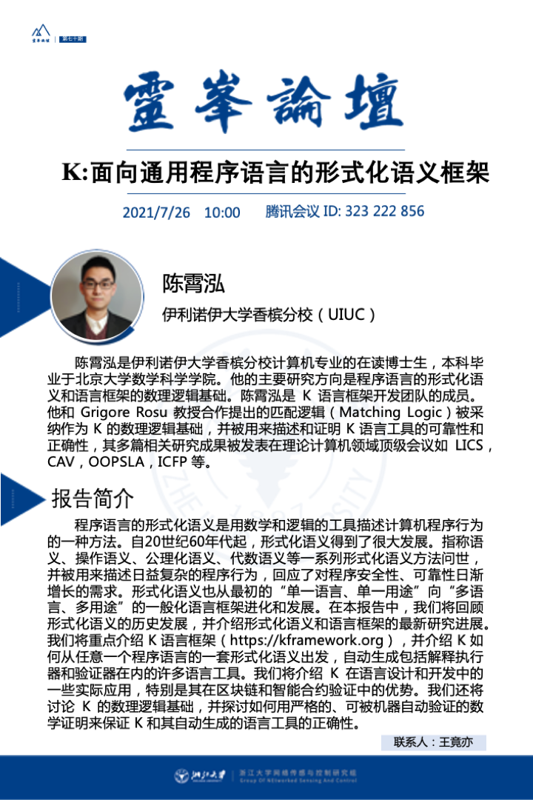

https://kframework.org/k-distribution/pl-tutorial/

在这里，您将学习如何使用 K 工具通过一系列截屏电影来定义语言。建议按照指定的顺序执行这些操作，因为在之前的语言定义中已经讨论过的 K 特性可能不会在后面的定义中重新讨论。截屏视频与 K 工具发行版中教程文件夹下的文件结构非常相似。如果您更愿意按照那里的说明自行完成教程练习，请返回https://kframework.org并下载 K 工具（如果您还没有这样做）。或者，您可以先观看下面的截屏视频，然后进行练习，或者同时进行。

https://kframework.org/

十分钟的概述视频幻灯片演示。
一个 90 分钟的教程视频，在 ETAPS'16 上提供。
[可选]关于基于重写的语义的高级采访（Wolfram Schulte 在ICSE'11采访了 Grigore Rosu 。
常问问题

https://github.com/kframework/k/releases/tag/v5.1.94

https://github.com/kframework 主题仓库s

# K语言框架_面向通用程序语言的形式化语义

http://kframework.org

