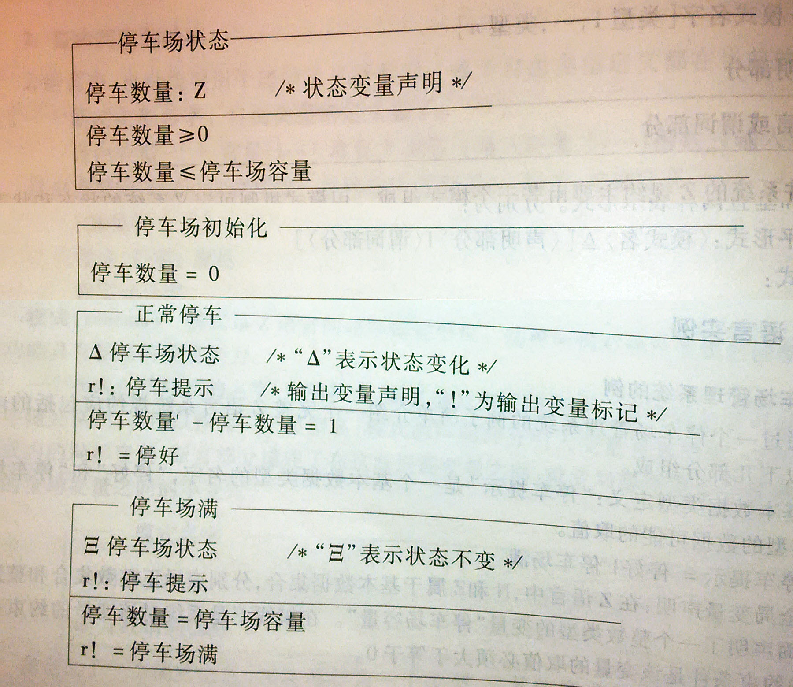

# Z语言

Z语言是由牛津大学程序设计研究小组开发的一种形式语言，它是一种以一阶谓词演算为主要理论基础的规约语言，是一种功能性语言。Z语言是将事物的状态和行为用数学符号形式化表达的语言，为编写计算机程序和验证计算机程序的正确性提供依据，是软件工程中编码之前的规格说明语言。

形式化描述语言Z指的是著名数学家Zermelo，它是目前使用最广泛的一种形式化描述语言，在软件产业的一些大型项目中已经获得成功的应用，Z以带等词的一阶谓词逻辑ZF（Zermelo-Fraenkel，蔡梅罗-弗兰科尔）公理集合论为主要数学基础。在Z中有两种语言：数学语言和模式（Schema）语言。数学语言用来描述系统的各种特征：对象及其之间的关系。模式语言是一种半图形化的语言，它用来构造、组织形式化说明的描述、整理、封装信息块并对其命名以便可以重用这些信息块。通常，形式化说明的可读性都不太好，但由于Z采用半图形化的模式语言，能用一种比较直观、有条理的方式来表达形式化说明，这就改善了可读性。
或许这些高深的解释你不懂，反正我不怎么懂，大家看看实例应该就明白一些了，看下图：

Ｚ以经典集合论和一阶谓词逻辑为基础，提供了一种称为模式的结构，以此来描述一个规格说明的
状态空间和操作。Ｚ规格说明由一系列模式组成，每个模式定义一个抽象对象或操作，并用谓词判定描
述给出新的对象或操作的语义约束。Ｚ模式说明可以组合成新的Ｚ模式，新的Ｚ模式继承其成分模式的
一切属性和约束。这样，软件系统的Ｚ模式规格说明可以按一定的层次结构给出。模式的使用为规格说
明提供了一种演算，通过这种演算，无论多么大型系统的规格说明都可以通过一个个小的部分来构成。 
基于一阶谓词和集合论的形式规格说明语言Ｚ，利用模式和模式演算对目标软件系统的结构和行为特征
进行抽象描述，其中状态模式对目标软件系统的结构特征进行抽象描述，操作模式对目标软件系统的行
为特征进行抽象描述。这是一种具有特色的有效的形式化方法，

但是Ｚ语言还存在如下缺点：

⑴ Ｚ语
言对大型系统的模块化能力不足。因为在Z语言中，目标软件系统的结构和特征都用模式来描述，随着
系统的增大，模式也会越来越多，而Ｚ语言中没有更加有效的机制来管理这些模式，最终导致Ｚ规格说
明难以阅读。 

⑵ 难以识别影响某一状态模式的所有操作模式。因为在Ｚ语言中，一个操作模式可能涉
及多个状态模式，为了确定能影响特定状态模式的所有操作模式，就需要逐个检查全部操作模式的声明
部分，这对于大型软件系统的规格说明来说是不实际的。

⑶ 不能支持规格说明的重用。Ｚ语言中没有
提供重用机制。

⑷ Ｚ语言难以由计算机直接处理。因为在设计Ｚ语言时，只是考虑到把Ｚ语言作为一
种严格的描述手段并没有考虑到将来由计算机辅助进行Ｚ语言应用，所以许多Ｚ语言符号在计算机中没
有对应的键，难以进行规格说明的输入和自动化处理。 

为了克服Ｚ语言这些缺陷，８０年代末到９０年代初相继提出了一些Ｚ语言的扩展方案，也进行了一些标准化工作，国际上在９０年代初提出形式化
方法和面向对象方法相结合的思想，虽然有所发展，但因缺少商品化的工具支持等到诸多原因，而不能
大量的实际应用，因而还需进一步完善。

