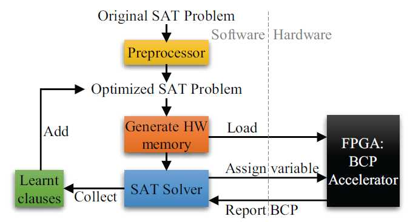

http://www.it.uu.se/research/group/astra/CPmeetsCAV/slides/piskac.pdf Limitations of SMT solvers

SMT solvers = tools for efficiently checking satisfiabilityof formulas.
Although very powerful tools, there are limitations:

Lack of decision procedures

Handling of quantifiers

The requirements for the Nelson-Oppencombination are too restrictive

Presented a new combination technique for theories sharing sets by reduction to a common shared theory:

Resulting theory is useful for automated verification of complex properties of data structure implementations

什么是 SMT (satisfiability modulo theories)？ - rgb的回答 - 知乎
https://www.zhihu.com/question/29586582/answer/1272167652
我理解的SMT就是在SAT的基础上，增加了一些一阶理论的内容。

首先明确SMT和SAT的概念，SAT是指命题逻辑公式可满足性判定问题，而SMT是指另外一类公式的可满足性判定问题。这一类公式具有两个特点：

在命题逻辑公式里面混入了一些一阶逻辑表达式；
具有任意的布尔结构。

可以说SMT的公式具有任意的抽象布尔结构，不关心atom的语义由什么构成（在命题逻辑中由变量构成，在一阶逻辑中由变量函数谓词构成），只关心逻辑连接词是什么，这样得到的B(F)就是对F的抽象，也可以理解为宏观的布尔结构。

因为SMT是由SAT+一阶理论构成，所以SMT的求解办法就是综合了SAT solver和Theory solver（默认它们俩都有自动求解工具），二者互相配合，共同求解。上面那个公式的求解过程跟题主的问题已经不相关了，直接贴个图在下面，不再赘述。

https://www.coursera.org/learn/automated-reasoning-sat
慕课在本课程中，您将学习如何应用可满足性（SAT / SMT）工具来解决各种问题。

给出了几个基本的示例来使应用程序具有风格：拟合用于打印海报的矩形，计划问题，解决难题和程序正确性。还提出了基础理论：解决方案是命题可满足性的基本方法，CDCL框架可用于大型公式的扩展，以及单纯形法可用于处理线性不等式。

轻量级学习本课程的方法只是看讲座，并做相应的测验。要使该主题具有风味，可以很好地解决这一问题。但是，更有趣的方法是以此为基础，自己将SAT / SMT应用于一些问题，例如，在荣誉任务中提出的问题。

# 1. SMT

满意度模理论教程  https://link.springer.com/chapter/10.1007/978-3-540-73368-3_5

https://en.wikipedia.org/wiki/Satisfiability_modulo_theories

An Introduction to Satisfiability Modulo Theories

http://user.it.uu.se/~pierref/courses/AD3/slides/SMT1.pdf

More lecture slides:

●http://ssa-school-2016.it.uu.se/

●http://www.sc-square.org/CSA/school/

●http://ssa-school-2018.cs.manchester.ac.uk/

-----------------------------------

## 1.1. 数据结构预算法

形式化方法的研究进展与趋势 https://dl.ccf.org.cn/books/detail.html?_ack=1&id=4138192862726144

人工智能系统的形式化发展与趋势 https://dl.ccf.org.cn/books/detail.html?_ack=4&id=5161520744974336

自动推理

SMT-lib[^SMT-LIB]有相关数据结构数理形式化研究进展。

在理论计算机科学和人工智能领域中，逻辑公式的可满足性问题一直是一个重要的 问题。世界各国学者在这方面做了大量研究工作，特别是在命题逻辑的可满足性问题 (SAT) 上取得了很大进展。SAT是命题逻辑推理中的一个经典的判定问题，也是第一个 被证明为N P难的问题，一直备受关注。但是随着研究的深人，人们发现SAT的表达能 力和应用范围有很大的局限性。因此，SMT近年来开始引起人们的极大兴趣。S M T的研 究对象是各种领域知识的逻辑组合，经常表达为带等词的一阶逻辑公式[5°]。与SAT判断 布尔公式的可满足性不同，SMT判断的是理论组合的可满足性，它的抽象层次更高，表 达能力也更强。它可以看作是对SAT的扩展，将SAT中的某些布尔变量用理论谓词取 代。例如，x+2=yV x=/(y-x+l) 是S M T的一个实例，它包含了两个理论：线性算 术、未解释函数。如果用布尔变量P1表示线性理论上的谓词x+2 =y，P2 表示包含未解 释函数的等式x=/(y-x+l),则此SMT公式将变为一个命题逻辑公式P1VP2。SMT涉 及的理论是一些数学理论和计算机领域内用到的数据结构理论，包括差分逻辑 (differencelogic)、线性算术理论（lineararithmetic, 包括线性实数算术（LRA) 和线性 整数算术（LIA))、位 向 量（bitvector)、数 组 （array)、未解释的函数（uninterpreted function) 等[51]。随着SMT应用范围的扩展，新的理论也被不断地加人，例如近年来兴 起的集合理论。为了表达方便，自动推理领域使用记号SMT(T) 来表示理论T上的SMT 公式，如线性实数算术理论上的SMT公式记为SMT(LRA)，位向量上的SMT公式记为 SMT(BV) 等

对SMT求解的研究不但是自动推理、约束求解领域主流国际会议IJCAR/CADE、CP 和SAT的主题之一，在验证和分析领域的著名国际会议CAV、TACAS上也是非常受关注 的议题。SMT也受到产业界的高度关注。微软、Intel、Cadence、NEC等公司的研究院或 实验室都在开展与SMT相关的研究项目。自2005年以来，自动推理学界每年都举办SMT 求解器比赛（SMT-C0MP)[52], 以促进研究者不断改进SMT求解器的性能。目前，比较 有代表性的SMT工具包括美国爱荷华大学的CVC4[53]、SRIInternational的Yices[54]、微 软的Z3[55]等，它们被集成于多个研究领域的自动工具之中，如高阶逻辑的交互式理论证 明器HOL、Isabelle、ACI2 , 模型检测工具BLAST、MAGIC, 程序分析工具KLEE等。

SMT是理论谓词的逻辑组合，其可满足性涉及两个层面：命题逻辑层次与理论层次。 根据如何处理这两个层面上的可满足性，SMT求解的主流算法经历了从积极（eager) 类 算法到惰性（lazy) 类算法的演变。

SAT求解技术取得的重大进步推动了积极算法的发展，积极算法是早期的SMT求解 器采用的算法，也称为Mt-blastmg。它是将SMT公式转换成可满足性等价的命题逻辑公 式，一般为CNF形式，然后用SAT求解器求解。这种方法的好处是可以采用高效的SAT 求解器，同时它的求解效率也依赖于SAT求解器的效率。对于不同的理论，积极算法需 要用不同的转换方法和改进方法以提高转换和求解的效率。例如，对于EUF—般用per- constraint编码，对于D L通常用small-domain编码等。积极算法的正确性依赖于编码的正确性和SAT求解器的正确性，而且对于一些大的例子来说，编码成CNF公式很容易引起 组合爆炸，也就是公式的长度指数级增长，因此这类方法在实际应用中效果不是很好， 一般解决不了规模较大的工业界实例。但由于位向量理论上的SMT公 式 （SMT(BV)) 与命题逻辑公式较为相似，因此bit-blasting仍为求解SMT(BV) 的主要算法。

惰性算法是目前主流的SMT求解方法，也是当前研究最多的算法。这种算法框架被 称为DPLL(T) 算法[56]。其基本思路是：将DPLL风格的SAT判定过程与特定理论的求 解 器 （T-s〇lver) 紧密结合，基于DPLL的SAT求解器负责命题逻辑部分的推理，得到对 布尔变量的（部分）赋值，而理论求解器负责判断SAT求解器得到的赋值一 理论谓词 的合取的可行性。这里，DPLL(T) 中的T代表理论。如果T是线性算术理论，T-solver 可以是Simplex算法或它的变种。

DPLL(T) 这一名称的含义是，这是一个集成了 DPLL 算法的框架，可以结合不同理论及其判定过程而实例化。早先的DPLL(T) 算法是将SAT 求解器（DPLL部分）当作黑盒，理论求解器检查模型的一致性要等到DPLL算法给出一 个解之后才进行，这种方法的缺点是理论求解器很少参与DPLL的求解过程。后来出现 了 online方法对其做了改进，使得理论求解器参与DPLL, 从而提高了求解效率。这些改 进主要有理论预处理、选择分支、理论推导、理论冲突分析和引理学习等。为了 DPLL 求解与理论求解更为有效地结合，理论判定过程一般要设计为增量式的（incremental) 和可回溯的（backtrackable )。DPLL(T) 算法是完备求解算法。为了对DPLL(T) 的求解能力形成补充，近年来， 研究人员开始尝试用非完备算法求解SMT。Friihlich等人针对位向量理论上的SMT公式 (SMT(BV))，提出了在理论层面设计局部搜索算法，将SAT的局部搜索算法中的一些先 进技术提升到理论层面上[57]。Niemetz等人进一步将位向量上的推理机制与局部搜索算 法相结合[58@ ]，从而大幅提高了局部搜索的效果。特别是当将局部搜索与基于Wt- blasting的完备算法混合使用时，对很多SMT(BV) 实例的求解可以加速1 ~3个数量级。 但位向量是比较接近于SAT的理论，在算术理论等其他理论上如何设计局部搜索算法仍 是一个具有挑战性的问题。除了局部搜索之外，研究人员也尝试了其他新颖的非完备算 法来求解SMT问题。在线性整数理论方面，Brombergei•等人提出了用空间超立方体探测 SMT(LIA) 公式解空间内部的方法，该方法适用于含整数解数目众多的SMT(LIA) 公 式，对于SMT-LIB中部分公式的求解速度比目前的SMT求解器快了几个数量级[6°]。在 浮点数理论方面，Fu等人将SMT转成一个无约束的优化问题，然后用蒙特卡罗马尔可夫 链 （MCMC) 的方法求解，在一些实例上获得了比Z3 等SMT求解器快700倍以上的 效果[61]

## 1.2. SMT solvers
作者：rainoftime
链接：https://www.zhihu.com/question/65438076/answer/233925406

首先，各人的背景、需求不同，这种问题很难有大而全的回答。。下面只针对“深刻理解求解原理，跟进一些最新成果“，给一点小建议。。。说明一下，这里不考虑3-SAT，＃SAT，MaxSAT，"SMT-opt"(SMT + 最优化）, "SMT-ind"（SMT with inducetive pred)，"SMT-CLP"(SMT + constraint logic programming)等变种/扩展。。

SAT：当前最主流、成功的架构是CDCL（Conflicit-Driven Lemma-Learning)，之所以说“架构“，是因为它本质上还是基于DPLL(Davis-Putnan-Logemann-Loveland)算法，只是加了一些lemma learning, restarting, phase selection等策略，和很多简化算法（如hidden tautology elimination, bloked clause elimination)。个人建议是好好花时间阅读、理解Minisat的代码。当前相当大一部分SAT引擎都是基于Minisat的。SMT：SMT求解器可能包涵各种theory如real, integer, bit-vector,等等。为了求解不同theory，可能涉及特定算法如线性规划、高斯消元等；但是这些thery的求解基本都有会SAT solver参与。

SAT solver是怎么参与的呢？大体分为“lazy approach“和“eager approach"两类（此处略去 xx 字）..如果想通过动手实现加深理解，对于“lazy aproach“，简单点的可以考虑EUF(theory of equality with uninterpreted function)或DL(difference arithmetic)...

在SAT Solver的基础之上，构建了SMT Solver，用的算法是DPLL(T)，里面的这个T是指Theories。不同的Theories对应不同的方法去实现。比如:

uninterpreted function: 借助DAG;

linear arithmetic: 高斯消元法；

different logic: Bellman-Ford算法;

Bit-vector: BLAST算法;

Arrays: McCarthy;

然后一个问题就是，如果出现多个Theories混用的话怎么办。处理的方法用的比较普遍的是Nelson-Oppen方法。

SMT-Comp: annual SMT-Solver competition

http://www.smtcomp.org 国际满意度模理论竞赛（SMT-COMP 2021） 

 

## 1.3. SMT Solvers: 
http://www.satcompetition.org/
The International SAT Competition Web Page 竞赛汇总网站

竞赛的目的是确定新的具有挑战性的 基准，并推广 针对命题可满足性问题（SAT）的新求解器，并将它们与最新的求解器进行比较。我们强烈鼓励人们在他们的领域（计划，硬件或软件验证等）中考虑基于SAT的技术，以提交用于比赛的基准。竞争的结果将很好地表明这种方法的当前可行性。比赛将使用SAT-Ex 系统完全自动化

https://sat-smt.in/

Theory and ImplementationSummer School on Logic and Theorem Proving
https://leodemoura.github.io/files/oregon08.pdf

 

这里有一个bench比较讨论，z3和yices萝卜青菜，微软背书z3 https://lemire.me/blog/2020/11/08/benchmarking-theorem-provers-for-programming-tasks-yices-vs-z3/

讨论各种SMT solver求解能力问题集的文章 https://spreadsheets.ist.tugraz.at/wp-content/uploads/sites/3/2015/06/DS_Hoefler.pdf

●Princess

http://logicrunch.it.uu.se:4096/~wv/princess/
Princess 是由乌普萨拉大学开发和维护的定理证明者。
Princess接受其自身格式，SMT-LIB格式或TPTP的输入。
它可选地使用OSTRICH 来解决使用新SMT-LIB字符串理论的子集的超集编写的字符串约束。

《Problem Solving for the 21st Century  Efficient Solvers for Satisfiability Modulo Theories》报告中写道   http://theory.stanford.edu/~barrett/pubs/BKM14.pdf

- 软件名Alt-Ergo

软件网站
alt-ergo.ocamlpro.com

Supported theories:uninterpreted functions, linear integer and real arithmetic, nonlinear arithmetic, polymorphic arrays,bit-vectors, records, enumerated datatypes, ACsymbols, quantifiers

- Barcelogic

www.lsi.upc.edu/oliveras/bclt-main.html

Supported theories:uninterpreted functions, integer and real difference logic, linear integer and real arithmetic

- Boolector
都说这个做布尔向量专业点

fmv.jku.at/boolector

Supported theories:arrays, bit-vectors

- CVC4

cvc4.cs.nyu.edu

https://cvc4.github.io/app 

CVC4

Supported theories:uninterpreted functions, integer and real difference logic, linear integer and real arithmetic, arrays,bit-vectors, datatypes, strings, quantifiers

- MathSAT

mathsat.fbk.eu

Supported theories:uninterpreted functions, integer and real difference logic, linear integer and real arithmetic, arrays,bit-vectors, floating point arithmetic

- OpenSMT

verify.inf.unisi.ch/opensmt.html

Supported theories:uninterpreted functions, real and integer difference logic, linear real arithmetic, bit-vectors

- SMTInterpolL

ultimate.informatik.uni-freiburg.de/smtinterpol

Supported theories:uninterpreted functions, linear integer and real arithmetic

- SONOLAR

http://www.informatik.uni-bremen.de/ ̃florian/sonolar

Supported theories:bit-vectors, floating-point arithmetic

- STP

sites.google.com/site/stpfastprover

Supported theories:arrays, bit-vectors

- veriT

www.verit-solver.org

Supported theories:uninterpreted functions, integer and real difference logic, quantifiers

- Yices

yices.csl.sri.com

Supported theories:uninterpreted functions, integer and real difference logic, linear integer and real arithmetic, arrays,bit-vectors

- Z3

Z3

http://rise4fun.com/z3

z3.codeplex.com

Supported theories:uninterpreted functions, integer and real difference logic, linear integer and real arithmetic, nonlineararithmetic, arrays, bit-vectors, datatypes, floating point arithmetic, quantifiers

●SMTInterpol

https://github.com/ultimate-pa/smtinterpol

