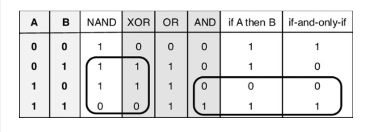

Z3支持布尔运算符：And, Or, Not, Implies (implication), If (if-then-else)。双蕴含符号用==表示。 以下示例显示如何解决一组简单的布尔约束。

`a⊕b = (¬a ∧ b) ∨ (a ∧¬b)=(a ∧ b) ∨ (¬a ∧¬b)=(a ∧ b) ∨ ¬(a ∨ b) ` `a⊕b =(a ∨ b) ∧ (¬a ∨ ¬b)=(a ∨ b) ∧ ¬ (a ^ b)`



[Proof by incomplete enumeration and other logical misconceptions](https://www.researchgate.net/publication/228422772_Proof_by_incomplete_enumeration_and_other_logical_misconceptions/figures?lo=1)
Truth tables of the NAND, XOR, OR, AND, If-then, and if-and-only-if


微软研究院写的教程入门
https://theory.stanford.edu/~nikolaj/programmingz3.html
本教程提供了一个程序员'满意度模理论求解器Z3的介绍。它描述了如何通过Python脚本语言提供的脚本使用Z3，并描述了Z3内部决策过程的几种算法。它旨在广泛涵盖Z3的几乎所有可用功能以及基础算法的本质。 

doc-z3项目下html的几个网页版本教程 https://ericpony.github.io/z3py-tutorial/strategies-examples.htm
和这个一样的 http://www.cs.tau.ac.il/~msagiv/courses/asv/z3py/strategies-examples.htm

--------------------------------------------------------------

这里有最简单的定理证明的思路：https://ericpony.github.io/z3py-tutorial/guide-examples.htm

A formula/constraint F is **valid** if F always evaluates to true for any assignment of appropriate values to its uninterpreted symbols.永真式，永远正确的公理，类型即命题，程序即证明。

A formula/constraint F is **satisfiable** if there is some assignment of appropriate values to its uninterpreted symbols under which F evaluates to true. 可满足是存在一个真值赋值。

Validity is about finding a proof of a statement; satisfiability is about finding a solution to a set of constraints. 


```z3
p, q = Bools('p q')
demorgan = And(p, q) == Not(Or(Not(p), Not(q)))
print demorgan

def prove(f):
    s = Solver()
    s.add(Not(f)) 
    if s.check() == unsat:
        print "proved" # 永真式f怎么取值都是true,not true 永远是false，也就是不可满足unsat
    else:
        print "failed to prove"

print "Proving demorgan..."
prove(demorgan)
```


------------------------------------------------------------------------------------------


学长说：最简单的，就是一个公式是否逻辑蕴含另一个公式
这个逻辑蕴含是否成立，可以转为一个公式是否有模型，然后用它的get model。这样能够证明formula1理论蕴含formula2理论。


```z3
Implies(formula1,formula2 )
solver.check() 既能判断是否满足
solver.model()还能求出其中一个解的赋值方式
```
-------------------------------------------------


交互方式 新版

```
z3 -in
```

编写一个x.smt然后输入
```
z3 -smt2 x.smt
```

libz3.dll和* .pyc / py所在的目录添加到PYTHONPATH


下载Z3对应的可执行文件到某个目录，然后使用编辑器编写一个SMT-LIB格式，后缀为.smt2的纯文本文件。 

接着调用`./z3 smt-lib-file.smt2`，即可针对 对应的SMT-LIB文件进行求解。 

现在流行的编辑器vscode有smt-lib-syntax插件，可以对SMT-LIB格式的文件进行语法高亮，便于编辑。  


Z3的输入形式有多种，包括文本，API以及交互式输入。 我们选择使用的在线版Z3，在编辑器中输入SMT-LIB格式的SMT公式即可。


# 1. z3定理证明


微软z3推理引擎介绍 - 逻辑跳板的文章 - 知乎
https://zhuanlan.zhihu.com/p/59360985


要弄明白z3定理证明的过程，首先要介绍几个概念：

- tactics 在z3可以被看作战略或者策略

- tacticals 在z3中可以被看作策略或者算法 比tacics低一级

- Goals 目标

和人类完成目标一样，定理证明器也会把大的目标分成小的目标 G -> G1,G2,....,Gn

这个过程叫 **model converter** 模型转换


在形式化系统中 我们的输入一般称为子句 clause ，子句由词项 term 构成。

这些term在Z3里叫 tactic

Z3内置的tactic多的吓人，可以通过（help-tactic) 函数查询。

```
python -c"from z3 import *;describe_tactics()"
```


windows发行版如果不是源码安装自己编译功能z3 -h发现很多用不了，下面在wsl下的ubuntu进行：


```
$ z3 -h
Z3 [version 4.8.10 - 64 bit]. (C) Copyright 2006-2016 Microsoft Corp.
Usage: z3 [options] [-file:]file

Input format:
  -smt2       use parser for SMT 2 input format.
  -dl         use parser for Datalog input format.
  -dimacs     use parser for DIMACS input format.
  -wcnf       use parser for Weighted CNF DIMACS input format.
  -opb        use parser for PB optimization input format.
  -lp         use parser for a modest subset of CPLEX LP input format.
  -log        use parser for Z3 log input format.
  -in         read formula from standard input.
  -model      display model for satisfiable SMT.

Miscellaneous:
  -h, -?      prints this message.
  -version    prints version number of Z3.
  -v:level    be verbose, where <level> is the verbosity level.
  -nw         disable warning messages.
  -p          display Z3 global (and module) parameters.
  -pd         display Z3 global (and module) parameter descriptions.
  -pm:name    display Z3 module ('name') parameters.
  -pp:name    display Z3 parameter description, if 'name' is not provided, then all module names are listed.
  -tactics[:name]  display built-in tactics or if argument is given, display detailed information on tactic.
  -probes     display avilable probes.
  --          all remaining arguments are assumed to be part of the input file name. This option allows Z3 to read files with strange names such as: -foo.smt2.

Resources:
  -T:timeout  set the timeout (in seconds).
  -t:timeout  set the soft timeout (in milli seconds). It only kills the current query.
  -memory:Megabytes  set a limit for virtual memory consumption.

Output:
  -st         display statistics.

Parameter setting:
Global and module parameters can be set in the command line.
  param_name=value              for setting global parameters.
  module_name.param_name=value  for setting module parameters.
Use 'z3 -p' for the complete list of global and module parameters.
```


在推理过程中可以对目标做一些探测来剔除一些不需要的分支


```smt
(declare-const x Real)
(declare-const y Real)
(declare-const z Real)

(push)
(assert (> (+ x y z) 0.0))

(apply (echo "num consts: " num-consts))

(apply (fail-if (> num-consts 2)))
(pop)

(echo "trying again...")
(assert (> (+ x y) 0.0))
(apply (fail-if (> num-consts 2)))

```


有了语义组织和目标探测的判定，借助lisp灵活的语义控制，我们其实就可以做定理证明了。


在此之上z3又集成了很多其他的算法，这让它的功能越来越强大。比如处理不动点muz，处理优化问题的opt，处理非线性问题的nlsat等。所以我现在更多的把z3看成一个强大的推理引擎，而不单是定理证明。


《SMT求解器技术对比分析及其能力扩展研究》


[Z3 Solver中Tactic的使用](https://blog.csdn.net/willlester/article/details/81347169 )

- Tactic 简介
  - [什么是 Tactic](https://blog.csdn.net/willlester/article/details/81347169#什么是-tactic)
  - [Tactic 的基本使用方法](https://blog.csdn.net/willlester/article/details/81347169#tactic-的基本使用方法)
- [可用的 Tactic 列表](https://blog.csdn.net/willlester/article/details/81347169#可用的-tactic-列表)
- Tactic 使用中相关的类
  - [Goal](https://blog.csdn.net/willlester/article/details/81347169#goal)
  - [Probe](https://blog.csdn.net/willlester/article/details/81347169#probe)
- 部分 Tactic 说明
  - [simplify](https://blog.csdn.net/willlester/article/details/81347169#simplify)
  - [solves-eq](https://blog.csdn.net/willlester/article/details/81347169#solves-eq)
  - [split-clause](https://blog.csdn.net/willlester/article/details/81347169#split-clause)
  - [skip](https://blog.csdn.net/willlester/article/details/81347169#skip)
  - [fail](https://blog.csdn.net/willlester/article/details/81347169#fail)
  - [bit-blast](https://blog.csdn.net/willlester/article/details/81347169#bit-blast)
  - [aig](https://blog.csdn.net/willlester/article/details/81347169#aig)
  - [sat](https://blog.csdn.net/willlester/article/details/81347169#sat)
  - [smt](https://blog.csdn.net/willlester/article/details/81347169#smt)
  - [normalize-bounds](https://blog.csdn.net/willlester/article/details/81347169#normalize-bounds)
  - [lia2pb](https://blog.csdn.net/willlester/article/details/81347169#lia2pb)
  - [pb2bv](https://blog.csdn.net/willlester/article/details/81347169#pb2bv)
  - [factor](https://blog.csdn.net/willlester/article/details/81347169#factor)
- Tactic 使用中涉及的函数
  - [Repeat](https://blog.csdn.net/willlester/article/details/81347169#repeat)
  - [OrElse](https://blog.csdn.net/willlester/article/details/81347169#orelse)
  - [TryFor](https://blog.csdn.net/willlester/article/details/81347169#tryfor)
  - [With](https://blog.csdn.net/willlester/article/details/81347169#with)
  - [Tactic.solver](https://blog.csdn.net/willlester/article/details/81347169#tacticsolver)
  - [FailIf](https://blog.csdn.net/willlester/article/details/81347169#failif)
  - [When](https://blog.csdn.net/willlester/article/details/81347169#when)
  - [Cond](https://blog.csdn.net/willlester/article/details/81347169#cond)


```cmd
>>describe_tactics()
ackermannize_bv : A tactic for performing full Ackermannization on bv instances.
subpaving : tactic for testing subpaving module.
horn : apply tactic for horn clauses.
horn-simplify : simplify horn clauses.
nlsat : (try to) solve goal using a nonlinear arithmetic solver.
qfnra-nlsat : builtin strategy for solving QF_NRA problems using only nlsat.
nlqsat : apply a NL-QSAT solver.
qe-light : apply light-weight quantifier elimination.
qe : apply quantifier elimination.
qsat : apply a QSAT solver.
qe2 : apply a QSAT based quantifier elimination.
qe_rec : apply a QSAT based quantifier elimination recursively.
psat : (try to) solve goal using a parallel SAT solver.
sat : (try to) solve goal using a SAT solver.
sat-preprocess : Apply SAT solver preprocessing procedures (bounded resolution, Boolean constant propagation, 2-SAT, subsumption, subsumption resolution).
ctx-solver-simplify : apply solver-based contextual simplification rules.
smt : apply a SAT based SMT solver.
psmt : builtin strategy for SMT tactic in parallel.
unit-subsume-simplify : unit subsumption simplification.
aig : simplify Boolean structure using AIGs.
add-bounds : add bounds to unbounded variables (under approximation).
card2bv : convert pseudo-boolean constraints to bit-vectors.
degree-shift : try to reduce degree of polynomials (remark: :mul2power simplification is automatically applied).
diff-neq : specialized solver for integer arithmetic problems that contain only atoms of the form (<= k x) (<= x k) and (not (= (- x y) k)), where x and y are constants and k is a numeral, and all constants are bounded.
eq2bv : convert integer variables used as finite domain elements to bit-vectors.
factor : polynomial factorization.
fix-dl-var : if goal is in the difference logic fragment, then fix the variable with the most number of occurrences at 0.
fm : eliminate variables using fourier-motzkin elimination.
lia2card : introduce cardinality constraints from 0-1 integer.
lia2pb : convert bounded integer variables into a sequence of 0-1 variables.
nla2bv : convert a nonlinear arithmetic problem into a bit-vector problem, in most cases the resultant goal is an under approximation and is useul for finding models.
normalize-bounds : replace a variable x with lower bound k <= x with x' = x - k.
pb2bv : convert pseudo-boolean constraints to bit-vectors.
propagate-ineqs : propagate ineqs/bounds, remove subsumed inequalities.
purify-arith : eliminate unnecessary operators: -, /, div, mod, rem, is-int, to-int, ^, root-objects.
recover-01 : recover 0-1 variables hidden as Boolean variables.
bit-blast : reduce bit-vector expressions into SAT.
bv1-blast : reduce bit-vector expressions into bit-vectors of size 1 (notes: only equality, extract and concat are supported).
bv_bound_chk : attempts to detect inconsistencies of bounds on bv expressions.
propagate-bv-bounds : propagate bit-vector bounds by simplifying implied or contradictory bounds.
propagate-bv-bounds-new : propagate bit-vector bounds by simplifying implied or contradictory bounds.
reduce-bv-size : try to reduce bit-vector sizes using inequalities.
bvarray2uf : Rewrite bit-vector arrays into bit-vector (uninterpreted) functions.
dt2bv : eliminate finite domain data-types. Replace by bit-vectors.
elim-small-bv : eliminate small, quantified bit-vectors by expansion.
max-bv-sharing : use heuristics to maximize the sharing of bit-vector expressions such as adders and multipliers.
blast-term-ite : blast term if-then-else by hoisting them.
cofactor-term-ite : eliminate term if-the-else using cofactors.
collect-statistics : Collects various statistics.
ctx-simplify : apply contextual simplification rules.
der : destructive equality resolution.
distribute-forall : distribute forall over conjunctions.
dom-simplify : apply dominator simplification rules.
elim-term-ite : eliminate term if-then-else by adding fresh auxiliary declarations.
elim-uncnstr : eliminate application containing unconstrained variables.
injectivity : Identifies and applies injectivity axioms.
snf : put goal in skolem normal form.
nnf : put goal in negation normal form.
occf : put goal in one constraint per clause normal form (notes: fails if proof generation is enabled; only clauses are considered).       
pb-preprocess : pre-process pseudo-Boolean constraints a la Davis Putnam.
propagate-values : propagate constants.
reduce-args : reduce the number of arguments of function applications, when for all occurrences of a function f the i-th is a value.       
reduce-invertible : reduce invertible variable occurrences.
simplify : apply simplification rules.
elim-and : convert (and a b) into (not (or (not a) (not b))).
solve-eqs : eliminate variables by solving equations.
special-relations : detect and replace by special relations.
split-clause : split a clause in many subgoals.
symmetry-reduce : apply symmetry reduction.
tseitin-cnf : convert goal into CNF using tseitin-like encoding (note: quantifiers are ignored).
tseitin-cnf-core : convert goal into CNF using tseitin-like encoding (note: quantifiers are ignored). This tactic does not apply required simplifications to the input goal like the tseitin-cnf tactic.
qffd : builtin strategy for solving QF_FD problems.
pqffd : builtin strategy for solving QF_FD problems in parallel.
smtfd : builtin strategy for solving SMT problems by reduction to FD.
fpa2bv : convert floating point numbers to bit-vectors.
qffp : (try to) solve goal using the tactic for QF_FP.
qffpbv : (try to) solve goal using the tactic for QF_FPBV (floats+bit-vectors).
qffplra : (try to) solve goal using the tactic for QF_FPLRA.
default : default strategy used when no logic is specified.
sine-filter : eliminate premises using Sine Qua Non
qfbv-sls : (try to) solve using stochastic local search for QF_BV.
nra : builtin strategy for solving NRA problems.
qfaufbv : builtin strategy for solving QF_AUFBV problems.
qfauflia : builtin strategy for solving QF_AUFLIA problems.
qfbv : builtin strategy for solving QF_BV problems.
qfidl : builtin strategy for solving QF_IDL problems.
qflia : builtin strategy for solving QF_LIA problems.
qflra : builtin strategy for solving QF_LRA problems.
qfnia : builtin strategy for solving QF_NIA problems.
qfnra : builtin strategy for solving QF_NRA problems.
qfuf : builtin strategy for solving QF_UF problems.
qfufbv : builtin strategy for solving QF_UFBV problems.
qfufbv_ackr : A tactic for solving QF_UFBV based on Ackermannization.
ufnia : builtin strategy for solving UFNIA problems.
uflra : builtin strategy for solving UFLRA problems.
auflia : builtin strategy for solving AUFLIA problems.
auflira : builtin strategy for solving AUFLIRA problems.
aufnira : builtin strategy for solving AUFNIRA problems.
lra : builtin strategy for solving LRA problems.
lia : builtin strategy for solving LIA problems.
lira : builtin strategy for solving LIRA problems.
skip : do nothing tactic.
fail : always fail tactic.
fail-if-undecided : fail if goal is undecided.
macro-finder : Identifies and applies macros.
quasi-macros : Identifies and applies quasi-macros.
ufbv-rewriter : Applies UFBV-specific rewriting rules, mainly demodulation.
bv : builtin strategy for solving BV problems (with quantifiers).
ufbv : builtin strategy for solving UFBV problems (with quantifiers).
```


```bash
>>describe_probes()
ackr-bound-probe : A probe to give an upper bound of Ackermann congruence lemmas that a formula might generate.
is-unbounded : true if the goal contains integer/real constants that do not have lower/upper bounds.
is-pb : true if the goal is a pseudo-boolean problem.
arith-max-deg : max polynomial total degree of an arithmetic atom.
arith-avg-deg : avg polynomial total degree of an arithmetic atom.
arith-max-bw : max coefficient bit width.
arith-avg-bw : avg coefficient bit width.
is-qflia : true if the goal is in QF_LIA.
is-qfauflia : true if the goal is in QF_AUFLIA.
is-qflra : true if the goal is in QF_LRA.
is-qflira : true if the goal is in QF_LIRA.
is-ilp : true if the goal is ILP.
is-qfnia : true if the goal is in QF_NIA (quantifier-free nonlinear integer arithmetic).
is-qfnra : true if the goal is in QF_NRA (quantifier-free nonlinear real arithmetic).
is-nia : true if the goal is in NIA (nonlinear integer arithmetic, formula may have quantifiers).
is-nra : true if the goal is in NRA (nonlinear real arithmetic, formula may have quantifiers).
is-nira : true if the goal is in NIRA (nonlinear integer and real arithmetic, formula may have quantifiers).
is-lia : true if the goal is in LIA (linear integer arithmetic, formula may have quantifiers).
is-lra : true if the goal is in LRA (linear real arithmetic, formula may have quantifiers).
is-lira : true if the goal is in LIRA (linear integer and real arithmetic, formula may have quantifiers).
is-qfufnra : true if the goal is QF_UFNRA (quantifier-free nonlinear real arithmetic with other theories).
is-qfbv-eq : true if the goal is in a fragment of QF_BV which uses only =, extract, concat.
is-qffp : true if the goal is in QF_FP (floats).
is-qffpbv : true if the goal is in QF_FPBV (floats+bit-vectors).
is-qffplra : true if the goal is in QF_FPLRA.
memory : amount of used memory in megabytes.
depth : depth of the input goal.
size : number of assertions in the given goal.
num-exprs : number of expressions/terms in the given goal.
num-consts : number of non Boolean constants in the given goal.
num-bool-consts : number of Boolean constants in the given goal.
num-arith-consts : number of arithmetic constants in the given goal.
num-bv-consts : number of bit-vector constants in the given goal.
produce-proofs : true if proof generation is enabled for the given goal.
produce-model : true if model generation is enabled for the given goal.
produce-unsat-cores : true if unsat-core generation is enabled for the given goal.
has-quantifiers : true if the goal contains quantifiers.
has-patterns : true if the goal contains quantifiers with patterns.
is-propositional : true if the goal is in propositional logic.
is-qfbv : true if the goal is in QF_BV.
is-qfaufbv : true if the goal is in QF_AUFBV.
is-quasi-pb : true if the goal is quasi-pb.
```


