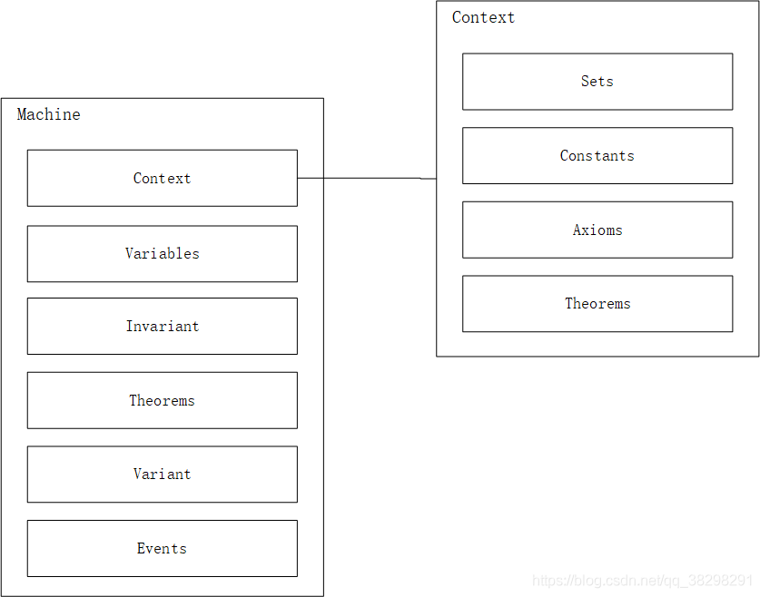
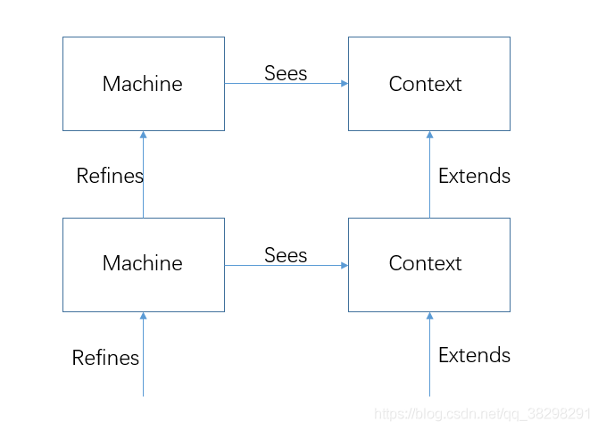

# 资料

北大裘宗燕老师创建维护 https://www.math.pku.edu.cn/teachers/qiuzy/fm_B/ 

北京大学数学学院信息科学系“软件形式化方法”研究生课。

本课程是软件形式化方法的基础课程，主要讨论基于 B 方法的形式化规范、验证和精化。

课程信息：周二下午7-9节（2:40~5:30）；文史楼204教室。

课程动态进展 （随课程进展更新）
课程通知（更新： 2015-11-28 ）	讲义下载（更新： 2015-11-28 ）	课程作业页（更新： 2015-11-28 ）

课程参考书和材料

本课程以《B方法, Jean-Raymond Abrial》作为主要参考书。中译本由电子工业出版社2004
课程中使用的工具系统和文档（来自Clearsy公司，放在这里只为课程学习）：

Atelier B 安装文件
Atelier B 语言参考手册
Atelier B 用户参考手册
Atelier B 交互式证明器参考手册
Atelier B 交互式证明器用户手册
Atelier B 证明义务参考手册
Atelier B B符号对照表
Atelier B B可重用组件参考手册（Free 版本系统没提供这些组件）
Atelier B 数学规则撰写手册
Atelier B 自动精化工具 Bart 参考手册

其他材料可到Clearsdy公司网站查找，或参考下面的网络资源链接

这里有一个 B 方法所用数学符号的 Latex 包

以前形式化方法课程（Z语言）页面链接

下面是有关B方法的一些资源网址：

有关B方法的Wiki页面

这里也提供了B方法网上资源的丰富链接
Clearsy是法国一家专门做B方法工具和基于B开发的公司，其免费工具Atelier B是目前Windows系统上最好用的B工具，也是本课程用的工具。B4free是该公司工具的另一版本。这几个页面都提供了丰富的链接
B-Core(UK) Ltd是一个专门做B方法的公司，这里由许多信息
Brillant的几个B方法资源页：B-Method online，B-Methods / Tools around B
Event-B和Rodin平台网站
关于形式化方法广泛问题的网上资源链接页
其他参考书：
缪怀扣，软件工程语言-Z，上海科学技术文献出版社，1999
Jim Woodcock and Jim Davies, Using Z, Specification, Refinement, and Proof, 下载该书的PDF文件和其中参考材料
Carroll Morgan, Programming From Specification, Printice Hall, 1998 （中译本：从规范出发的程序设计，裘宗燕译，中信出版社&机械工业出版社，2002）
部分书籍可以从网上书店找到。

阅读材料

JIM WOODCOCK, PETER GORM LARSEN, JUAN BICARREGUI, JOHN FITZGERALD,
Formal Methods: Practice and Experience, Computing Survey, 2009, ACM
Jean-Raymond Abrial,
《工业开发中的形式化方法：成就，问题和未来》， 2006年国际软件工程大会特邀报告（中文翻译版）

Jean-Raymond Abrial,
Faultless Systems: Yes We Can! Computer, 2009.9, IEEE CS

D.L. Parnas,
Really Rethinking 'Formal Methods', Computer, 2009.12, IEEE CS

相关资料

软件形式化的文献汇编（收集中。更新： 1970-01-01 ）
其他信息汇编（北京大学图书馆的有关图书目录，有关重要国际杂志等）。
十大IT灾难
Can Software Kill You?
Outsmarted: Victoria pays the price

本文档是Event-B形式化方法的参考书，书中包含Event-B结构与语法介绍；数学证明；符合表示  https://download.csdn.net/download/shangdi765/4926757

Modeling in Event-B System and Software Engineering    pdf书籍和全部ppt  https://download.csdn.net/download/u014643811/9688372

基于Event_B的软件形式化需求获取方法研究 硕士论文，关于EVENT_B形式化方法的，有例子。 https://download.csdn.net/download/zhongzhu717/1368297

# Event-B学习总结

https://blog.csdn.net/qq_38298291/article/details/83789931

概念
Event-b 是一种基于传统的谓词演算和定理证明的形式化语言。

Event-b 新的特征是它引入了事件（Event）。事件是event-b的一个重要特征，因此它非常适合用来为周期行为建模。除此之外，Event-b支持逐步精化地建立系统模型。

组成
一个完整的Event-b 模型包括四部分，Context(上下文) ， Machine(自动机) ， Proof Obligations（证明义务） 和 Refinement（精化）。

Context：上下文主要定义常量，这些常量可以是数值或者数据集合。
Machine：自动机主要定义动态的行为，包括状态以及状态属性，还有事件模型的建立都在machine模型里建立。
Proof Obligation：证明义务并不是为了得到某些信息而进行的操作，他并不是必须的。它的作用只是确定建立的模型是否符合原始需求以及内部需求。更多的模型只是为了进行语法的练习。
Refinement ：精化是增加系统的功能、增加细节、改变状态模型。精化一个自动机过程中，可能需要增加新的变量和新的事件。一般一个模型需要进行多次精化才能符合要求。

Machine和Context上文已经提过，就不再多做赘述。

Variable：Variable定义了状态变量，我的理解是全局的变量
Invariant：Invariant则定义了相应Variable的类型
Theorems：Theorems定义了相应variable的行为
Events：Events则定义了能使状态变量改变的事件，其中包括初始化。
Variant：variant相对于Variable来说，则是Events中临时变量，作用域比Variable小。
Sets：是数据集合
Constants：是定义的一些常量
Axioms：描述了不能从其他公理派生出来的属性
Theorems：描述了可以由公理导出的性质
精化和拓展
一个项目中可以存在多个Machine和Context，但它们不能是独立的，这也从侧面解释了“Event-b支持逐步精化地建立系统模型”。具体关系如下图。

即Machine在精化中越来越复杂，越来越细致。Context也越来越庞大。

