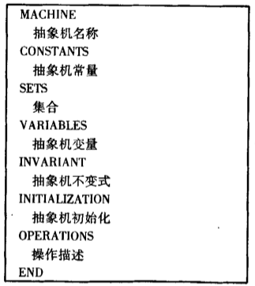
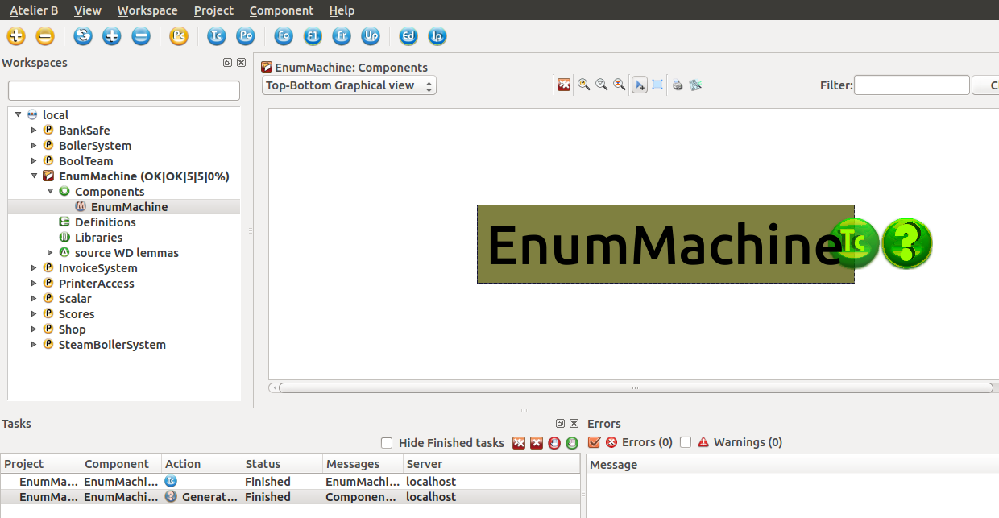
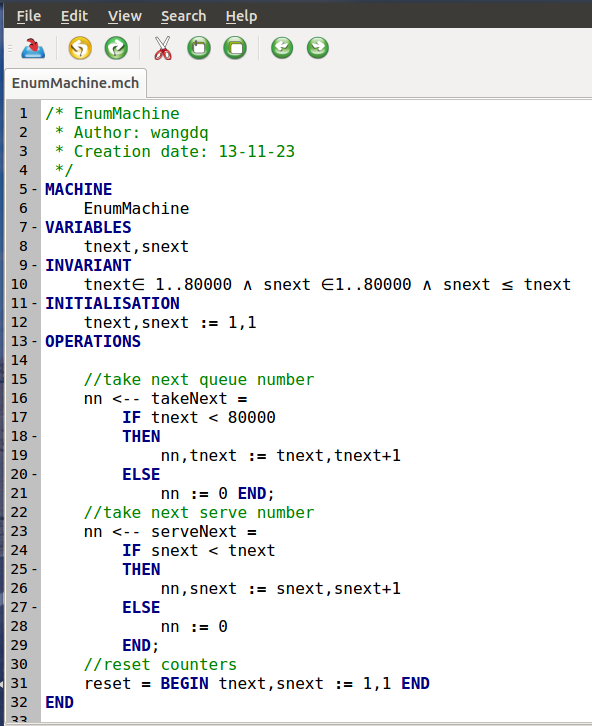
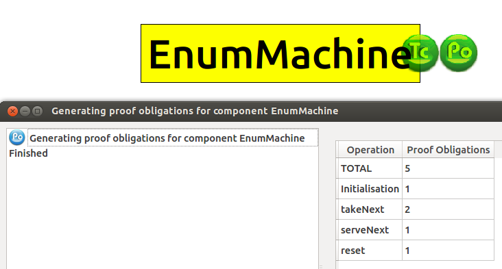
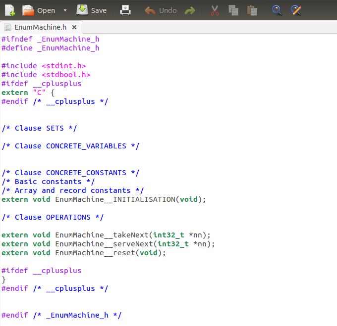

# B方法形式化

教学资源汇总 https://www.labri.fr/perso/sutre/Teaching/B/

还有 裘宗燕主页教学 https://www.math.pku.edu.cn/teachers/qiuzy/fm_B/

https://en.wikipedia.org/wiki/B-Method

the B-book Assigning programs to Meaning《B方法》裘宗燕译P416
(在抽象机操作的上下文中的)递归不是规范相关概念，而是程序设计相关概念:
一个通过递归定义的操作体现的是某个更抽象的，以非递归方法定义的规范所描述的最终计算过程。

Event-B

Atelier B软件 B方法free软件源码？可能人家公司 https://www.clearsy.com/ 没公布，有很多手册文档，也需要看paper

代码生成手册
chrome-extension://oemmndcbldboiebfnladdacbdfmadadm/https://www.clearsy.com/wp-content/uploads/sites/3/ressources/DOC/english/translators-user-manual.pdf
https://sourceforge.net/p/atelierbgu

i/wiki/Home/ 图形化用户界面源码 该项目包含Atelier B图形界面源代码。Atelier B是基于B语言的CASE工具，允许开发经过数学证明的默认免费软件。 svn checkout https://svn.code.sf.net/p/atelierbgui/code/trunk atelierbgui-code

> 通过人机界面以QT格式使用Atelier B，或者直接使用命令（命令模式）使用
https://www.atelierb.eu/en/atelier-b-tools/

Atelier B是多用户。在项目开发过程中可以自动执行的任务如下：
–组件的语法验证
–自动产生证明义务
–将B安装自动翻译为C或Ada语言

>自动精炼
集成了自动优化工具（BART）。BART使用可以由用户扩展的细化规则库来实现细化和实现。BART以优化规则为基础。可以添加其他细化规则，以对某些组件进行细化个性化

语法分析仪
这些用于执行B语言文件的所有语法验证：
>模型编辑器已集成到Atelier B中。这集成了语法分析器，自动完成功能以及整个模型的导航功能。
>类型检查器首先对B组件进行语法验证，然后进行一定数量的上下文验证，包括类型控制和标识符范围控制。组件必须经过类型检查器才能通过验证，并且在进行下面的任何其他验证之前
> B0检查器执行特定于安装中使用的BO语言（B语言的子类）的验证，以确保它们可以被翻译。
项目检查器检查项目的所有组件以控制其体系结构（组件之间的链接）。在项目的最终翻译之前，必须先检查项目。

B模型可以pdf，rtf和LaTeX格式保存。

>自动翻译器
这些安装构成了B语言开发的编码阶段。它们是使用B语言子组件编写的，类似于命令式编程语言。为了便于在任何目标系统上生成代码，将安装程序自动翻译为标准编程语言。然后可以将获得的程序编译并组装到目标计算机上，以生成可执行软件。

>项目的图形表示
通过自动在图形上放置它们，将其用于项目组件及其链接的图形表示。用户可以选择不同的显示选项，例如要查看的链接类型，项目的整个依赖图或组件的依赖图的视图。

>证明工具
–使用B语言的组件自动生成证明义务 –证明
其证明义务时B组件是正确的
–在自动模式下进行证明：大多数证明义务在没有用户干预
的情况下进行了证明-在交互模式下使用证明时自动模式失败：用户使用交互命令（引证添加，案例证明等）指导证明者进行证明义务证明
–谓词证明者：谓词证明：证明用户添加的规则
–查看Poof义务，他们的证明义务来源及其状态（琐碎，已证明，未证明）
–已验证规则库的管理，包括2 200多个规则

>项目管理
工作室B提供大型项目管理服务（例如，包括500个组件）。特别是：
–网​​络中的多个用户使用的工作室B。这些用户可以同时处理同一个项目
-归档和还原整个项目
-构建项目或几个子项目或库。这样，Atelier B可以使多个开发人员团队进行大型模块化开发
–通过为每个组件提供其状态（传递给Type Checker，转换为C或Ada），证明数量来查看项目的整体状态。义务和证明的百分比
–自动生成项目组件之间的依赖关系。这样，为了对选定的组件执行操作（通过类型检查器，通过证明义务生成器等），工作室B报告其所依赖的组件所需的操作。

https://github.com/CLEARSY/apero

《B方法》第三章数学对象
基于集合论模型，构造了data structure指称语义数学对象:
ADT自然数，整数，有穷序列，有穷树，标记树，二叉树，良构关系(不动点递归循环相互转换等价性,wp(pre,effect)最弱前条件技术)上定义递归…
想知道linked list相关的抽象机(范畴学 数学对象指称语义)应该怎么样定义？ 要找到范畴学上定义
https://gist.github.com/akoskovacs/5074344

https://cn.bing.com/search?q=linked+list+haskell&qs=n&form=QBRE&pc=U316&sp=-1&pq=linked+list+haskell&sc=4-19&sk=&cvid=B03726E44B2D49E89E10F0FF5FC23A70

张淞书上Zipper表示列表间游走，拉锁；树结构等价的linear tree 前序遍历需要三种操作，包括游历到左右分支，返回上一级。

《b方法》两个模型p204(一个集合对应一个关系，集合变换器)沟通了“广义代换的逻辑世界，物理”和集合论的“数学世界，范畴学物理对象”p258

应该还要有一个“递归22循环转换器”

# 《B方法》

这本书讲了抽象机，挺详细的。

https://blog.csdn.net/wangdingqiaoit/article/details/16973389 B方法-拓展你形式化方法的视野

1 什么是形式化方法?
           使用非形式化的自然语言描述系统规格说明容易引起二义性，不完整，可能存在矛盾;为了克服欠形式化方法的缺点，人们把数学引入软件开发过程，创造了基于数学的形式化方法。
     所谓形式化方法，是指具有坚定数学基础的方法(例如集合，关系，谓词逻辑等)的基础之上的方法，是数学上的综合，分析技术的应用，用于开发计算机控制的系统，经常有推力工具的支持，它可以提供一个用于模型设计和分析的严格而有效的途径。

简而言之，形式化方法即建立在严格数学基础之上的软件设计，验证，并运用与实际开发的技术。

目前流行的形式化方法，包括**有穷自动机，Petri网,Z语言,上下文相关的文法等形式化方法**。

2 形式化方法直观感受
        **Z方法和B方法**均由法国科学家Jean-Raymond Abrial发明，B方法基于集合，关系和谓词逻辑等数学理论书写规范，主要通过不变式(INVARIANT)和证明义务(Proof Obligation, PO)来保证规范正确性。
        
        
B方法描述软件的基本单元是抽象机(Abstract Machine),抽象机之间可以组织成更大的抽象机，抽象机可以逐步精化直至最终实现（代码自动生成）。

典型的抽象机组织结构如下图所示：

 下面通过B方法直观感受下形式化方法开发。这里的例子来自北大数学系 裘宗燕教授B方法课件(你可以访问裘宗燕老师关于B方法的课程主页了解更多内容)。

 

 B方法的支持工具软件AtelierB如下图所示。

我们展示的是一个银行叫号机的简化模型EnumMachine，它包括三个操作:

1)客户下一个号码takeNext操作

2)银行服务员服务下一客户的的叫号serveNext操作

3)号码重置操作reset操作。
我们需要编写的叫号机的模型，在B方法中称之为抽象机，代码如下图所示:

上述这段代码中IF语句以及其他逻辑关系符号，表示了简单的数学关系以满足叫号机的正确性。这里只是作为展示，其实形式化方法可以包含更多的逻辑性以满足程序正确性，而且不都是用我们熟悉的if..else语句表示的。

编写完的抽象机需要进行类型检查，然后由系统自动或交互式完成证明义务，系统生成的证明义务如下图所示：

类型检查通过后，免费版的AtelierB可以为我们生成一个叫号机模型的C语言头文件，如下图所示:

根据生成的头文件，由开发人员完成实际代码的编写，当然其他版本的AtelierB可以支持生成更多语言的代码，从抽象机到自动代码生成，我们看到了B方法的强大能力。

3 形式化方法特点
     形式化方法克服了非形式化语言描述的缺点，它能简洁准确地描述研究对象，便于建立正确完整的数学规则说明;同时在软件开发过程中使用数学的另一个有点是，可以在软件工程活动之间平滑地过渡，不仅功能规则说明，系统设计也可以使用数学表达式，当然程序代码也是一种数学符号。可以利用数学证明方法证明设计符合规则说明，程序代码正确地反映了设计结果。当然形式化方法也绝不是万灵神药，他也有它的局限性，因此也有人对形式化方法持怀疑态度。

对于形式化方法我接受两个观点：

   1）软件需求日益复杂，软件开发过程中没有一个普适的解决问题的方法，因此任何有助于缓解系统复杂性，提高软件质量的方法都有其价值;

   2) 不要过分夸大某一种方法的能力，没有绝对的正确与先进，计算机技术总是不断发展的，实践中总是结合多种方法的优势进行的。

好了吧，头脑风暴就到这儿了，如果对形式化方法感兴趣，想进一步学习，下面你需要思考诸如数组是一个索引到值的函数(映射)之类的数学问题了。

